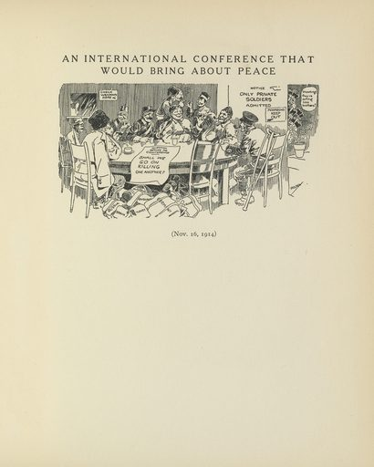

# Artvee Daily Digest — 2026-06-18

## 1. 今日概览
- 候选范围：20 张
- 精选数量：1 张
- 涉及分类：posters-design
- 涉及艺术家：Luther_Daniels_Bradley
- 选择策略：`diverse`

## 2. 今日精选

### 1. An_International_Conference_That_Would_Bring_About_Peace — Luther_Daniels_Bradley

- 分类：posters-design
- 来源：https://artvee.com/dl/an-international-conference-that-would-bring-about-peace/
- 视觉：构图：纵向构图
- 视觉：dominant palette: #e0d0c0, #e0e0c0, #e0d0b0, #d0d0b0, #c0c0a0
- 用途：海报设计参考, 活动宣传, 展览主视觉, 壁纸
- Prompt seed：`art nouveau vintage poster illustration, An_International_Conference_That_Would_Bring_About_Peace, public domain print`

## 3. 今日风格总结
- 构图分布：纵向构图(1)
- 主色（top across picks）：#e0d0c0, #e0e0c0, #e0d0b0, #d0d0b0, #c0c0a0
- 类别分布：posters-design(1)

## 4. 可用于哪些项目
- 海报设计参考（命中 1 张）
- 活动宣传（命中 1 张）
- 展览主视觉（命中 1 张）
- 壁纸（命中 1 张）

## 5. 数据来源与边界
- 数据源：`web/data/artworks.json`（P1 builder 输出）
- 缩略图：`thumbs/512/`（P1 builder 生成，本地路径相对 `digests/`）
- 边界：未触发下载；未发布公网；未调用在线模型；本 digest 完全 deterministic。
- Prompt seed 仅作创作起步提示，请结合实际需要二次修改。
