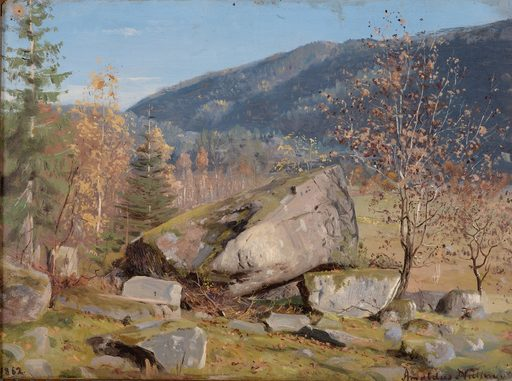
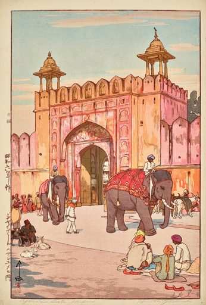
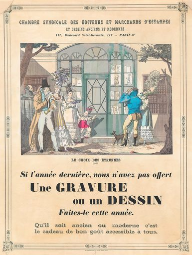
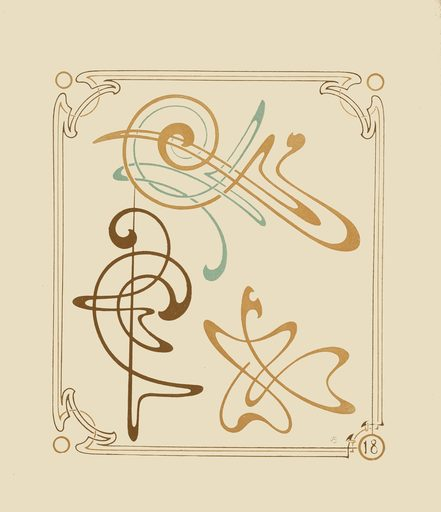
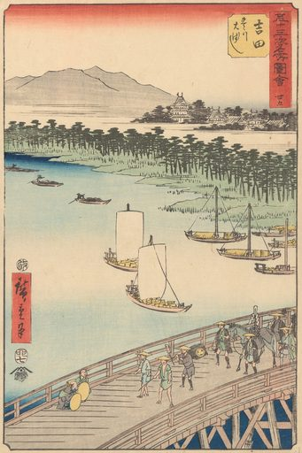

# Artvee Daily Digest — 2026-06-12

## 1. 今日概览
- 候选范围：20 张
- 精选数量：5 张
- 涉及分类：book-illustrations, japanese-prints, posters-design
- 涉及艺术家：Alphonse_Mucha_(Czech,_1860-1939), Amaldus_Nielsen_(Norwegian,_1838_–_1932), Anonymous, Utagawa_Hiroshige_(Japanese,_1797_–_1858), Yoshida_Hiroshi_(Japanese,_1876-1950)
- 选择策略：`diverse`

## 2. 今日精选

### 1. Høstdag._Bjelland,_Mandal_(1862) — Amaldus_Nielsen_(Norwegian,_1838_–_1932)

- 分类：book-illustrations
- 来源：https://artvee.com/dl/hostdag-bjelland-mandal/
- 视觉：构图：横向构图
- 视觉：dominant palette: #90b0c0, #907060, #a08060, #807060, #807050
- 用途：书籍插图, 童话配图, 故事封面, 明信片
- Prompt seed：`classic book illustration watercolor, Høstdag._Bjelland,_Mandal_(1862), public domain print`

### 2. Jaipuuru_no_Ajumeru_mon_(The_Ajmer_Gate_at_Jaipur)_(1931) — Yoshida_Hiroshi_(Japanese,_1876-1950)

- 分类：japanese-prints
- 来源：https://artvee.com/dl/jaipuuru-no-ajumeru-mon-the-ajmer-gate-at-jaipur/
- 视觉：构图：纵向构图
- 视觉：dominant palette: #e0d0b0, #c0c0b0, #e0c0a0, #b0c0b0, #e0b090
- 用途：海报背景, 书籍封面, 视频分镜参考, 动画参考帧
- Prompt seed：`ukiyo-e inspired vintage art print, Jaipuuru_no_Ajumeru_mon_(The_Ajmer_Gate_at_Jaipur)_(1931), public domain print`

### 3. Affiche_van_de_Chambre_Syndicale_des_Éditeurs_et_Marchands_d’Estampes_et_Dessins_Anciens_et_Modernes_te_Parijs_(1919) — Anonymous

- 分类：posters-design
- 来源：https://artvee.com/dl/affiche-van-de-chambre-syndicale-des-editeurs-et-marchands-destampes-et-dessins-anciens-et-modernes-te-parijs/
- 视觉：构图：纵向构图
- 视觉：dominant palette: #f0d0b0, #e0d0b0, #f0e0c0, #d0c0a0, #e0c0a0
- 用途：海报设计参考, 活动宣传, 展览主视觉, 壁纸
- Prompt seed：`art nouveau vintage poster illustration, Affiche_van_de_Chambre_Syndicale_des_Éditeurs_et_Marchands_d, public domain print`

### 4. Abstract_design_based_on_arabesques_(1900) — Alphonse_Mucha_(Czech,_1860-1939)

- 分类：posters-design
- 来源：https://artvee.com/dl/abstract-design-based-on-arabesques/
- 视觉：构图：纵向构图
- 视觉：dominant palette: #e0d0c0, #e0d0b0, #d0c0a0, #e0e0c0, #d0d0b0
- 用途：海报设计参考, 活动宣传, 展览主视觉, 壁纸
- Prompt seed：`art nouveau vintage poster illustration, Abstract_design_based_on_arabesques_(1900), public domain print`

### 5. Yoshida_(1855) — Utagawa_Hiroshige_(Japanese,_1797_–_1858)

- 分类：japanese-prints
- 来源：https://artvee.com/dl/yoshida/
- 视觉：构图：纵向构图
- 视觉：dominant palette: #e0d0b0, #c0c0a0, #d0c0a0, #c0b090, #b0a080
- 用途：海报背景, 书籍封面, 视频分镜参考, 动画参考帧
- Prompt seed：`ukiyo-e inspired vintage art print, Yoshida_(1855), public domain print`

## 3. 今日风格总结
- 构图分布：纵向构图(4), 横向构图(1)
- 主色（top across picks）：#e0d0b0, #d0c0a0, #e0c0a0, #90b0c0, #907060, #a08060, #807060, #807050
- 类别分布：japanese-prints(2), posters-design(2), book-illustrations(1)

## 4. 可用于哪些项目
- 海报背景（命中 2 张）
- 书籍封面（命中 2 张）
- 视频分镜参考（命中 2 张）
- 动画参考帧（命中 2 张）
- 海报设计参考（命中 2 张）
- 活动宣传（命中 2 张）
- 展览主视觉（命中 2 张）
- 壁纸（命中 2 张）
- 书籍插图（命中 1 张）
- 童话配图（命中 1 张）
- 故事封面（命中 1 张）
- 明信片（命中 1 张）

## 5. 数据来源与边界
- 数据源：`web/data/artworks.json`（P1 builder 输出）
- 缩略图：`thumbs/512/`（P1 builder 生成，本地路径相对 `digests/`）
- 边界：未触发下载；未发布公网；未调用在线模型；本 digest 完全 deterministic。
- Prompt seed 仅作创作起步提示，请结合实际需要二次修改。
