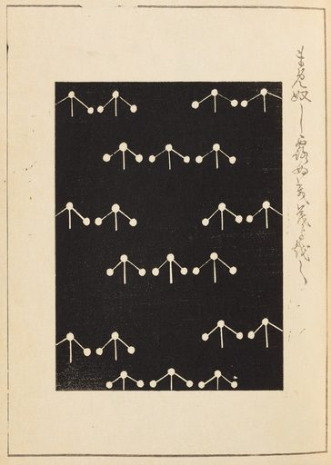

# Artvee Daily Digest — 2026-06-15

## 1. 今日概览
- 候选范围：20 张
- 精选数量：1 张
- 涉及分类：japanese-prints
- 涉及艺术家：Furuya_Kōrin
- 选择策略：`diverse`

## 2. 今日精选

### 1. Shin-Bijutsukai_Pl.343 — Furuya_Kōrin

- 分类：japanese-prints
- 来源：https://artvee.com/dl/shin-bijutsukai-pl-343/
- 视觉：构图：纵向构图
- 视觉：dominant palette: #202020, #e0d0b0, #e0d0c0, #202010, #201010
- 用途：海报背景, 书籍封面, 视频分镜参考, 动画参考帧
- Prompt seed：`ukiyo-e inspired vintage art print, Shin-Bijutsukai_Pl.343, public domain print`

## 3. 今日风格总结
- 构图分布：纵向构图(1)
- 主色（top across picks）：#202020, #e0d0b0, #e0d0c0, #202010, #201010
- 类别分布：japanese-prints(1)

## 4. 可用于哪些项目
- 海报背景（命中 1 张）
- 书籍封面（命中 1 张）
- 视频分镜参考（命中 1 张）
- 动画参考帧（命中 1 张）

## 5. 数据来源与边界
- 数据源：`web/data/artworks.json`（P1 builder 输出）
- 缩略图：`thumbs/512/`（P1 builder 生成，本地路径相对 `digests/`）
- 边界：未触发下载；未发布公网；未调用在线模型；本 digest 完全 deterministic。
- Prompt seed 仅作创作起步提示，请结合实际需要二次修改。
