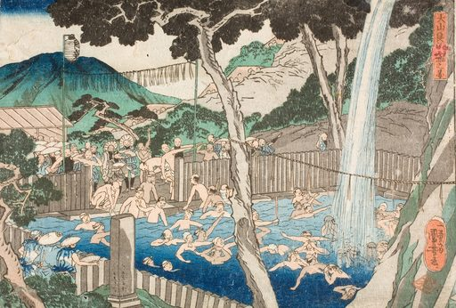
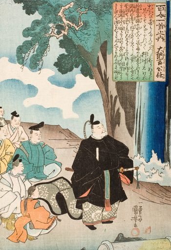
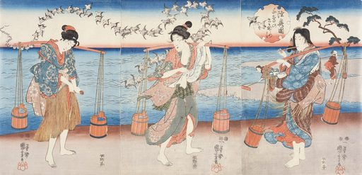
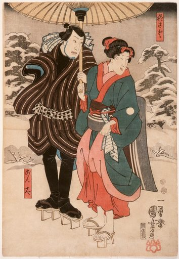
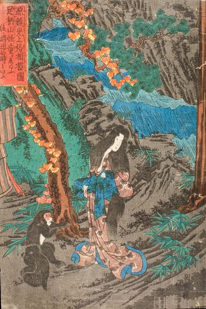

# Artvee Daily Digest — 2026-06-12

## 1. 今日概览
- 候选范围：20 张
- 精选数量：5 张
- 涉及分类：japanese-prints
- 涉及艺术家：Utagawa_Kuniyoshi
- 选择策略：`diverse`

## 2. 今日精选

### 1. Rōben_Waterfall_at_Mount_Ōyama — Utagawa_Kuniyoshi

- 分类：japanese-prints
- 来源：https://artvee.com/dl/roben-waterfall-at-mount-oyama/
- 视觉：构图：横向构图
- 视觉：dominant palette: #a09080, #b0a090, #c0b0a0, #908070, #e0d0c0
- 用途：海报背景, 书籍封面, 视频分镜参考, 动画参考帧
- Prompt seed：`ukiyo-e inspired vintage art print, Rōben_Waterfall_at_Mount_Ōyama, public domain print`

### 2. Poem_by_Dainagon_Kintō — Utagawa_Kuniyoshi

- 分类：japanese-prints
- 来源：https://artvee.com/dl/poem-by-dainagon-kinto/
- 视觉：构图：纵向构图
- 视觉：dominant palette: #f0e0d0, #d0c0b0, #d0d0c0, #c0b0a0, #c0d0c0
- 用途：海报背景, 书籍封面, 视频分镜参考, 动画参考帧
- Prompt seed：`ukiyo-e inspired vintage art print, Poem_by_Dainagon_Kintō, public domain print`

### 3. Plovers_of_the_Noda_Jewel_River_of_Mutsu_Province — Utagawa_Kuniyoshi

- 分类：japanese-prints
- 来源：https://artvee.com/dl/plovers-of-the-noda-jewel-river-of-mutsu-province/
- 视觉：构图：横向构图
- 视觉：dominant palette: #d0c0b0, #d0d0c0, #d0c0c0, #e0d0c0, #e0e0d0
- 用途：海报背景, 书籍封面, 视频分镜参考, 动画参考帧
- Prompt seed：`ukiyo-e inspired vintage art print, Plovers_of_the_Noda_Jewel_River_of_Mutsu_Province, public domain print`

### 4. Osayo_and_Genta — Utagawa_Kuniyoshi

- 分类：japanese-prints
- 来源：https://artvee.com/dl/osayo-and-genta/
- 视觉：构图：纵向构图
- 视觉：dominant palette: #e0c0a0, #d0b090, #c0a080, #e0c0b0, #c0a090
- 用途：海报背景, 书籍封面, 视频分镜参考, 动画参考帧
- Prompt seed：`ukiyo-e inspired vintage art print, Osayo_and_Genta, public domain print`

### 5. On_the_Way_to_Kyoto_Minamoto_no_Raikō_Meets_Kaidōmaru_in_the_Ashigara_Mountains_of_Sagami_Province_and_Takes_Him_as_a_Retainer — Utagawa_Kuniyoshi

- 分类：japanese-prints
- 来源：https://artvee.com/dl/on-the-way-to-kyoto-minamoto-no-raiko-meets-kaidomaru-in-the-ashigara-mountains-of-sagami-province-and-takes-him-as-a-retainer/
- 视觉：构图：纵向构图
- 视觉：dominant palette: #807060, #908070, #706050, #605040, #a09080
- 用途：海报背景, 书籍封面, 视频分镜参考, 动画参考帧
- Prompt seed：`ukiyo-e inspired vintage art print, On_the_Way_to_Kyoto_Minamoto_no_Raikō_Meets_Kaidōmaru_in_the, public domain print`

## 3. 今日风格总结
- 构图分布：纵向构图(3), 横向构图(2)
- 主色（top across picks）：#a09080, #c0b0a0, #908070, #e0d0c0, #d0c0b0, #d0d0c0, #b0a090, #f0e0d0
- 类别分布：japanese-prints(5)

## 4. 可用于哪些项目
- 海报背景（命中 5 张）
- 书籍封面（命中 5 张）
- 视频分镜参考（命中 5 张）
- 动画参考帧（命中 5 张）

## 5. 数据来源与边界
- 数据源：`web/data/artworks.json`（P1 builder 输出）
- 缩略图：`thumbs/512/`（P1 builder 生成，本地路径相对 `digests/`）
- 边界：未触发下载；未发布公网；未调用在线模型；本 digest 完全 deterministic。
- Prompt seed 仅作创作起步提示，请结合实际需要二次修改。
