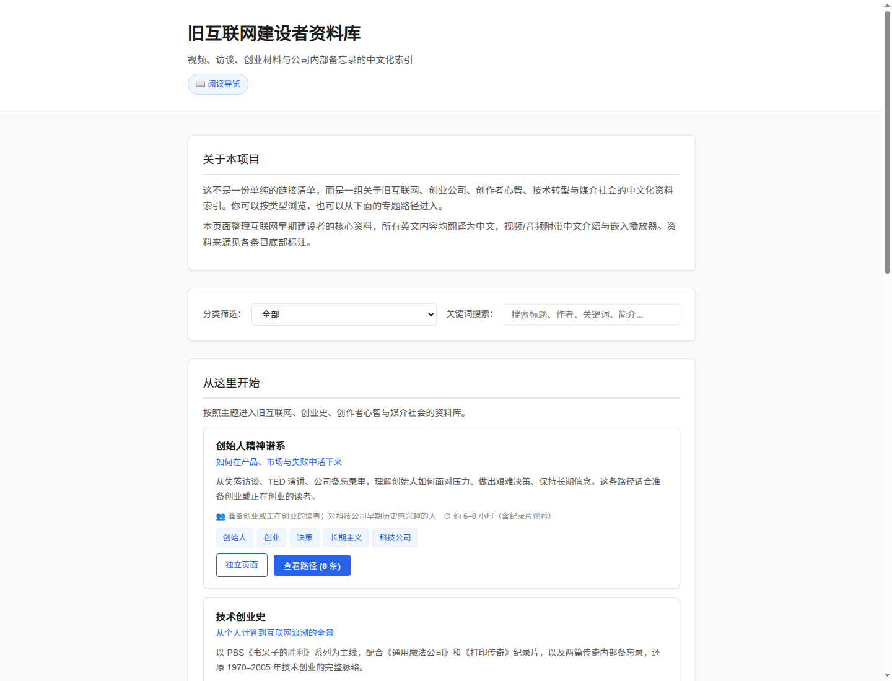
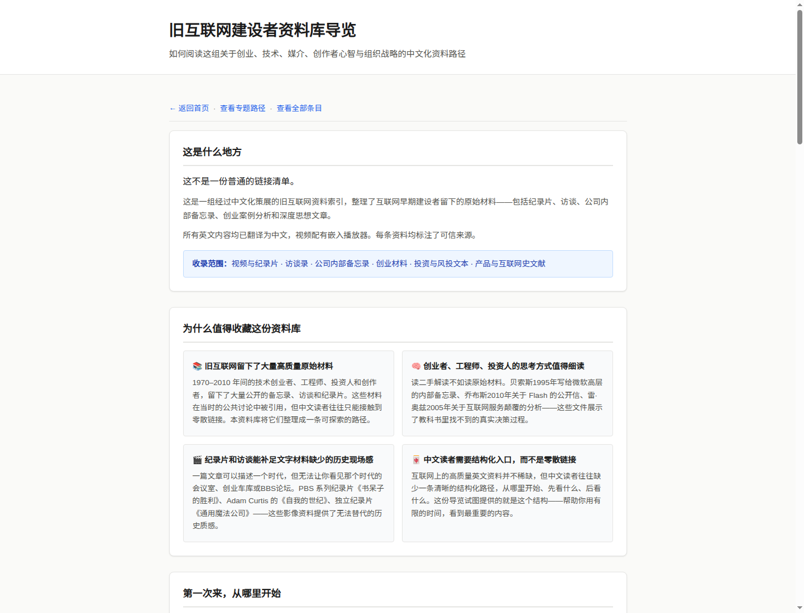
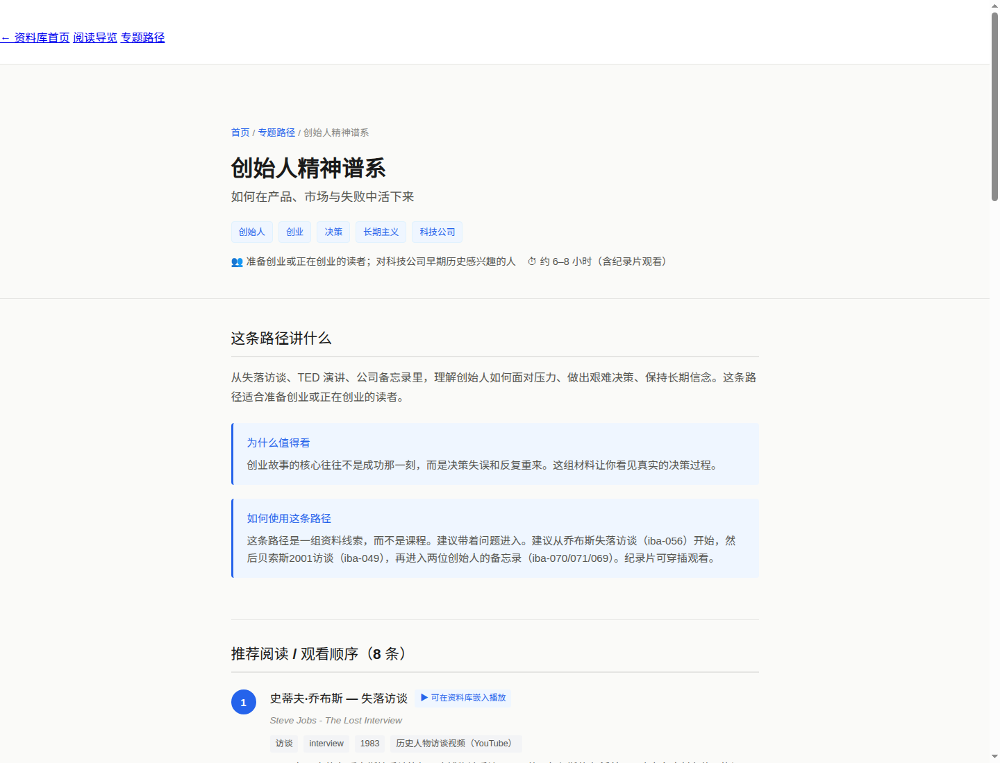
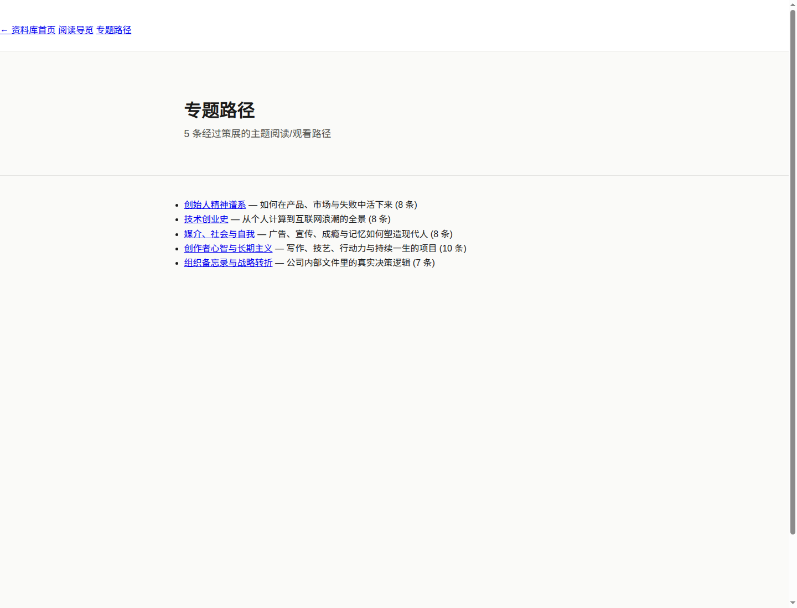

# 旧互联网建设者资料库 / Internet Builder Archive

> 视频、访谈、创业材料与公司内部备忘录的中文化索引

## 项目说明

本项目整理互联网早期建设者的核心资料，包括视频、访谈、创业材料、公司内部备忘录、投资资料、产品史资料等。所有英文内容均翻译为中文，视频/音频附带中文介绍与嵌入播放器。

## 目录结构

```
projects/internet-builder-archive/
  index.html          # 主页面
  styles.css          # 样式表
  app.js              # 交互逻辑（筛选、搜索）
  data/
    items.json        # 条目数据
  docs/
    DATA_SCHEMA.md    # 数据字段说明
    CONTENT_GUIDE.md  # 录入规范
  README.md           # 本文件
```

## 条目分类

- 视频与演讲
- 访谈
- 创业材料
- 公司内部备忘录
- 投资与风投
- 产品与互联网史
- 其他

## 更新方式

1. 用户提供原帖截图或资料列表
2. 按 `docs/CONTENT_GUIDE.md` 规范录入每条资料
3. 更新 `data/items.json`
4. 提交前校验 JSON 格式：`python3 -c "import json; json.load(open('data/items.json'))"`
5. 本地预览后提交

## 发布方式

静态文件由 GitHub Pages 直接托管，`index.html` 为入口。

## 注意

- 当前所有条目均为 **placeholder** 状态，待用户提供真实资料后替换
- 未经确认的链接不得伪造，外链标注为 `[待补链接]`
- 不确定来源时不得臆造

---

## Launch Materials / 发布材料

本项目的对外传播材料存放于 `docs/launch/` 目录：

- [中文发布长文](docs/launch/LAUNCH_POST_ZH.md) — 适合发布在博客、微博、 newsletter 等平台
- [X 帖子串草稿](docs/launch/X_THREAD_ZH.md) — 10 条中文 X 帖子，适合直接发布于 X/Twitter
- [README 展示段落](docs/launch/README_SHOWCASE_BLOCK.md) — 可直接复制到项目 README 的 Markdown block
- [专题路径短发布帖](docs/launch/PATH_SHORT_POSTS_ZH.md) — 5 条路径各 3 种中文版本 + 短标题 + 英文简介，适合 X/朋友圈/Telegram
- [社交分享卡片 SVG](assets/iba-share-card.svg) — 1200×630 社交分享展示卡片，可用于 X/社交平台配图

---

## 待复核条目 / Staging Items

当前有 4 条 staging 条目处于待人工复核状态，复核完成后可转 verified 或删除。复核指南和机器可读文件：

- [staging 人工复核清单](docs/STAGING_REVIEW_PACKET_ZH.md) — 逐条复核说明，包含 P0/P1 优先级和建议处理动作（当前 4 条 P0 待复核）
- [staging_review.json](data/staging_review.json) — 机器可读复核文件，适合程序处理（Phase 2B-B 使用）

---

## 页面截图 / Screenshots

> 以下截图使用 Chromium headless 截取真实页面。视口 1440×1100（桌面端）或 390×1200（移动端）。

### 首页



### 导览页



### 专题路径：创始人精神谱系



### 专题路径索引



### 5 条专题路径独立 SVG 分享卡片

位于 `assets/path-cards/`：

- [founder-spirit.svg](assets/path-cards/founder-spirit.svg) — 创始人精神谱系（8 items）
- [tech-startup-history.svg](assets/path-cards/tech-startup-history.svg) — 技术创业史（8 items）
- [media-and-society.svg](assets/path-cards/media-and-society.svg) — 媒介、社会与自我（8 items）
- [creator-mindset.svg](assets/path-cards/creator-mindset.svg) — 创作者心智与长期主义（10 items）
- [organization-and-strategy.svg](assets/path-cards/organization-and-strategy.svg) — 组织备忘录与战略转折（7 items）

---

*最后更新：2026-05-31 | 状态：Phase 2K 完成*
