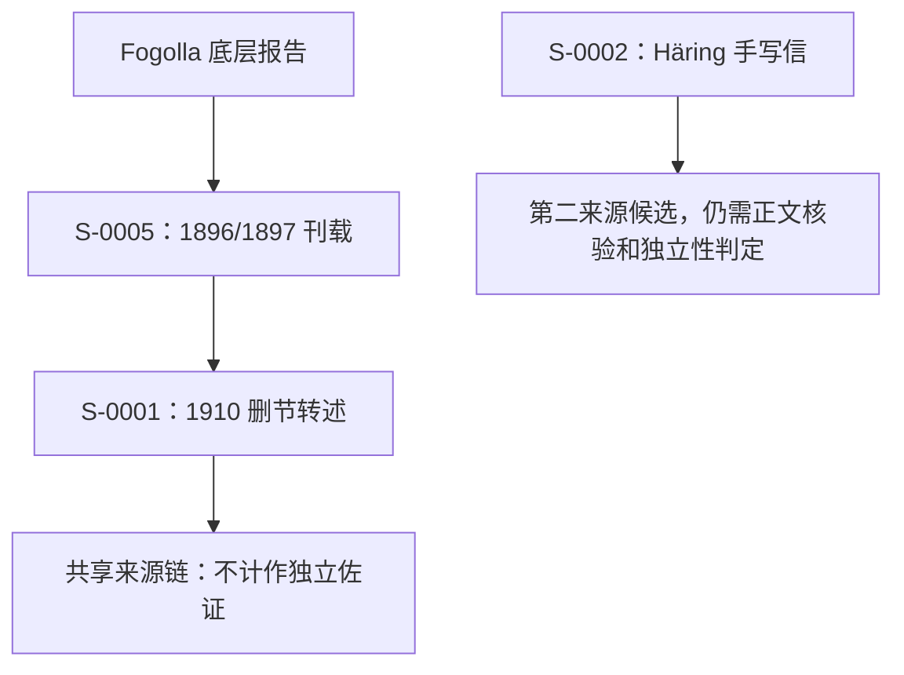

# Research-to-Drama Engine｜开发纪事（P1–P10）

[返回中文图文介绍页](https://conanxin.github.io/projects/research-to-drama-engine/) · [项目说明](README.md)

> 整理基线：2026-09-19。依据项目 Notion 记录与用户提供的 Hermes 执行回执；不是在此公开仓库重新执行的云端代码测试。最近研究 checkpoint 为 `6ff24a7`。下面的历史短提交号来自原研究仓库，**不是本网站仓库的提交链接**。最早文件、精确 Git 时间和测试入口仍需在原工程发布时复核。

## 1. 起点：不是先写戏，而是先回答“为什么能写”

最初目标不是直接交付一部完整历史剧，而是建立一条可检查、可追溯、可以拒绝越界的史料到戏剧文本工作流。问题从“模型能否生成文字”变成“这句话依据什么材料，使用了哪项权限”。

历史证据强度与戏剧使用方式是两条独立轴。用户接受一段文本，不会让这段文本反向成为历史证据。最小产物是逐单元授权的 Scene Text，不是成片或完整剧本。

本项目与 `classic-to-drama-engine` 不等同。后者以《奥德赛》经典文学改编起步；本项目以 Shohchow 相关历史材料验证研究到戏剧的转换。不因名称相近覆盖另一个仓库。

## 2. P1–P3：材料、命题与证据分开保存

**Source / Asset。** Source 描述文献，Asset 描述取得的具体文件。原始扫描、阅读渲染、模型读稿有不同来源与处理过程，不能混成一个对象。

**Claim / Claim Occurrence。** Claim 保存研究命题，Occurrence 保存原文的出现位置与逐字材料。推断产生的命题不能伪造“原文出现”。同一段文字可能包含视觉观察、叙述者解释和他人转述等不同层次。

**Evidence Assessment / Inference Record。** EA 记录来源支持什么及其限制；IR 保存推断的前提与过程。例如局部签名、首字母和连续页线索形成的 Fogolla 身份推论，仍应是 INFERRED，不能变成“本页已明确署名”的直接事实。

早期逐步形成正确的回退方向：World 发现证据未处理，就回到 Evidence；Evidence 发现命题范围或行动阶段有误，就回到 Claim。不能由下游生成器悄悄修补上游历史。原记录中的 P3 closeout：`d51751c`。

## 3. P4：Historical World 是一道准入边界

WRD 保存准入、排除或重建的理由，WP 承载获准的世界命题。这不是把全部 Claim 复制成“真相库”，也不是允许后续文本任意增加事实。

历史地名字面、现代地点解析与空间投影被分开。一个非空间命题不必因为没有现代坐标而全部阻塞；反过来，读出一个历史地名也不代表已经完成现代定位。

早期里程碑：`c6cebb6`（最小 World）、`17bdb7b`（Location v1）、`36bbb5f`（Spatial v1）、`2d99f3a`（P4 checkpoint）。

## 4. P5–P7：把创作权限落实到文本单元

Dramatic Decision 区分历史约束与真正的创作补全授权。Scene Blueprint 指定输入的 WP、有效 DD 与 completion slots。Scene Text 每个 unit 说明它是 WORLD_RENDERING，还是使用了一项获准的补全。

**STX-0001：允许补全，但必须说清楚。** World basis 是“1876 年决定修建小教堂”，不是“教堂已经建成”。四个单元分别承载历史行动与获准的站位、最小动作、对白措辞。对白即使被批准，也不是历史逐字原话。

**STX-0002：没有权限时真的不补。** 最终状态文本仅保留“1868年，Pa-tae 仅剩一户五口人的基督徒家庭”，没有人物姓名、天气、动作或情绪。零槽位是测试条件；零槽位不等于零 DD。

相关节点：`ad4450a`（P5）、`02f285d`（P6）、`aebfde7`（P7接口）、`18b6bb0` / `fa5977c`（STX-0001生成 / 验收）、`731a695`（最小闭环）、`0273ba3` / `a6b4b49`（STX-0002生成 / 验收）。

## 5. P8：两次纠错，比“全 PASS”更值得公开

### 5.1 零槽位不等于零 DD

`1091668` 曾误认为 Scene Blueprint 可以不含 DD。`8753fb7` 重新读取 live Schema 后纠正：需要至少一个已批准 DD。最终以一条最小 Historical Constraint 满足约束，而不是修改 Schema 来迁就错误理解。

Sie-kiatun 样本保留作者停留一日、13 名 neofiti、cresima。neofiti 不额外强化成已领洗者，cresima 保持坚振礼，作者不静默实名为 Fogolla，停留一日不变成到达后一日内。经 `WP-0019 / WRD-0021 → DD-0009 → SB-0003 → STX-0003` 完成验收。

### 5.2 两个 Source ID 不等于两条独立证据链

`791e6e2` 一度把 S-0001 与 S-0005 当作两条来源链。`425f893` 的复审依据 SR-0001 发现：Ricci 明示其文字是 Fogolla 原报告的删节。1896/1897 刊载与1910删节出版，共享同一底层报告。

`e9db61a` 记录更严格的来源独立性标准获用户接受。已验收样本仍有效；撤回的是它们足以证明 L3 的判断。正式成熟度回到 L2，L3 保持 CONDITIONAL。

不同作者、年份、语言、载体能帮助发现候选，但不自动证明某个具体命题的来源独立性。

## 6. P676：把顺畅故事拆回五个命题

| Claim → World | 保留的信息 | 尚未证明的联系 |
| --- | --- | --- |
| C-0084 → WP-0024 | 旅店遇见商人及货物、来源与去向信息 | 与后文受害者是同一个人 |
| C-0085 → WP-0021 | 三名骑马者伪装为商人跟随的视觉层 | 后续全部犯罪事实 |
| C-0086 → WP-0020 | 预备行劫及察觉作者到来后继续赶路 | 此次已经抢劫得手 |
| C-0087 → WP-0022 | 几乎同时抵达无名旅店并过夜 | tutti 全部成员、旅店同一性 |
| C-0090 → WP-0023 | 作者转述的既遂抢劫与结局 | 作者目击、跨日同一组三人 |

C-0085 曾拟折叠进 C-0086。复审后保留两个 WP，因为视觉描述与叙事身份归因不是同一语义层。信息保留优先于最少对象数量。

`c8347be` 验收 STX-0004：同一 Scene 使用两个 WP，但两个 WORLD_RENDERING units 各自只绑定一个 WP。`c34315f` 验收 STX-0005：显式转述框架一直保留到最终文本。

`dbf64b8` 完成五个命题的 World 准入。5/5 是准入覆盖，不是完整连续抢劫故事、跨日身份关系或 IR-0003 已得到证明。

## 7. P9：手稿尚未核验，怎样继续而不伪装完成

S-0002 是 Häring 德文手写信扫描件，没有可用文本层。`3e56588` 准备阅读渲染与转写契约，`9428f8d` 保存模型辅助读稿，`9e32fb6` 记录第二次模型视觉复核。

两次模型读法一致，不是两条独立历史来源，也不等于真人校读。项目采用 verification-deferred Shadow：在报告层模拟后续对象，不写入正式 Claim、EA、World 或 Drama 记录库。

P5 一般性捐助命题先被测试，随后保留并推迟 Drama。更自足的 P2 赠书事件成为最小样本：P. Hugo 告知 Häring，收信方 Eure Exzellenz 曾向 unsere Mission 赠送一本 Meßbuch。P3 另外三本和 P5 捐助状况不混入。

| 阶段 | 原研究记录节点 |
| --- | --- |
| Shadow Claim | c6f483e |
| Shadow Evidence | 03d45fa |
| Shadow World 冻结 | 30c413e |
| Shadow HC DD 冻结 | b829a07 |
| Shadow SB 冻结 | 4237329 |
| Shadow STX 草稿 | 3276f7e |

Shadow 的作用是测试这个样本的接口与语义传播，不是绕过转写核验或预批准正式研究对象。

## 8. 文本修订：准确与好读是两条评价轴

`82fd30e` 给出语义通过、表达建议修订。“已 completed 赠书事件”、重复中介说明和过重审计措辞被标为表层问题。`2265e52` 修订，`63f5a65` 复评为可验收，`64dad64` 接受当前版本。

> 据 Häring 信中转述，其会兄 P. Hugo 告诉他，收信方（原文称 'Eure Exzellenz'）曾向信中所称的 'unsere Mission' 赠送一本 Meßbuch。Häring 没有声称自己亲眼目击这一赠书过程。

保留 MINOR_SCOPE_NOTE：末句只解释本信 P2 这段记述，不证明 Häring 实际未在场，不主张他从未在其他材料中声称目击。验收不是最终文学锁定。

期间出现 Telegram 中断与重复回执。恢复应先确认真实 HEAD 和已落盘内容，而不是盲目重跑。检查项数量、字符数和日志数量不能代替实际语义判断。

## 9. P10：把外部依赖缩小到需要核对的段落

`64dad64` 后停止扩展 Shadow。`e557575` 梳理最小核验范围，`8201ffe` 准备材料；P2 四行核验请求已发送，`6ff24a7` 记录 SENT_WAITING_REPLY。

馆方既有邮件另有日期与收信人说明，但那不等于 P2 逐字核验。日期冲突、机构元数据、正文校读和内容来源独立性应分别记录。请求由用户授权后通过 ChatGPT 的 Gmail 连接发送；Hermes 记录的是外部动作回执。

发送不等于收到确认，确认读法不等于独立证明赠书事件。后续须区别确认、改字、不清楚与纯行政答复；不能把任一回复都变成 VERIFIED。

## 10. 公开什么，尚不能宣称什么

记录支持：五个正式 STX 样本验收；有受控补全与零补全；multi-WP 和 reported-narrative 路径；P2 Shadow 样本经历生成、修订、复评和用户验收。

尚未验证：第二条 canonical 独立来源链端到端、整页人工校读、所有 Evidence tier 的 Drama 泛化、完整剧本产物、通用自动执行服务、任意史料下的可靠性。L2/L3 是本项目内部等级，不是外部认证。不要使用“工程完成95%”“整个项目完成85%”“保证零幻觉”等未经测量的宣传。

当前公开的是本网站、图解和开发文档；真实 Engine 源码仍需从原工作树形成公开发行。发布时保留代码、Schemas、Skills、必要测试与实际运行入口；不公开私人邮件、个人地址、凭据、原始私人扫描或未筛选日志。第三方代码的上游与许可证应按真实文件保留。

不从聊天摘要重写“替代引擎”，不把静态介绍页的启动命令冒充 Engine 安装方式。原始研究 Git 中的历史短提交号可以作为来源索引，但不能伪装为公开发行仓库的有效提交链接。

## 11. 接下来怎样完成核心验证

研究路径：真人核对 P2 → 读取回复及纠正内容 → 正式转写资产与来源独立性审查 → canonical Claim/CO/EA → World → 获批 DD → 获批 SB → 获授权生成并经用户验收的 STX → 重新判断 L3。

发布路径：从真实工作树导出可公开工程 → 核实许可证、测试与 quickstart → GitHub 公开仓库 → README 与 Homepage 链接本站。研究等待和发布可以并行，但两者的通过条件不同。

**停止无收益重复。** 已完成的 Shadow 样本不因等待外部回复而继续制造准备阶段；新研究证据到来时从相应入口恢复。公开文档诚实记录已完成、未完成与纠错，比把所有回合重述成“全 PASS”更重要。
