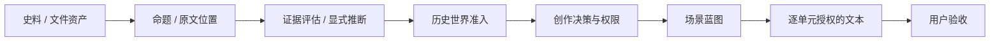
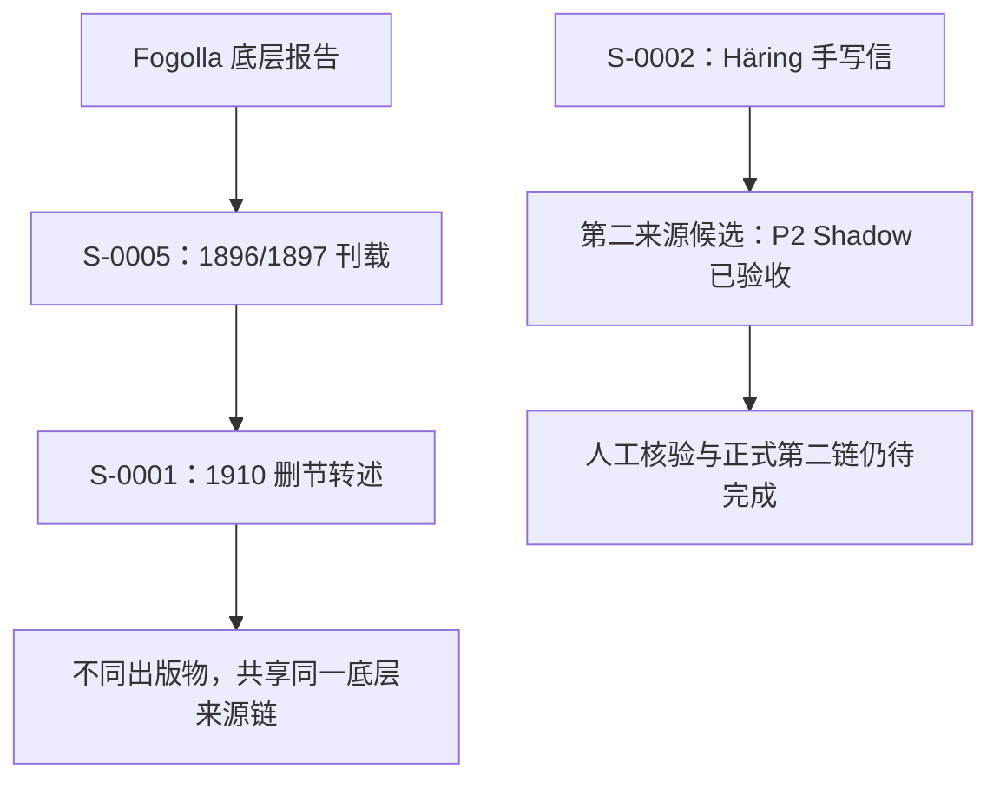

# Research-to-Drama Engine

## 让每一段生成文本，都能说明自己的证据与权限

**[打开中文图文介绍页](https://conanxin.github.io/projects/research-to-drama-engine/)** · **[阅读开发纪事（P1–P10）](DEVELOPMENT.zh-CN.md)** · [查看网页源码](index.html)

> 发布范围：本目录公开中文介绍页、方法图解和开发纪事，**不是完整 Engine 源码发行版**。原工程 `research-to-drama-skills` 尚待从原工作树导出可公开的源码、Schemas、Skills、测试与运行说明。不要将名称相似的 `classic-to-drama-engine` 当成本项目。

## 项目是什么

Research-to-Drama Engine 是一套以史料为依据、按文本单元记录创作权限的研究协议与 Agent 工作流原型。它不把“读到材料”和“可以写成戏剧”视为同一件事，也不把用户接受的生成文本反向当成历史证据。



这张图说明工作流，不代表一条已经实现的全自动命令。真实执行包含 Agent、JSON Schema、研究判断和用户审批。

## 三个最容易越界的地方

| 材料或状态 | 必须保留的边界 | 不应自动写成 |
| --- | --- | --- |
| 决定修建小教堂 | 行动阶段是“决定” | 教堂已经建成 |
| 作者转述抢劫事件 | 转述不等于作者目击 | 作者视角的现场重演 |
| P. Hugo 告诉 Häring 一本赠书的消息 | 具名中介、一本、来源层级 | Häring 在现场接书，或把另外三本合并进来 |

有明确授权时可以使用对白、最小动作等创作补全；但这些内容仍是戏剧创作，不变成史料原话。没有授权时，`completion_slots=[]` 必须真的意味着不补写。

## 为什么两个来源编号仍然不够



S-0001 对 S-0005 的删节依赖，使“两个 Source ID 就是两条独立证据链”的早期判断被撤回。项目保留了这次纠错，而不是把开发过程改写为一路通过。

## 当前验证范围

整理基线：2026-09-19；最近研究回执 `6ff24a7`。以下为项目记录所支持的状态，不是本目录重新执行云端测试的结果。

- 五个正式 Scene Text 样本已验收，覆盖有补全、零补全、实践、多 WP、显式转述等不同形态；它们仍属于同一 Fogolla 底层来源链。
- S-0002 的 P2 Shadow 样本已完成生成、表层修订、复评和用户验收。它验证的是**这个样本的工作流与语义边界**，不是独立史料认证。
- 正式成熟度保持 `L2`，`L3=CONDITIONAL`。L2/L3 是项目内部验证等级，不是行业标准。
- P2 人工核验请求已经发出。发送请求不等于收到确认；文本读法确认也不等于独立证实赠书事件。

尚未证明：第二条 canonical 独立证据链端到端完成、所有 Evidence tier 的戏剧泛化、任意史料下的可靠性、完整剧本产品或通用自动执行服务。不使用未经测量的完成百分比，也不承诺“零幻觉”。

## Canonical 与 Shadow

| Canonical 正式研究层 | Shadow 验证实验层 |
| --- | --- |
| 有真实来源与正式准入记录 | 在未完成转写核验时模拟接口与语义传播 |
| 使用正式记录 ID 与审批 | 使用 `VALIDATION-…` 命名空间 |
| 正式文本必须走完整审批 | Shadow 验收不能替代正式审批 |
| 证据及来源独立性需要审查 | 两次模型读法一致不等于人工校读或独立佐证 |

不能通过改名或复制状态，把 Shadow 对象直接变成正式对象。

## 本目录

```text
projects/research-to-drama-engine/
├── index.html               # 中文介绍页；三张内联 SVG 图解、案例切换与时间线
├── README.md                # 项目入口与真实发布范围
└── DEVELOPMENT.zh-CN.md     # 开发纪事、关键纠错与历史提交索引
```

网页是静态 HTML/CSS/JavaScript，不需要后端、登录或数据库。下载本目录后可直接打开 `index.html`。Engine 的安装及测试命令必须从实际工程恢复；本目录不提供尚未核实的 CLI、pip 包名或启动参数。

## 源码开源的剩余工作

从原 `research-to-drama-skills` 工作树导出真实工程，保留原有许可证和第三方归属，提供可运行的最小示例与实际测试入口。公开发行树不包含私人邮件、个人地址、凭据、原始私人扫描或未筛选日志，也不直接携带可能含有这些内容的全部研究 Git 历史。

完整 Engine 仓库发布后，其 README 与 Homepage 应链接到：

**https://conanxin.github.io/projects/research-to-drama-engine/**

网页公开、源码公开和史料核验是三个不同的完成条件。当前不能把中文页面公开表述为完整 Engine 已开源。
