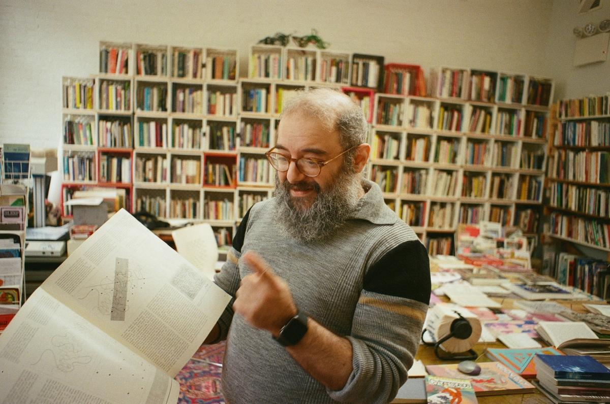
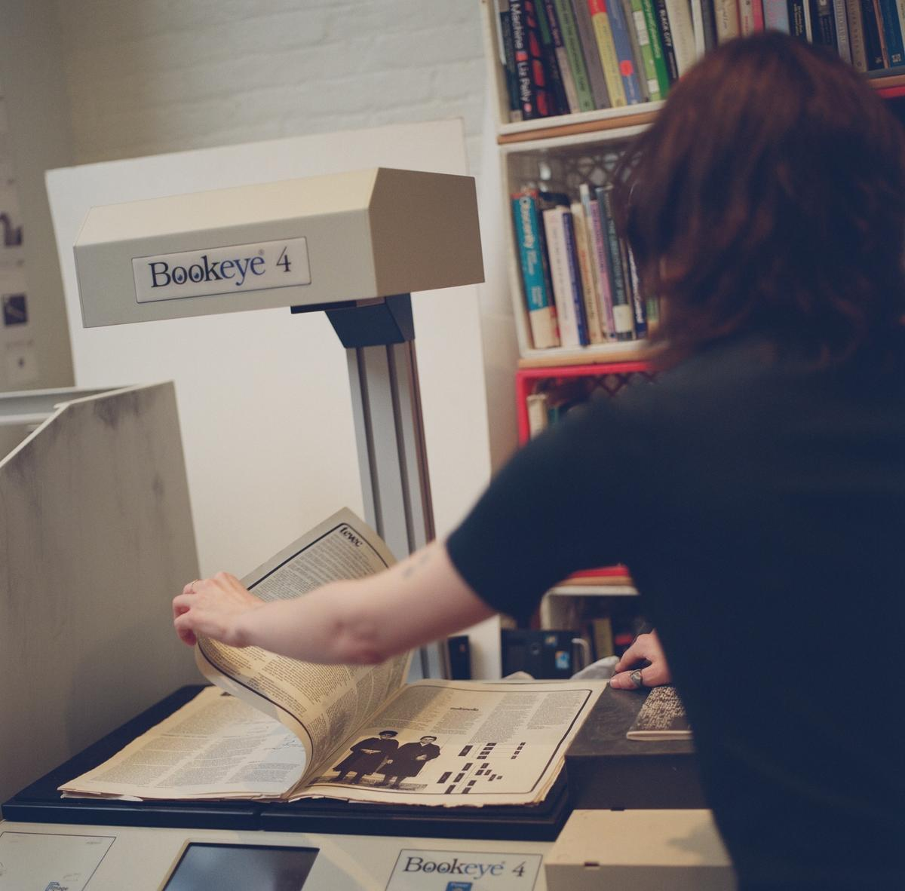
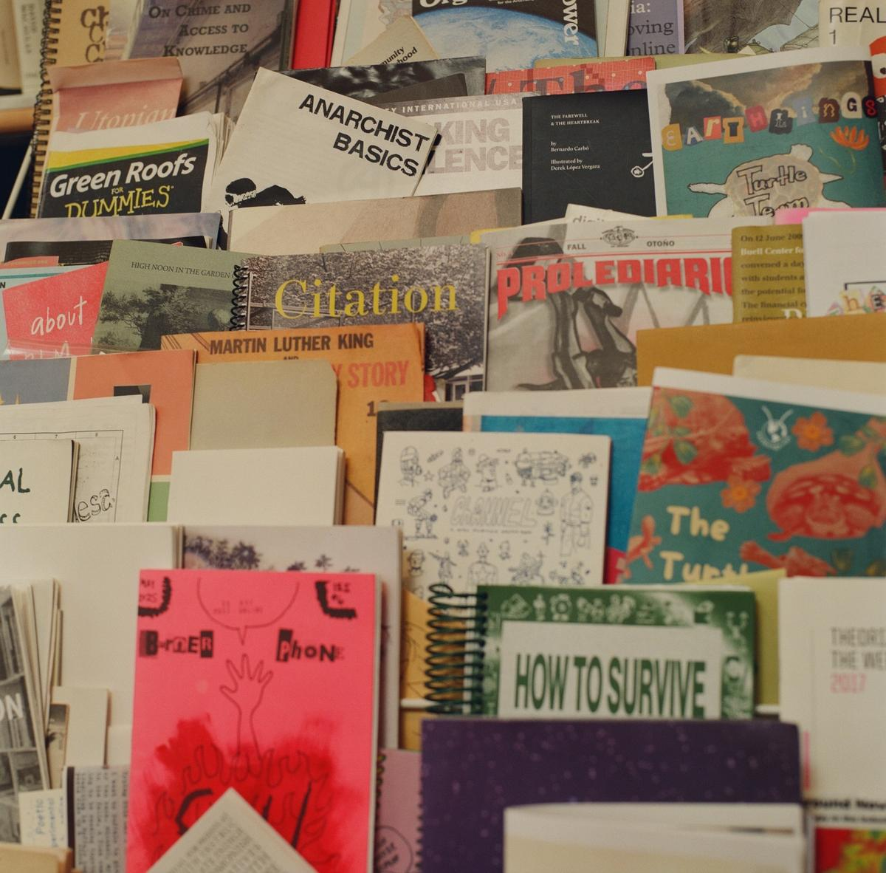

# 与「控制论图书馆」幕后成员的对谈

**原文标题：** An Interview with the People Behind the Cybernetics Library

**发布日期：** 2026 年 7 月 16 日

**作者：** 梅格娜·拉奥（Meghna Rao）

**发布平台：** Are.na Editorial

**原文链接：** https://www.are.na/editorial/an-interview-with-the-people-behind-the-cybernetics-library

---

**主频道：** [控制论图书馆（cybernetics library）](https://www.are.na/meghna-rao/cybernetics-library-_oezd5pp_3k)

**相关条目：** [丹·泰英（Dan Taeyoung）](https://www.are.na/dan-taeyoung) · [梅兰妮·霍夫（melanie hoff）](https://www.are.na/melanie-hoff) · [控制论会议（Cybernetics Conference）](https://www.are.na/sam-hart/cybernetics-conference) · [萨尔·哈默曼（Sal Hamerman）](https://www.are.na/sal-hamerman) · [萨姆·哈特（Sam Hart）](https://www.are.na/sam-hart) · [信息系统（Information Systems）](https://www.are.na/sam-hart/information-systems) · [控制论数字图书馆（Cybernetics Digital Library）](https://www.are.na/david-hecht/cybernetics-digital-library) · [米米·奥努奥哈（Mimi Onuoha）](https://www.are.na/mimi-onuoha)

**分类：** [Learning in Public](https://www.are.na/editorial/category/learning-in-public)

---

[控制论图书馆（Cybernetics Library）](https://cybernetics.social/) 坐落在地狱厨房区一家合作社里一间小而明亮的房间。比起反主流的知识传统，这里更以百老汇和装饰艺术建筑闻名。从地铁站走过去要十分钟，一路上没什么像样的食物可选，除了 Whole Foods 的熟食柜台。我仍然时常来访——无论是在毒日头底下顶着曝晒，还是顶着大片大片的雨水——而我从来没有一次失望而归。在这个[仅供馆内浏览的图书馆（browsing-only library）](https://cybernetics.social/) 里，书籍是很好的陪伴：上百本书连同小册子、海报和其他杂物一起，被码放在彼此堆叠的格子牛奶箱里。但更好的陪伴，还是这两位图书馆员——戴维·艾萨克·赫克特（David Isaac Hecht）和查斯基（Chaski，Saskia Knowles）。一周里大多数日子，他们都在那儿，陪伴他们的，是各自高高堆起的、贯穿历史的一摞摞书。

戴维有个关于这家图书馆的老笑话。它不只是「装着」关于控制论的图书——它实际上是在「表现」控制论。要给控制论（cybernetics）一个粗略而宽泛的定义，或许可以从它的词源说起：希腊语 *kybernētēs*，意思是「舵手」——在凶险难测的水域中领船前行的人。控制论研究的是各种系统——它们依据反馈（feedback）做出反应，并相应地改变自身；一种信念是：持续的演化，能让人免于被熵（entropy）掀起的浪涛拍翻。

做这次访谈的那个春日礼拜，我到访时看见戴维踩在一架折叠梯上，正在整理一批大丰收的战利品。布鲁克林南区有一栋房子正在出售，戴维得到了线报：那家的主人藏书很多，却没有处置它们的计划。房间另一头，查斯基正在架起一台大扫描仪，准备用于他们的新项目——[控制论图像图书馆（Cybernetics Image Library）](https://cyberneticsimagelibrary.dev/)。窗外那棵树上终于冒出了点点新芽——在熬过漫长而凛冽的冬天之后。这家图书馆——是我自己想多了，还是这就是控制论的魔力？——已经和我上次来时感觉不一样了。

**梅格娜·拉奥：** 请描述一下控制论图书馆。

**查斯基：** 就是我们所在的这个空间，这里面的物件。书、小册子、那些用完即弃的小东西，还有一些特别的物品。它也是人们走进来、四处翻看、看着这些东西，并由我们或其他访客引导的过程。它是开放时间，是阅览室时间，是戴维和我的大型「表演」可能发生的时刻。它也是各种项目和合作的一个节点。还有我们做过的那些装置、工作坊和艺术项目。

**梅格娜：** 你好几次都这么说：「控制论式」图书馆的一种定义方式，就是它会接收反馈，并从中演化。

**戴维·艾萨克·赫克特：** 确实。其实，图书馆的诞生本身，就是非常明确的反馈。「控制论」这个词，已经随着它被编进军事思维和硅谷的叙述而多少消失了。诺伯特·维纳（Norbert Wiener）——是这个词的创造者——后来公开否定了自己在二战期间为军方所做的早期研究：他当时搞明白的是，一门火炮可以被编程，根据它对过往事件的「记忆」来开火，每次都比上一次更准。后来很多年，一位研究员问起他这件事，他写了一封极其火爆的信，公开与他自己当年的研究划清界限。那些仍然坚持这个词最初的解放性含义的人，往往是嬉皮士和另类的学者。也就是说——研究我们所身处其中的系统，研究我们如何改变这些系统，以及这些系统如何反过来改变我们。

所以，一家控制论图书馆，正是明确地建立在这个循环之上。这也是它和很多其他图书馆不一样的地方——很多别的地方有更多的门槛、官僚程序和结构，决定了一个研究者要如何「登记进入」那个图书馆。

**梅格娜：** 让我回到最初。查斯基是后来才加入的，但一开始只有你，对吗？

**戴维：** 对。在图书馆之前是一个读书小组。那是 2015 到 16 年。我那时候和[丹·泰英（Dan Taeyoung）](https://www.are.na/dan-taeyoung/channels)、[梅兰妮·霍夫（Melanie Hoff）](https://www.are.na/melanie-hoff/channels) 是朋友，经由他们听说了「控制论俱乐部」这么个东西。我一下子就兴奋起来——本科时我学过认知科学和建筑关系，对系统很感兴趣。我也非常反对学科化，不喜欢我们人为设定的那些硬边界。所以那个俱乐部正合我胃口。

读书俱乐部其实就开在这里——[Prime Produce](https://www.primeproduce.coop/)，也就是我们至今仍在运营的这家合作社。后来，其中一位组织者筹办了一场[关于控制论的会议](https://www.are.na/editorial/cybernetics-conference)。我和另一位馆员[萨尔·哈默曼（Sal Hamerman）](https://www.are.na/sal-hamerman/channels)，是在一次晚饭上，被组织者之一[萨姆·哈特（Sam Hart）](https://www.are.na/sam-hart/channels) 临时拉去组织图书馆的。所以图书馆大概就是在那顿饭桌上「孵」出来的。那场会议就在 Prime Produce 开，而且大获成功。满到不可思议。没有人提前离场。至今我们都还会遇到人说「我当年在场」，我们就会——哇，传奇啊。那算是「零点坐标」。

**梅格娜：** 那么最初的图书馆，主要是你家里的书？

**戴维：** 主要是我出的。萨姆也给了些。在图书馆开始之前，萨姆和我各自建了一个 Are.na 频道，搜集相关的书。后来，萨姆把他那部分书的大部分都带去了柏林，这也就成了柏林图书馆的起点。而我对「买书」这件事的明显病态，突然之间有了一张通行证——现在我可以说，「哦，这是给图书馆买的。」

**梅格娜：** 控制论也用在你组织这个图书馆系统的方式上吗？显然它不是按杜威十进制、按主题、甚至按字母顺序排的。

**戴维：** 元数据（metadata）对我们来说是个有意思的问题。我们有许多物品，本身并不带元数据。有些小册子没有文字，也不适合用我们使用的那个系统——一个叫 LibraryThing 的目录——来归类。但图书馆在诞生时做了一件事，让它一直保持灵活：我们用自定义方式给每一样东西都打了标签，超越了「标题、作者」这种标配元数据。一本书可能带着来自[美国国会图书馆（Library of Congress）](https://www.loc.gov/) 的标准著录。然后我们可能会再深挖一层，写下——嗯，这本书其实暗中讲的是战争技术。我们开始用更人性、更灵活的方式来给这批收藏编码。你可以找到两件东西——比如，一张地图和一本——按标准系统捕捉不到，但按我们这些标签却彼此相关。

**梅格娜：** 你们怎么挑选上架的书？

**戴维：** 主要是凭感觉。如果你把某本书递给查斯基或我，你会从我们的反应里「读」出来。是一种身体上的「要」。

**梅格娜：** 你们有没有说过「不要」？

**戴维：** 极少。远远少于我们应有的「不」。所以我们开始向其他方向扩张，作为弥补。隔壁房间有一个相当规模的诗歌藏书；楼上花园也配了一组相关藏书。地下室有一个小书架，摆的是工具制作和加工类的东西。有时候我们会把一样东西拿来，然后说：「其实，这玩意儿应该放在别处。」有一本很重要的书我放在桌边——是 MoMA 出的一个关于意大利厨房设计的展览册——有段时间我一直把它放在外面，心想：「不行，这太学科、太专门了。」然后我又翻了翻，想：这其实是一个「控制论式的厨房」啊。哇。它完全契合。

这个问题很难回答！比如这些「教你写代码」的书。说实话，有些情况下我会拒绝这一类，但例外是——它们大多数来自泰德·纳尔逊（Ted Nelson）。比如，最近有谁会对 Windows 98 感兴趣吗？可它代表了家庭计算史上一个重要的节点。所以它当然也重要。

**查斯基：** 这种「难以归类」的特质，反而让它保持灵活，保有控制论的气质。也许也包括某种安全感。抵抗一个轻易的定义，似乎就是这种状态的一部分。我个人并不想去化解那些张力，也不想把这儿的每一件物品都完美地归类。

**梅格娜：** 然后你们还不断在加新的内容，比如查斯基的图像图书馆。

**查斯基：** 对！我第一次来这个图书馆，是 2022 年跟着我在研究生院上的一门课一起来的。我把每一样东西都拍了下来，因为实在没法一次性全部装进脑子。我想把这些照片分享出去，但我想确保把它们和它们原本的语境挂上钩。一年后我开始参与图书馆的工作，就开始搭建图像图书馆的基础设施——把所有这些照片和它们来自的书、小册子挂上钩，也和其他地方挂上钩。我有时用它们做成贴纸；还有一些「故障效果」，是把两张图像叠在一起。

**戴维：** 它非常「超文本」（hypertext）——有那个味道。你知道[泰德·纳尔逊对网络的批评](https://www.are.na/editorial/information-systems)——你点一个链接，就「掉进去」了，完全没有「你从哪儿来」的感觉。他整套想法就是：万物应当互相联系。查斯基在做的正是这件事。

---

> **原网页嵌入：Are.na 频道**
>
> **频道名称：** Cybernetics Digital Library（控制论数字图书馆）
> **创建者：** David Hecht
> **原始链接：** https://www.are.na/david-hecht/cybernetics-digital-library
> **频道简介：** Controlnets Library Digital Collection / Cybernetics Library Digital Collection. Contributors: Thank you so much for your additions! If you are able, please give your block a title that relates to its content, thus allowing the collection to be searched/filtered more easily.
>
> [在 Are.na 查看](https://www.are.na/david-hecht/cybernetics-digital-library)

---

**梅格娜：** 你刚才说「控制论」这个词多少已经消失了，只剩下嬉皮士还在用。我确实觉得这个词正在随着 AI 回到主流科技话语里，尤其是 RSI——那种会从自身学习、并调整自己的 AI。你们心中的理想读者是谁？你们在意现实影响吗？在意你们的读者群吗？

**戴维：** 我们不是技术乐观主义者（techno-optimist）。但我们确实相信，控制论把我们带到了今天，我们也在试着找到出路。我们所依附的那一脉知识传统，是关于我所谓的「加州意识形态（Californian ideology）」的批判性话语。我们对它是批判的，对那种由军方资金推动的轨迹也是批判的；但我们同时也在研究这些东西、与它们建立关系，这意味着我们愿意去与之对话。

我们对「谁来读、用这个图书馆」，持开放和多元的态度。我希望我们的读者是这样的人——他接触不到这些资源。也许他在科技行业工作，或者关注这个领域，但一直被排除在相关话语之外，甚至不知道有这个地方。也许他在我们收藏的这些材料里找到了共鸣与价值，能支撑他自己独立的工作。任何对既定叙事抱有怀疑的人，都欢迎。

**梅格娜：** 这正是书的妙处——你把它们摆出来，你无法决定任何人从里面带走什么。

**戴维：** 一点没错。你没法控制，会不会有人走进来读完一本书，然后冒出一句：「嗯，是时候去搞更多军事系统了。」这就是我们所有人所处的这个空间之所以复杂的地方。

**梅格娜：** 当然，也不是说你和查斯基就不在场。我在这儿每次拿起一本书，都一定听得到你的一些点评。

**戴维：** 没错，我们尽量提供一定量的批判性话语，确保人们对他们随手拿起的那些东西里的复杂与矛盾怀有敬意。同样重要的是，要认识到图书馆也不是中性的信息场所。我们最初那次会议上有一位艺术家——[米米·奥努奥哈（Mimi Ọnụọha）](https://www.are.na/mimi-onuoha/channels)——办过一个工作坊，讲的恰恰是：哪怕是国会图书馆的目录，也自有其独特的政治结构。我不认为有谁能站在一个「中立」的位置上。我希望人们找到东西，但我也会开门见山。

**梅格娜：** 我必须问一句——你们组织图书馆的方式，和你们认为「社会应该如何组织」，这之间有关系吗？

**戴维：** 我认为，社会将从更清晰的结构中受益——同时还需要某种无政府式的灵活。本地的组织、关怀，少一点[自上而下（top-down）的方式](https://en.wikipedia.org/wiki/Top-down_and_bottom-up_design)，以及那些能支持人们参与能力的结构。这就是你在图书馆里看到的。书的组织方式，很大程度上反映了人们是怎么使用它的。我们一直在努力搭建让一切更可达的基础设施。我们不会硬塞任何预设的组织系统给任何人，我们只是在轻轻地策展。

比如，有人走进图书馆，就想自由地翻每一格书架。我们喜欢这样。然后如果有人问「哪里能找到某个东西」，我们对它怎么组织心里有数，能帮他们找到、能帮他们建立联系。目录是有的。它并不是完全「自由落体」式的。

**梅格娜：** 你们怎么赚钱？

**查斯基：** 我们正处在一个激动人心的进程当中——正在成为一个有财政托管（fiscal sponsorship）的机构。我们刚刚成为一个更大的 501(c)3 名下的项目。在非营利领域这是很标准的事：如果你不想走完正式注册一家机构的法律流程、时间和麻烦，有一个机制是让你挂靠到另一个组织下面。这能让图书馆更可持续地运转——因为眼下我们基本上没有任何钱。我拿到过一笔非常小的拨款去做图像图书馆，但这种事并不常有。

**戴维：** 我们开始想各种办法赚钱。我们办活动、开始收门票，来的人确实很多。虽然基本上还是自筹资金，我们还没有真正想清楚怎么让它自我维持。很多人热爱它，但我们还没有想清楚下一步。

**梅格娜：** 你觉得「把图书馆做大」，会不会反而破坏它那种「控制论式的、在地的」吸引力？

**戴维：** 这是一个很切中要害的问题。我之前提到过，那种四处蔓延的连接，已经开始在很多地方生长。它在 Are.na 上有在线的枝蔓。最正式的另一个分支在柏林。Charles 是创始人之一，他在亚利桑那教书，他的办公室现在是图书馆的亚利桑那分馆。我们还遇到一位在俄亥俄教书的人，问：「我能不能开一个克利夫兰分馆？」

我和查斯基正在做一些长期愿景上的事，但我觉得有意思的是——如果这个项目能变成一种「别人可以复制」的模式结构。一组守护者彼此联网，整体对本地条件和需求作出反应——控制论式地反应。

**梅格娜：** 如果你只能挑一本书，递给一位刚来到图书馆的人——最爱的那本也好，能让他/她之后整段旅程都「立得住」的那本也好——你会给哪一本？

**戴维：** [那本关于 Sitterwirk 图书馆的书](https://soberscove.com/book/the-dynamic-library/)。是我特别钟爱的一个瑞士项目，讲的是一群人如何尝试用更横向、更参与式的方式来组织信息。他们讲，人与书之间的「界面」是一个有意思的工作场域，而且它涉及机器人和交互式系统——所以它非常「控制论」。

**查斯基：** 我会有点「抬杠式」地推荐[《No Archive Will Restore You》](https://punctumbooks.com/catalog/10.21983/P3.0231.1.00)，作者 Julietta Singh。或者更「cyblib 经典」一点的——[《Sex, Performance, and the 80's》](https://www.beatbooks.com/pages/books/40657/sex-performance-and-the-80-s)。还有一本经典是[《Online Searching: A Primer》](https://booksrun.com/9780938734307-online-searching-a-primer-3rd-edition)，里面有一段安抚初学者的话——大意是「电脑完全受到搜索者的保护，不会受到任何伤害」。每次读到这儿我都觉得好笑，它也让我想起我学用 Git 的时候，那种「要把一切搞砸」的恐惧。其实只要专注于本地，把东西搞砸真的很难。

---

**梅格娜·拉奥（Meghna Rao）** 是一位来自皇后区的作家与编辑。

---

## 原文信息

- 原文：*An Interview with the People Behind the Cybernetics Library*
- 作者：Meghna Rao
- 发布平台：Are.na Editorial
- 发布日期：2026 年 7 月 16 日
- 原文链接：https://www.are.na/editorial/an-interview-with-the-people-behind-the-cybernetics-library

## 术语对照（首次出现处已在正文中标注）

| 英文术语 | 中文译法 |
|---|---|
| cybernetics | 控制论 |
| Cybernetics Library | 控制论图书馆 |
| Cybernetics Image Library | 控制论图像图书馆 |
| feedback | 反馈 |
| entropy | 熵 |
| metadata | 元数据 |
| hypertext | 超文本 |
| browsing-only library | 仅供馆内浏览的图书馆 |
| fiscal sponsorship / 501(c)3 | 财政托管 / 501(c)3 非营利组织 |
| techno-optimist | 技术乐观主义者 |
| Californian ideology | 加州意识形态 |
| top-down approaches | 自上而下的方式 |
| RSI (Recursive Self-Improvement) | 递归式自我改进 |