**第 2 部分：马斯克的使命**

和大多数人一样，埃隆·马斯克有自己的一小撮人生目标。和大多数人不一样的是，他的人生目标之一是把 1,000,000 人送上火星。

在过去的几个月里，每当我和朋友解释我在写这一系列文章时，总会有那么一个明显的瞬间——在我提到「火星那件事」的时候。他们的面部反应从「什么？不要啊」到「噢太可惜了，亏我还一直觉得埃隆·马斯克听上去挺酷的，没想到他是个乱来的疯亿万富翁」再到「我该不该笑？还是 Tim 这事是认真的、他会不会不高兴？」

我没见过的一种反应是：「酷，听起来挺合理。」

我懂——直到最近我自己也是同样的反应。通常一句话里出现「火星」这个词，要么是在讲某个高深的天文学玩意儿，要么是某个极客的科幻玩意儿。而「殖民」这个词一般只出现在讲历史句子里。这两个词在现实世界里压根儿不该凑到一块儿。

为了解释为什么马斯克想把一百万人送上火星，我要给你介绍两个住在银河系另一端某个类地行星上的外星人——Zurple 和 Quignee：

Zurple 和 Quignee 住的行星叫 Uvuvuwu，它的形成比地球晚 12 亿年，但因为在 Uvuvuwu 上单细胞生物从简单进化到复杂只用了 3 亿年（地球上用了 16 亿年），Uvuvuwu 上的生命抢先一步，在 1,100 万年前就达到了人类级别的智力。今天，Uvuvuwu 上的生物已经远远领先于我们在地球上能梦想到的一切。

Zurple 和 Quignee 自从 240 万年前读研时认识以来就是朋友，他们最喜欢的活动之一就是观察整个银河系中新生的智慧生命，然后打赌它们是会灭绝还是「闯关成功」（他们有办法实时观测所有的行星，靠的是我们人类根本理解不了的科技）。

最近，Zurple 和 Quignee 一门心思盯着 143-Snoogie 行星上正在发生的事——也就是他们对地球的叫法。他们对 143-Snoogie 的兴趣始于大约 35 万年前，当时 Zurple 的 IntelligenceWatch APP 上弹出了一条提醒：

*143-Snoogie 上的生命已达到胎儿期智力。*

当时他正和 Quignee 一起吃午饭，他一提到这个提醒，Quignee 就说：「我跟你赌 2 赔 1，它们会灭绝。」Zurple 握了握手表示成交。为啥不呢？一直有一群物种可以追踪、可以当啦啦队，是件挺有意思的事。

但最近——大约从 100 年前开始——这两个外星人开始对 143-Snoogie 上的生命给予更密切的关注，而今天，他们完全被这颗行星上正在发生的事给迷住了。

要想明白为什么，我们来想一下他们之间的赌注，以及什么会让他们中的一个赢。Quignee 希望人类灭绝，热切地希望。Zurple 希望人类「闯关成功」，至于这个词什么意思，我们先放一放。

他们很可能在关注的一件事，是 143-Snoogie 生命史上各种灭绝事件的模式。让我们来看一看。

**宇宙的恐怖之处**

物种灭绝有点像人的死亡——它们一直在发生，频率温和而稳定。但一次*大灭绝事件*，对物种来说，就好比战争或者横扫性流行病对人类来说——一种不寻常的事件，一次性抹掉一大块人口。人类从未经历过一次大灭绝事件，而如果真的发生一次，合理的可能性就是它会终结人类——要么是事件本身就把我们弄死了（比如和一颗够大的小行星撞上），要么是事件的后果弄死了我们（比如某样东西摧毁了食物供应，或者剧烈改变温度和大气的构成）。下面这张灭绝图表显示了动物随时间的灭绝情况（以海洋生物灭绝为指标）。我已经标出了五次大灭绝事件，以及每次事件中损失的物种总数百分比（这张图上没有包括许多人相信正在成为新一轮大灭绝的事件——它正在当下发生，由人类的影响造成）：[1](#footnote2-1-3902)

[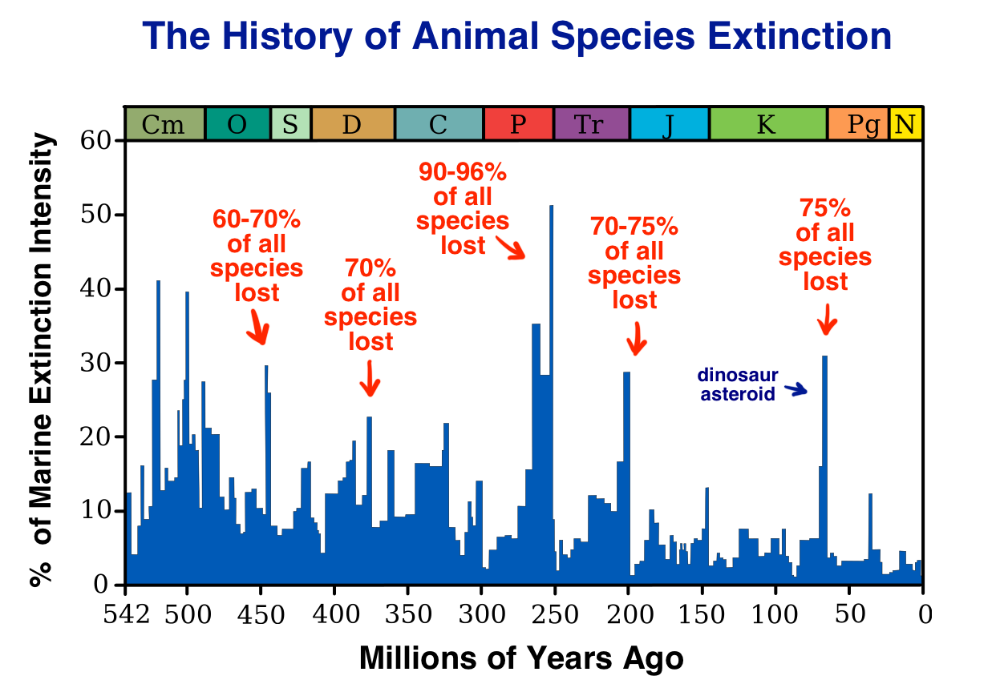](../assets/images/original/img_065_79e49fdb.png)

自然发生的灭绝事件可能由很多原因引起。宇宙是一个充满暴力、充满敌意的地方，而我们是一群脆弱的生物，依赖一系列精确条件之间的微妙平衡。我们现在还活着，是因为宇宙暂时允许我们活着。可能把我们抹掉的事情有：[2](#footnote2-2-3902)

- **一颗近邻的超新星。**超新星是宇宙里最大的爆炸，发生在大质量恒星死亡的时候。如果有一颗在我们 30 光年之内爆发——这大概每 2.5 亿年发生一次——它大概就会把我们干掉。

- **一次伽马射线暴。**伽马射线暴是宇宙中最明亮的事件。它发生在一颗大质量恒星的核心一层层地聚变成越来越重的元素，直到最后它再也聚变不下去了，于是恒星坍缩成一个黑洞，同时向两个方向喷射出一束[双极喷流](https://en.wikipedia.org/wiki/Gamma-ray_burst#/media/File:Gamma_ray_burst.jpg)，那玩意儿疯狂到在几秒钟内释放的能量相当于太阳在整个 100 亿年寿命中所释放的总和。伽马射线暴比超新星稀有得多——每个星系在 100 万年里只会发生几次——但和超新星（在我们这种星系里大约一个世纪发生两次[3](#footnote2-3-3902)）不同的是，伽马射线暴可以从更远的地方——比如我们银河系内的任何地方——把我们这一天给毁掉，只要它恰好对准我们。有假说认为，上面那张图里的第一次大灭绝事件[可能就是](http://www.nasa.gov/vision/universe/starsgalaxies/gammaray_extinction.html)由伽马射线暴引起的。

- **一次太阳超级耀斑。**太阳耀斑经常发生，而地球的磁场通常能帮我们挡住它们（这就是极光的成因），但我们已经[在观测中](https://www.researchgate.net/publication/231080377_Are_Superflares_on_Solar_Analogues_Caused_by_Extrasolar_Planets)看到过，其他类太阳恒星偶尔会爆发出比普通耀斑强*几百万*倍的超级耀斑。我们太阳要是来一次超级耀斑，那就爽了。说到地球磁场——

- **地球磁场的反转。**这种事随时可能发生，每当地球磁场「想引起关注」的时候就会反转一次——平均大约每 50 万年反转一次。问题其实不在反转本身——危险的是*过渡期*。在磁场反转的过程中，会有 100 到 1,000 年这么一段窗口，磁场强度会降到正常水平的 5% 左右。既然我们仰赖磁场的保护，减弱期间对生命来说可能是毁灭性的。科学家们已经发现了磁场反转与大灭绝事件之间的[联系](http://blogs.discovermagazine.com/d-brief/2014/06/10/earths-magnetic-flips-may-triggered-mass-extinctions/#.VdGG11NViko)。

- **一个流浪黑洞。**时不时地，会有这么一个家伙不请自来地溜进一个太阳系，大搞破坏。哪怕它没有从地球近旁经过，哪怕它只是从我们身边大约 10 亿英里远的地方路过，它也会把地球甩进一个更扁的椭圆轨道，让我们的夏天温度飙升到大约 150°F（65°C），冬天温度则降到大约 -50°F（-45°C）。那可不行。

- **外星人是混蛋。**让我用已故物理学家 Gerard O'Neill 的话来总结一下：「先进的西方文明对所有与之接触过的原始文明都产生了毁灭性的影响，即使在那种已经竭尽全力去保护和守卫原始文明的情况下也是如此。我看不出有什么理由，同样的事情不会发生在我们身上。」[4](#footnote2-4-3902)

- **一次全球性流行病。***[《极度恐慌》](https://www.imdb.com/title/tt0114069/)*那种没有好莱坞式完美结局的版本。

- **一颗小行星。**这还用说吗。要说的东西太多，不适合塞在一个项目符号里，所以这里给你准备一个蓝色小框：

**小行星撞击让你不爽 蓝色小框**

太阳系到处都有漫游的小行星和彗星[1](#footnote-1-3902)，小的如一粒鹅卵石，大的如一颗矮行星，但它们大部分都待在三处地方——1）火星和木星轨道之间的小行星带（它本来可能凝结成一颗行星的，但因为附近木星引力的能量而始终没成）；2）大得多的、环绕海王星轨道的柯伊伯带；3）大得*多得*多的奥尔特云——一个包裹着整个太阳系的巨大球状天体云。

快速比一下尺寸：如果太阳系是一枚 1 美分硬币（直径 2 厘米），海王星只是硬币边缘的一个小针孔（地球的整条轨道小得看上去就只是中心一个小点），那小行星带就是硬币中央用削尖的铅笔细细画出来的一个圆环，直径大约 2 毫米。柯伊伯带则是硬币外围的一个扁圆（像土星环），用指尖沾颜料涂一圈就差不多那么厚。奥尔特云和前两者不一样，它不是一个圆盘，而是一个球——从硬币四周往外大约 30 厘米（1 英尺）开始，然后向四面八方延伸 30 *米*（100 英尺），所以它比[地球飞船](https://waitbutwhy.com/wp-content/uploads/2020/07/Spaceship_Earth_2.jpg)还要大一圈。[2](#footnote-2-3902) 顺便说一句，最近的恒星距离这枚硬币 90 米（295 英尺）——差不多是硬币到奥尔特云球体外侧之间距离的三倍。所以如果太阳系这枚硬币处在一个橄榄球场的某一个端区，最近的恒星就是另一个端区的一个小针孔，而旅行者 1 号——速度最快的人造物体——已经连续飞了 38 年，它只飞到了离硬币 4 厘米远的地方——是迄今飞得最远的人造物体。我得强迫自己停下来回到正文，但这事儿实在太有趣了我停不下来。

Anyway，小行星。

我们可能会被一颗小行星或彗星（接下来我都直接用「小行星」来指代两者）撞上——起因是它被某种碰撞或引力扰动（很可能是木星或一颗路过的恒星造成的）撞出了原本的轨道。

[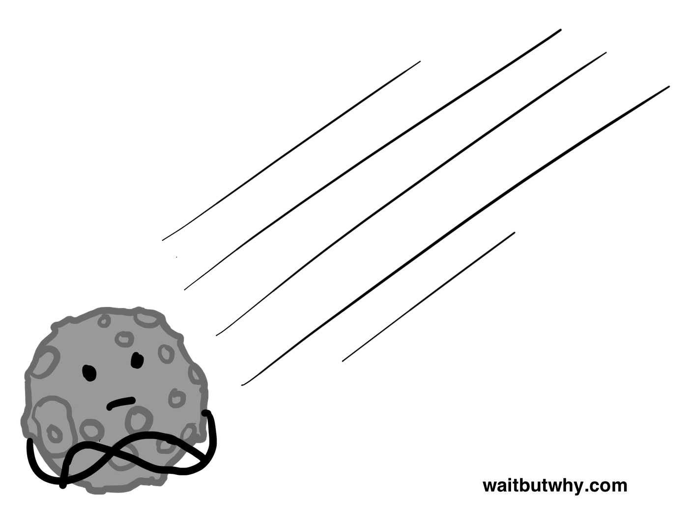](../assets/images/original/img_066_4eab4c95.jpg)一颗小行星不需要多大就能把一切搞砸。1908 年，一颗小小的、60 米大小的小行星在西伯利亚上空 3-6 英里（5-10 公里）处[爆炸](http://www-th.bo.infn.it/tunguska/aah2886.pdf)。即使从那么高的地方下来，它还是[夷平了](http://fox41blogs.typepad.com/.a/6a0148c78b79ee970c019104045f70970c-pi) 8,000 万棵树。要是它一路直接撞到地面，爆炸的威力会相当于 1,000 多颗广岛原子弹。[5](#footnote2-5-3902) 一颗直径只有半英里（0.8 公里）的小行星就足以把足够多的灰尘扬到空中，让地球的温度降低好几度、持续好几年，从而引发各种戏剧性的后果。1989 年，一颗差不多这么大的小行星[穿过了地球的轨道](http://articles.latimes.com/1989-04-20/news/mn-2278_1_asteroid-nasa-project-national-aeronautics)，而它经过的位置，正好是地球 6 小时前所在的地方。更大一颗小行星撞击的效果呢？只需要注意木星上每一个小行星撞击留下的疤痕都差不多和地球一样大就行了：[6](#footnote2-6-3902)

[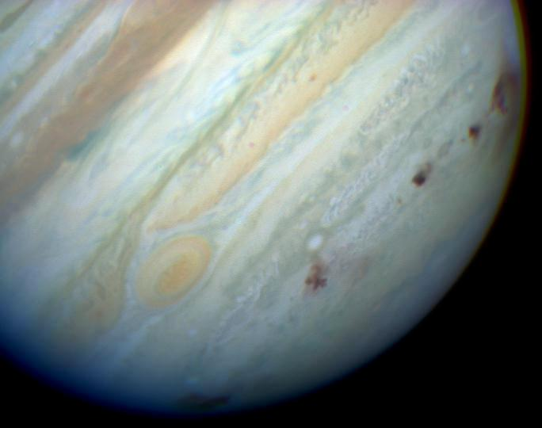](../assets/images/original/img_067_10a71b33.jpg)

那颗让恐龙哭出来的小行星直径大约 6 英里（10 公里）。要是一颗同样大小的小行星撞上我们，先是迎头一发热浪——在小行星坠落地附近，热浪的温度是太阳表面温度的十倍——因为小行星以子弹速度的 100 倍从天而降，把下方的空气狠狠压缩。然后几乎在瞬间，一道冲击波会向外扩散，把方圆数百英里内的一切夷为平地。就在那时，威力超过*十亿*颗广岛原子弹的爆炸，会把小行星和撞击点处大约 1,000 立方公里的岩石高高溅入太空，在那个半球所有人面前竖起一道比云层还高的黑墙。当所有这些岩石重新坠回大气层时，它们会变成几千颗巨大的火球，点燃整个地球上的城市和森林。很快，整个地球都会变得滚烫，一连串地震被触发，世界各地的火山相继喷发，难以想象的巨大海啸会拍打每一片海岸。在这之后，一团全球性的尘埃云会升起来，把太阳遮住几个月甚至几年，让地球显著降温——气候要过 1,000 多年才能恢复到今天的样子。

而这一切，都仅仅是因为被一个东西撞了——而那个东西的尺寸，如果地球是一栋三层小洋楼，它的大小顶多也就是一颗豌豆。

[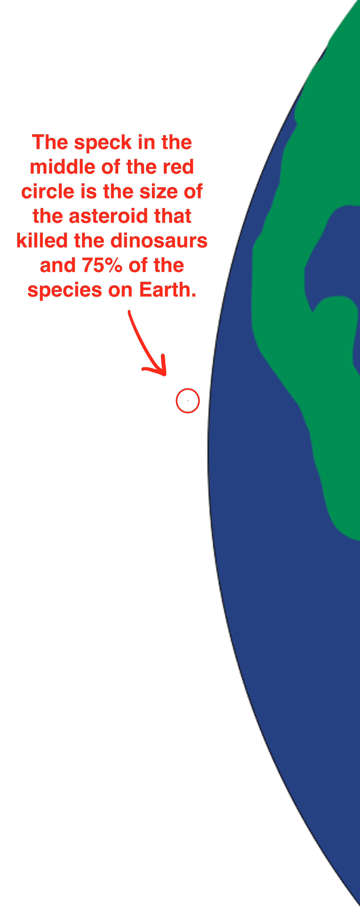](../assets/images/original/img_068_cb01c643.png)

地球本身受到的影响其实不会太大——但地球*表面*的条件会受巨大影响，因为它们实在太脆弱了。这里有一个让人抓狂的[视频](https://www.youtube.com/watch?v=bU1QPtOZQZU)，呈现了我刚刚描述的场景。

更恐怖的一点是，小行星在太空中几乎不可见，也非常难以探测。航天机构和业余天文学家正在追踪一些可能具有威胁的小行星，但很多情况下，我们要到小行星已经轰隆隆地砸下来那一刻才知道它要来了。[3](#footnote-3-3902)

所以，即使我们觉得自己是待在一颗安全的小行星上、处在一个静谧安宁的宇宙里，实际情况更像是身处一片*目前*宁静祥和的森林——但时不时地，会有一种恐怖的嗜血肉食动物从树丛里突然窜出来，把这里大部分的生命都撕成碎片，从存在中彻底抹掉。上面那张大灭绝事件图表讲述了五个来自过去的恐怖故事：在那些时期，我们安静的地球变成了当时生活在这里一切生物都无法言喻的噩梦现场。而它还会再发生一次——就在你坐着的这个地方。唯一的问题是：什么时候。

我们来看看动物 6 亿年的历史以及期间发生的大灭绝事件：

[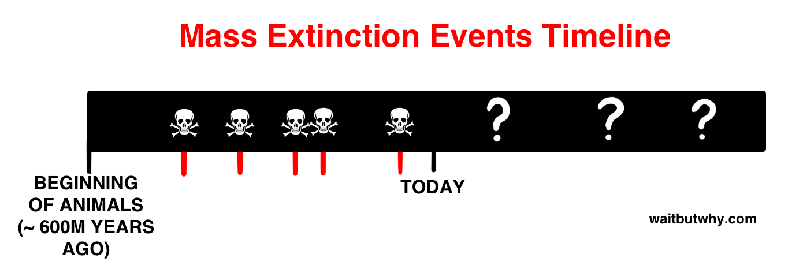](../assets/images/original/img_069_133666c3.png)

看着这条时间线，我们看到，虽然未来肯定潜伏着坏事，但问题中涉及的时间尺度是*巨大*的，所以一场灾难性的、关乎存亡的自然灾害在近期内发生的概率非常低。到底有多低呢？

为了把这个概率在脑子里捋清楚，我们从过去推算：在未来 5,000 万年内的某个时候发生一次大灭绝事件的概率很大，这意味着在接下来 1,000 年里发生一次的可能性大约是 5 万分之一。从比例上说，这和某人在地上画一个 X，然后告诉你，闪电在接下来一个月内某个时候会击中那个点是一样的。一个月里 5 万分之一约等于一分钟，所以下一分钟闪电击中那个点的概率，等同于下一个千年里地球上发生一次大灭绝事件的概率。换句话说，在接下来 1,000 年里待在地球上，应该和站在那个闪电点上站一分钟一样安全——反正你心里知道这个月某个时候闪电是会击中这个点的。

如果千年是闪电例子里的一分钟，那么一个人的一生大约是五秒钟。所以问题是：让你站到那个 X 上站五秒钟，你会感觉如何？我可不会特别乐意在那个 X 上站*任何*时间，而那五秒钟可能多少会有点压力——但我也清楚，我几乎肯定会没事。这才是我们在有生之年在地球上生活应有的感受——至少就关乎存亡的自然灾害而言是这样的。

如果你只关心自己这一辈子，甚至是你之后十代后人的一辈子，那被绑在地球上并不是什么大事。

但如果你关心的是作为一个*物种*的人类，你的思路就必须变一变。如果人类作为一个物种永远被局限在地球上，那和一个打算在 X 上面站上好几个月的人没有区别。既然上面那张灭绝图表告诉我们，闪电差不多每两个月就会击中 X 一次，那这就不是一个多好的长期计划——对吧？也许我们的技术能帮我们扛过几次闪电直击脸部，但过程本身依然会让人痛苦不堪，而任何一次单独的闪电都有把我们抹掉的可能。

我们换个角度来看。假设地球是一块硬盘，地球上的每一个物种——包括我们自己——都是硬盘上一个装满几万亿行数据的 Excel 文件。用我们压缩过的时间尺度——5,000 万年 = 一个月——我们已知的事情是：

- 现在是 2015 年 8 月
- 硬盘（也就是地球）出现在 7.5 年前，差不多是 2008 年初
- 一年前，2014 年 8 月，硬盘上装满了 Excel 文件（也就是动物的起源）。从那以后，新的 Excel 文档被不断创建，而另一些则蹦出一个错误提示再也打不开（也就是灭绝了）
- 自 2014 年 8 月起，硬盘崩溃了五次——也就是五次灭绝事件——分别在 2014 年 11 月、2014 年 12 月、2015 年 3 月、2015 年 4 月和 2015 年 7 月。每次硬盘崩溃，几个小时后就会重启，但重启之后，大约 70% 的 Excel 文件就再也没了。除了 2015 年 3 月那次，那次直接干掉了 95% 的文件
- 现在是 2015 年 8 月中旬，智人（homo sapiens）这个 Excel 文件大约两小时前才被创建出来

现在——如果你拥有一块装着一份极其重要的 Excel 文件的硬盘，而且你知道这块硬盘相当稳定地每两个月就会崩一次，上一次崩溃发生在五周前——你会做的、最显而易见的事情是什么？

*你会把那份文件复制到第二块硬盘上。*

这就是埃隆·马斯克想把 100 万人送上火星的原因。

为什么是 100 万人？因为这是马斯克大致估计的、构建一个*完全自给自足人口*所需要的最少人数。这里，自给自足的定义很简单——它意味着，如果地球从存在中消失了，火星上的人口仍然能够生存、繁荣、成长。他们不会在任何事情上依赖地球。需要挖矿？火星上得有知道怎么建造矿井的人，也得有下井干活的矿工。需要建一座新医院？需要发射火箭去修一颗坏掉的互联网卫星？需要扩大农业以应对食物短缺？因为战争爆发需要采取紧急措施？火星人口得靠自己把这些事全都覆盖到位。马斯克不认为 1 万人或者 10 万人会够用——但他认为 100 万人应该足够。

这个概念——以自给自足的方式让人类生命延伸到多颗行星上——通常被称为「行星冗余」。马斯克把它叫做物种的生命保险。我把它叫做备份硬盘。

当然，火星那块硬盘并不比地球那块更可靠。它会和地球一样脆弱，遭受大多数相同的灾难，它也会每两个月崩一次。但大多数情况下，这两块硬盘的崩溃时间会错开。如果某一块崩得*特别*猛，把那块硬盘上的 Excel 文件也弄没了，那另一块硬盘上的还在——而且它会有充裕的时间去规划一份新的备份。

所以现在你已经把那份宝贵的 Excel 文件放到了两块硬盘上。你会感觉*好*多了。但要是那份文件对你来说足够重要，你可能不会满足于只有两块硬盘。你会想把它复制到一打*更多的*硬盘上。但我们还能选哪些硬盘呢？这是上蓝色小框的好时机：

**哪些行星适合居住？**

我们一个一个过。[7](#footnote2-7-3902)

**水星**

[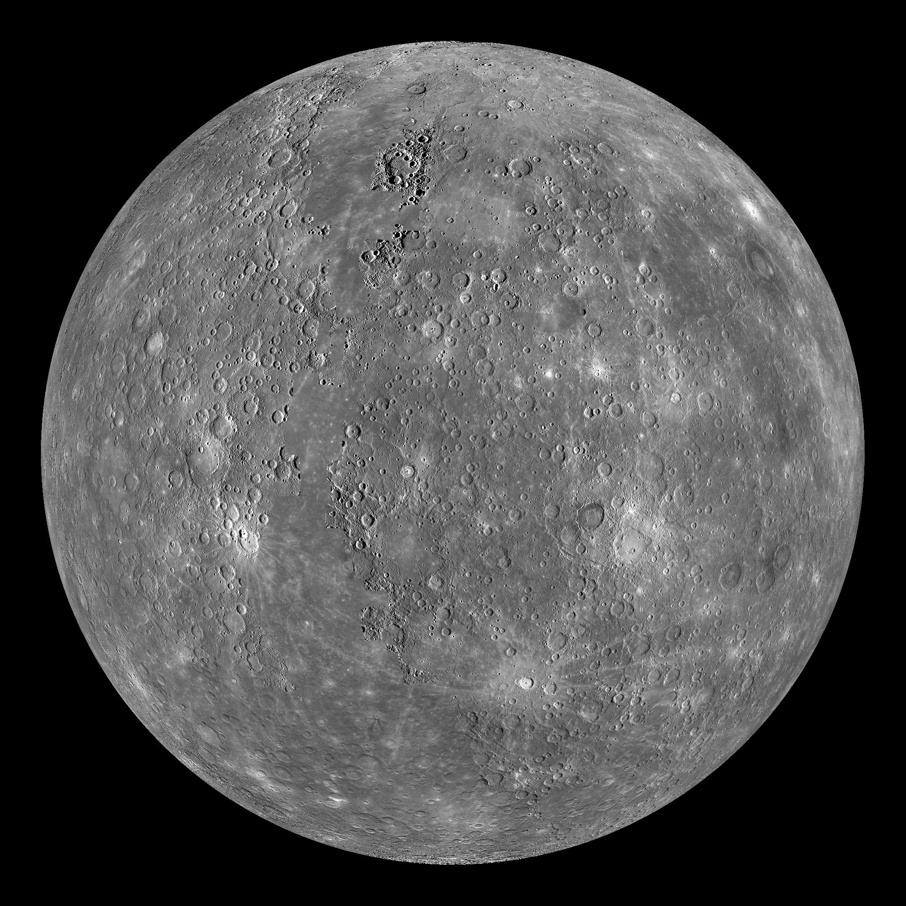](https://en.wikipedia.org/wiki/Mercury_(planet)#/media/File:Mercury_Globe-MESSENGER_mosaic_centered_at_0degN-0degE.jpg)水星的坏运气在于它是离太阳最近的行星，这就好比你被安排坐在一个 450 磅（约 200 公斤）、亢奋到爆的壮汉旁边吃饭。如果你到了水星上，你的一天要在 800°F（430°C）的高温中度过——热到你可以把一坨铅放在地上，它会自己化成一滩水。水星上几乎没有任何大气，所以你在被烧死的过程中，同时还会站在一个近乎真空的环境里——这会瞬间把你肺里的空气抽走，并开始把你皮肤里的水分蒸发掉。缺乏大气也意味着你会遭受来自太阳的强烈辐射（太阳在天空中看上去会比在地球上大 2.5 倍）。好的方面是，水星的重力只有地球的 38%，所以你在滑稽地一边跳来跳去一边迅速死去。说到这里，你会极度期盼夜晚到来，然后你就会悲伤地发现，水星的一个昼夜循环长达 58 个地球日。

一个月后，当夜晚*终于*降临时，你心情好了一分钟，然后你会意识到现在的温度是 -280°F（-170°C），比地球历史上记录到的最低温度（南极的沃斯托克站）还要低 152°F。这是因为水星没有大气来留住太阳的任何一个热、或者把这些热分布到整个行星上。你还是尴尬地站在真空里。你得花整整一个月被深度冻死，然后才能在日出时重新开始被烧死。

你在水星上最好的选择是待在两极附近——那里虽然严寒且永远黑暗，但至少上面有冰，所以你能保持水分。理论上，可以在两极附近建立一个人类基地，但收益也不会太大。

我问马斯克怎么看水星，他管它叫「地狱」，然后对话就被这俩字给终结了。

**金星**

[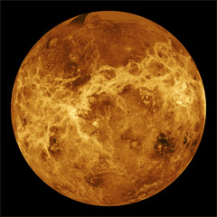](https://en.wikipedia.org/wiki/Venus#/media/File:Venus_globe.jpg)金星不甘示弱地发了一通脾气，结果硬是让「住在水星上」听起来像在毛伊岛海滩上坐着吃烤虾。

事实证明，真空和金星这种「我偏要反过来」的环境一比，简直是天堂。下面是去金星走一趟的流程：

首先，空气 96% 是二氧化碳，吸一口就中毒。

其次，谁还关心空气能不能呼吸呢，因为你很快就会被大气压直接压扁——它的压强是地球表面大气压的 90 多倍。这个压强相当于你身处海面以下 1 公里——比水肺潜水的[世界纪录深度](https://www.deeperblue.com/ahmed-gabr-breaks-scuba-diving-world-record/)还要深三倍。就算你有办法勉强站稳，大气阻力也大到让你挥动手臂的感觉像把手臂插在水里挥动。

再次，前两条谁还关心呢，因为那里的温度是 870°F（465°C）。想象一下，你把烤箱开到能熔化铅的那种滚烫温度，然后再往上调*又*138 度——然后让*整个星球*都保持这个温度。在夜晚（这里夜晚来得很慢——金星的一天[比](http://www.universetoday.com/47898/length-of-day-on-venus/)它的一年[4](#footnote-4-3902)还要长），金星的温度纹丝不动，因为那层厚厚的大气把热量死死锁在里头。

白天的时候，你在昏暗的光线中经历这一切，头顶是一层红橙色的云层。太阳只是天空中一块朦胧的、偏黄的亮斑。夜里，你会身处一片完全没有星星的漆黑之中——同时被压扁在一个滚烫的熔炉里。至少那儿没有[虫子](https://waitbutwhy.com/2014/02/why-bugs-ruin-everything.html)。

听了我刚才说的这一切之后，我对苏联探测器[金星 13 号](http://www.space.com/18551-venera-13.html)的那个超硬核着陆器肃然起敬——它 1982 年一路降落到金星表面，并且硬是撑了 127 分钟——撑到足以拍下这两张照片，而这是我们仅有的金星表面的影像：

[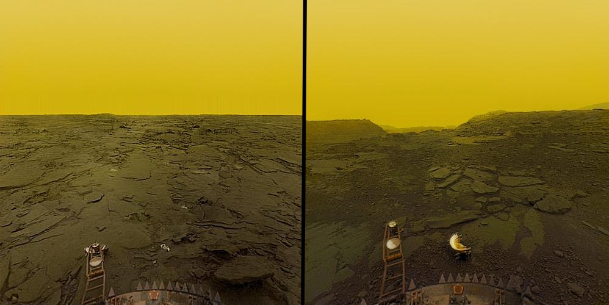](https://www.reddit.com/r/woahdude/comments/1e04ud/surface_of_venus_pic/)

金星表面上倒不用担心风的问题——你只会感受到一阵微风——但随着你往大气层上方爬，风会迅速变成另一个级别的噩梦。金星上层大气是一种新型地狱——风速持续保持在我们最强飓风的两倍，到处都是硫酸液滴（和通下水道用的那种酸一样），直接抽你脸上。典型的金星。

不过说来也怪，如果你一路爬到金星大气的*最顶端*，你会意外地得到一个奖励——令人震惊的、令人愉悦的宜居条件。巧得很，在金星云层顶端某一层，温度和气压跟地球差不多，而且因为氧气和氮气在金星浓密的大气中都会上升（就像地球上氦气会上升那样），那一层里的空气说不定真的接近*可以呼吸*。这让一些[科学家](http://scitation.aip.org/content/aip/proceeding/aipcp/10.1063/1.1541418)真的开始讨论人类对金星高层大气进行*殖民*的可能——建造「被设计成漂浮在金星大气中约五十公里高度的空中城市」。[8](#footnote2-8-3902)

当我问马斯克对金星的看法时，让我意外的是，他居然真的说，金星在「极端困难」的条件下是有可能变得宜居的。他说，假设技术足够发达，也许到了非常遥远的未来，办法是有可能把金星的大部分大气清理掉，从而让它*有可能*成为遥远的未来殖民的选项。[5](#footnote-5-3902)

**火星**

[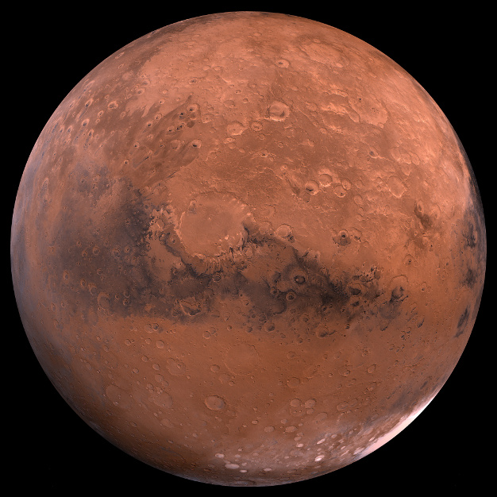](http://space-facts.com/mars/)如果火星是地球上的一块地方，没人会想去。但在一场「宜居性」大讨论里——所有非地球的行星都活在地狱难度——移民火星听起来反而不那么糟。

火星基本上就是一块更冷、长得像亚利桑那沙漠的南极，空气不能呼吸，太阳晒久了还要你的命。火星上每一寸土地的可宜居性都比地球上最不宜居的地方差出一大截。但那里的条件*刚好*勉强够用——只要有一个人工「居所」（hab）住着、一个小温室花园、再加上一套够好的宇航服，你就可以在火星上活下去、不死掉。火星上甚至有水——还不少——都冻成了极冠里的冰。要是你在合适的季节到了行星上合适的位置，你甚至能享受到*70°F（21°C）*的美好天气。或者至少你可以一边隔着居所的窗户往外看，一边在脑子里告诉自己外面其实挺舒服。

火星上的一天（一个「sol」）大约是 24.5 小时，对人类和植物都挺友好。再加上那里的重力只有地球的 38%，你基本上可以正常过日子。还会有一些有趣的低重力红利，比如能扣一个 15 英尺的篮，或者住在公寓的二楼、早上直接从窗户跳下去上班（重力大约只有三分之一，所以从 X 英尺高的窗台跳下去，在火星上的冲击力相当于在地球上从 3X 英尺高的窗台跳下去）。

太阳系里最酷的旅游景点也在火星上——太阳系最高的山，奥林帕斯山：[9](#footnote2-9-3902)

[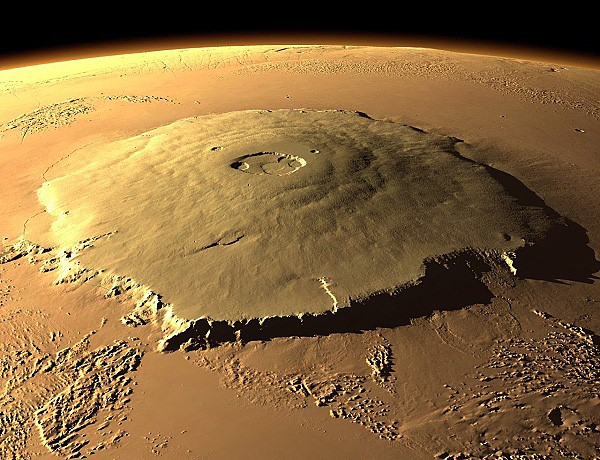](../assets/images/original/img_074_b061cb17.jpg)

它[能罩住整个亚利桑那州](http://static3.businessinsider.com/image/54b3015e6bb3f7551d36bd2b-960/olympus-mons.jpg)，让珠穆朗玛峰看起来像一个小山包：[10](#footnote2-10-3902)

[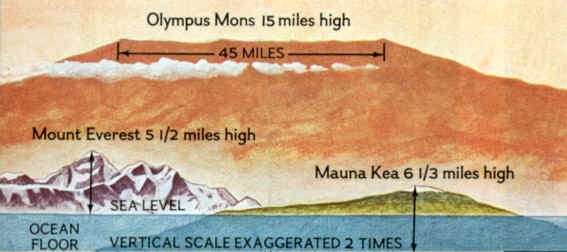](../assets/images/original/img_075_6777e1ab.jpg)

更别提火星上的那条大峡谷——它让美国大峡谷看起来像是被纸划了一道小口子：[11](#footnote2-11-3902)

[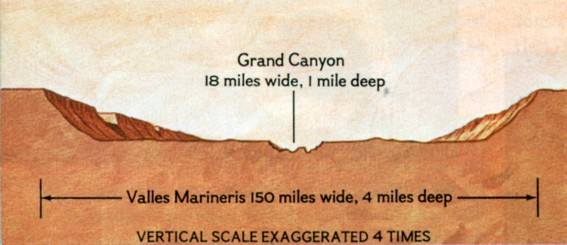](../assets/images/original/img_076_84fd0bd3.jpg)

我们稍后会细说，但理论上，只要有足够多的努力和技术，人类可以*地球化改造*火星，遥远未来的某一天，让它变成一颗相当宜居的行星——有树、有海洋、出门不用穿宇航服。

**行星相对距离 蓝色小框**

我们很快就要离开太阳更远了，所以让我们把这些距离先放进一个看得见的尺度里来感受一下。你可以这样切：把太阳系大致分成相等的三段，每段大约 10 亿英里，或者 10 AU（一个 AU 是地球到太阳的距离）：

**第一段：**太阳到土星
**第二段：**土星到天王星
**第三段：**天王星到海王星[6](#footnote-6-3902)

所以如果太阳系是一码长，土星、天王星、海王星就分别落在每只脚的最末端。木星距离太阳 6 英寸（约 5 AU），正好把第一段切对半，而其他四颗行星都被挤在前两只脚的头两英寸里：

[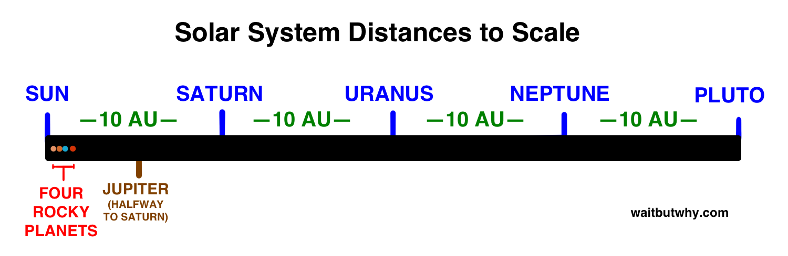](../assets/images/original/img_077_1ba58a7a.png)

**木星、土星、天王星和海王星**

[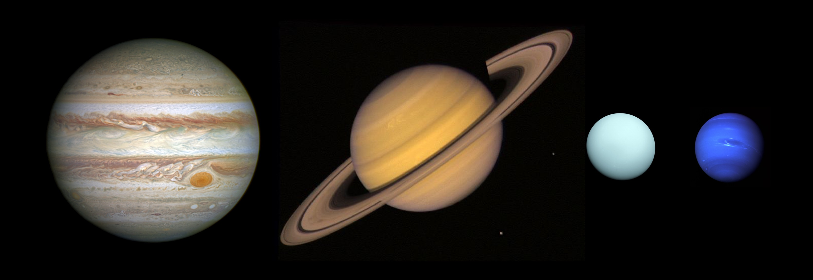](../assets/images/original/img_078_207b33fa.jpg)

希望你享受过「地板」这个东西，因为后面这些行星一个都没有。下面是这四颗遥远的行星为什么这么怪：

46 亿年前，太空中曾经有一大团气体云，某次扰动触发了它向自身坍缩的过程。宇宙里的物质都心里清楚这意味着什么——一下子就是「黑色星期五」，大家疯了一样去抢物质资源。每颗恒星和行星都会告诉你，关键在于起跑要早。如果你一开始质量最大，那你就更容易吸引到更多物质，变得更大，优势会进一步扩大。一旦早期领跑者确立，后来者就很难追上。

最后的赢家会成为一颗恒星——其他所有家伙都会沦为围着这颗恒星转 100 亿年的「狗仔队行星」，直到恒星过气退休，然后一场新的游戏重新开始。

就我们太阳系而言，太阳赢得了这场比赛，它抢走了那团气体云大约 99.8% 的总物质。在那之后，就变成了对残羹剩饭的惨烈争夺。能抢到足够的，好歹还能光荣地成为一颗行星；想抢但没抢到的，就只能屈辱地花上 100 亿年当「行星的狗仔队」——低人一等的卫星。

那些既没成功变成恒星、也没变成行星、甚至*也没*变成卫星的倒霉物质，只能注定变成小行星——太阳系里的流浪汉——或者被更大的天体吸收掉，连身份都丢掉。外面的世界真残酷。

在这场老鼠赛跑中，有时候会发生一件尴尬的事。有些物质还没有老练到懂得太阳系形成的金科玉律——*识时务者为俊杰*。水星、金星、地球和火星显然很早就看懂了形势，意识到太阳已经领先太多了，果断放弃了当演员的梦想，转身去争取当一颗行星。

而那四颗*气态巨行星*[7](#footnote-7-3902) 呢，则继续徒劳地吸积气体，妄图逆风翻盘。但当你做这种事的时候，你最后就会落在一个很糟糕的处境里——变成一个怪异的「差一口气就是恒星的家伙」。木星的成分是氢和氦，跟太阳一模一样，但和太阳不同的是，木星没有足够的质量点燃核聚变，它有的质量只够它永远提醒大家它曾经那次失败的「逐梦演艺圈」。

气态巨行星当然不会承认这一点。一旦它们完全意识到自己成不了恒星，这四位立刻换了一副嘴脸，假装自己从一开始就是想成为行星的。现在它们被卡在一个令人沮丧的、进退两难的「既不是恒星也不是普通行星」的位置上，要花 100 亿年当一颗没有表面的臃肿行星。没有人想当一颗没有表面的行星。

我们不太确定气态巨行星——比如木星——的内部到底在发生什么。[8](#footnote-8-3902) 如果你尝试去探个究竟，你会穿过外层的云层一路俯冲下去，强大的引力（地球的 2.5 倍）会越拉越快。你越往下落，周围就变得越暗、越热、压强越来越大。最终，你会陷入一片漆黑，温度会超过太阳表面的温度，再加上你头顶那层巨厚的大气，周围的气体被压得你根本分不清它是气体还是液体（这种状态叫做「超临界态」）。[9](#footnote-9-3902) 再往下，氢会被压得*极*致密，电子开始在原子之间流动，让它变成一片液态的、能够导电的「金属氢」。至于你是否真的能在木星的最中心踩到一个固态核心，至今没有定论。

没有争议的是：人类永远不会搬到木星上。也不会搬到土星、天王星、海王星上。

人类*有*可能搬去的地方，是木星和土星周围那些巨大的、岩石质、被冰层覆盖的*卫星*。但那里不会暖和。我们也*也许*能搬去我们自己的月球，但那基本上就是水星情况的一个温和版——白天的温度能让水沸腾成气体，夜里的温度能让氧气凝结成液体，还没有对太阳辐射的任何防护。加之 28 天的自转周期意味着植物得连续两周在没有阳光的环境里硬撑——不容易。

当我问马斯克除了火星以外人类还能搬去哪里时，他说如果技术足够先进，那确实还有少数几个地方可以——几颗卫星、几颗最大的小行星，如果你想玩得很野的话甚至包括水星和金星。但他最后说：「我的意思是，火星*远远*是最优选择。」

在我们回到正片、回到非蓝色小框的世界之前，我们能不能先停下来承认一下，住在*地球*上现在听起来是有*多棒*？？想象一下生活在*室温*天气、一个大气压、*1g*引力、温柔的小风、湿润的雨幕、丰富的液态海洋、磁层和大气层一起保护你免受太阳辐射、到处都是食物、空气你可以直接*吸进去*，这是一种什么样的特权。要让你能够在不穿宇航服的情况下走到户外随便溜达，需要一大堆不同的条件*精确*到位。所以让我们都来珍惜一下住在地球上的这种*奢侈*吧——先珍惜七分钟，然后我们所有人会同时再次把这一切抛到脑后，永远地。

我们重新整理一下思路。到现在为止，我们已经确立了下面这些：

- 备份人类硬盘是一件关键而必要的事情，迟早要做——把所有鸡蛋都放在一个星球篮子里，让我们自己暴露在灭绝风险之中。
- 火星是远远最好的备份人类硬盘的地方。
- 但只要技术足够，我们*确实*可以创建更多的备份，方法是把多达十几颗甚至更多的卫星、小行星和行星都给殖民了。

另一个有意思的选项是：科学家们已经探索过一大堆[空间栖息地](http://www.space.com/22228-space-station-colony-concepts-explained-infographic.html)的奇思妙想，它们看起来都挺有意思的。虽然现有的方案被我们当下的想象力所限制，但我可以设想这样一个未来——住在行星上对那时的后代来说，就像我们今天看史前人类住在洞穴里一样原始。在过去几千年里，人类发明了「室内」这个概念，现在几乎所有人都把家定义为「室内的某个地方」——也许在未来，一座巨大的、人造的、有着山川河流和树木、容纳几百万人的太空栖息地，会相当于把「室内」这个概念推广到整个*世界*。而担心天气、地震、被小行星撞这种事，到那时可能就像洞穴人担心睡着时被一群狼袭击一样。也许吧。

不管怎么说——一旦有几百万人类分布在多个天体或栖息地上，那份 Excel 文件就相当安全了，人类应该能扛过自然很久、很久。

**哦但是还有**

当然，所有这些硬盘都还装在同一个太阳系里，如果你的所有备份都放在同一栋房子里，那这栋房子哪天要是着了火就很麻烦。很不幸，我们正用着一块注定要崩的硬盘，我们也正住在一栋注定要着火的房子里。太阳的寿命差不多走完了一半。这是「第二幕」的剧本：[12](#footnote2-12-3902)

[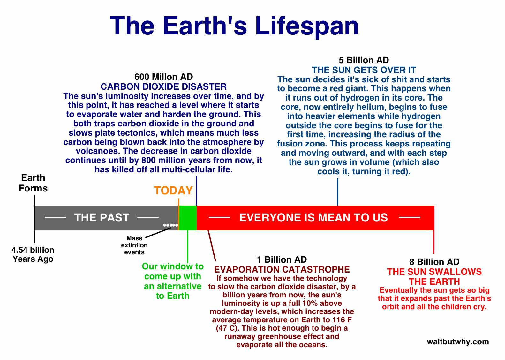](../assets/images/original/img_079_1a2a2be5.jpg)

在蹂躏完地球之后，太阳会向外膨胀，一个一个地让我们其他那些可能成为家园的地方变得不再宜居。幸运的是，我们还有一个绿色窗口期，给了我们一个做点什么的机会。马斯克指出，我们现在距离「地球走到海洋蒸发、热度变得无法忍受、所有复杂生命统统死光」那一刻，大概已经走过了 90%——「所以如果智慧生命的进化再多花 10% 的时间，它就永远不会进化出来。」[10](#footnote-10-3902) 说到我们的进化，我们是在第九局才登场的，堪堪赶上最后一秒——现在我们必须想出办法，在被卷回永恒的「无」之前，先把自己扩展到行星之外，最终扩展到太阳系之外。

这里的一条好消息是，相关的时间尺度都大得离谱。太阳的「发疯」还要等到长得不可思议的时间之后，而且我假定，如果我们真的撑到了那个绿色窗口的尽头，那时的技术应该足以让我们：A）轻松在太阳系各个安全区域之间迁徙；B）变成一个跨*恒星*的物种，把我们分散到银河系里其他适合生命生存的恒星系；和/或 C）创造出不依赖恒星就能提供能源的、安全的太空栖息地——要么通过核能，要么更可能的是某种我们今天都想象不出的先进方法。

所以我们的待办事项清单是：

1）在某样东西在地球上把我们灭绝之前，先让我们自己变得「地球免疫」（方法是成为多行星物种）。这会给我们足够的时间来：
2）在太阳把太阳系毁掉之前，先让我们自己变得「太阳系免疫」。

说到第 1 件事，是的，下一次大灭绝事件可能随时发生，但只要我们利用接下来的几千年想出怎么把自己扩展到地球之外，那我们就有很大概率在任何过于灾难性的事情发生之前先把自己备份好。

所以这件事看起来是相当可控的——但我们再回到 Zurple 和 Quignee 这边。如果我们距离任何「可怕事件」还隔着几千年、甚至很可能是几百万年——那他们俩为什么现在就这么死盯着 143-Snoogie 上正在发生的事呢？

**人类的恐怖之处**

为了强调「成为多行星文明」这件事那完全无法衡量的分量，马斯克经常讲起一个观点：把视野往历史上一拉远，所有事件就都会暴露出它们真正的*意义*。你拉得越远，一件事件的「重大性」就必须在那个尺度下显得够「大」才不会被过滤掉。

物理世界可以玩这个「拉远」游戏。从你坐的地方看去，街道、房子、汽车都是有意义的物体。但从飞机上看，它们全都消失了，能立住的只有像城市、湖泊、山脉这种更大的东西。从国际空间站看，只剩下大陆和海洋是有意义的。再远一些，就只剩行星和恒星。再远，就只剩整个星系。

把视野往生命的历史上拉也是一样的道理（我们在[另一篇文章](https://waitbutwhy.com/2013/08/putting-time-in-perspective.html)里干过一次）。要登上每日新闻，一个事件可以是最新的某个丑闻、金融市场的波动、一桩抢劫、一场抗议、一场体育比赛、两位政客会面。这些事件相当小，但「意义滤网」上的洞也相当小。

当我们把视野拉远到一整年的跨度时，就像是从地面升到了飞机——我们离得太远，看不见绝大多数每天的新闻事件了，它们中的大多数都融进了背景。从这个距离看，只有这一年里影响最大的事件是可见的，那些更宏观的、原本近处看不太清的故事主线也开始浮现——一次骇人听闻的恐怖袭击、一场重要选举、一项席卷全球的新产品或新服务。

看一整个世纪的跨度，就像是从国际空间站看地球。这个世纪里的那些大故事，就像是那些从飞机上看不到全貌的大陆和大洋——席卷性的文化或政治变迁、战争和其他重大悲剧及其引发的一切、突破性的科学发现、改天换地的技术进步。

如果我们再往远拉，看几千年，那更宏大的故事线会浮现——帝国的兴衰、世界性宗教的弧线、科学理解或技术进步的新一轮迭代、影响世界数百年的现象，比如帝国主义时代、工业革命、民族国家的诞生。

把视野拉到 10 万年，我们能看到我们这个物种的整条故事线。我们看到大规模迁徙、语言和农业和文字的发展，以及工业化世界最终诞生。

不过，即使是在这么史诗的尺度下，我们离「看清生命整体故事线的轮廓」还差得远。生命史的推进速度比人类史要慢得多。

就算往回拉到 1,000 万年，我们也只能看到生命尺度故事线的零星痕迹。在我们自己的进化线上，我们看到大型灵长类动物越来越分化、人族与黑猩猩支系的分裂、人属的进化历程，并最终演化成人类。这就是在 1,000 万年的尺度上，你在生命故事其他部分看到的那种东西——没有什么大事件，主要就是对既有生物学的各种小修小补。

用一块 5 亿年的镜头，我们才能看到动物这条伟大的故事。复杂度的提升——先是鱼类、然后昆虫、然后爬行动物、再然后哺乳动物依次出现，伴随着恐龙的兴衰。在这里，五个大灭绝事件清清楚楚地映入我们的视野。

而当我们一路拉到最远——38 亿年——我们能在这头看到生命的起源，在那头看到今天——这时，哪些事件才有资格被称为「重大」？

我们看到简单的细胞，然后看到复杂的细胞，然后看到多细胞生命。我们看到生命大爆发式地多样化、从海洋登上陆地，最终，随着哺乳动物的登场，达到了高智能。

在一份「生命最重大飞跃」的清单上，把哺乳动物和「智能」包括进去，可能看起来有点自以为是，但其实不是，因为只有通过意识，生命才能迈出下一个伟大的飞跃——成为多行星物种。

如果人类能在火星上自给自足，那么对于整个地球生命来说，这会是一个事件——即便用最大的「拉远镜头」来衡量，它都还立得住——它就是*那个*级别的。

而当你以这种视角来看时，你才会意识到尼尔·阿姆斯特朗把登月称为「人类的一次巨大飞跃」其实用词并不准确。登月属于「把第一个人送入太空」或「第一个人登顶珠穆朗玛峰」这一类——它是人类的伟大*成就*。但如果第一条爬上陆地的海洋生物只是在那儿躺了一分钟就被冲回海里，那它也算不上生命的巨大*飞跃*，登月同样也算不上。只有当某些变异的鱼开始以*可持续*的方式在陆地上*生活*时，生命作为一个整体才完成了一次巨大飞跃。只有*永久*地*殖民*火星，才是人类的巨大飞跃。

但我们是不是应该停一下、稍微 note 一下：在 38 *亿*年——3,800,000,000 *个世纪*——之后，我居然声称*这个世纪*我们可能会见证一次与历史上六、七次最伟大飞跃比肩的巨大飞跃，这事儿多少有点*奇怪*。怎么可能呢？

而且等一下，这让我想起一件事。当我们钻研[人工智能](https://waitbutwhy.com/2015/01/artificial-intelligence-revolution-1.html)的时候，它确实看起来 A）是一件有可能在下个世纪爆发成超级智能的事情；B）是一件有可能*永久地、戏剧性地*影响这颗星球上所有生命的事情（不论是更好的还是更糟的方向）。这*算不算*一次潜在的巨大飞跃呢？

而且——随着我们对人类基因组的理解不断深入、基因工程科学突飞猛进，一百年后，科学完全有可能搞明白怎么让人类活到远远超过自然生物寿命的年龄，并给人安排真正的「返老还童」流程。如果真发生这种事，而我们征服了衰老，*这难道不也会*够格登上生命史上重大事件的清单？

这他妈到底是怎么了？？

要么是我天真得无可救药，要么这是一个*极其*不平静的时代。我认为是这么回事：

正如我们讨论过的，进步的速度可以呈指数级增长，因为越多的进步发生，就越能促成*更快*的进步发生，而当进步向上爆炸的时候，会引发一连串的级联。我们可以在下面这一系列越来越爆炸式的增长率中看到这一点：

- 史前人类物种在区区 10 万年的时间里对自然界造成的影响，比*正常情况下大得多得多*——从来没有其他物种在这么短的时间里、在这么广的范围内、发生这么大的变化。

[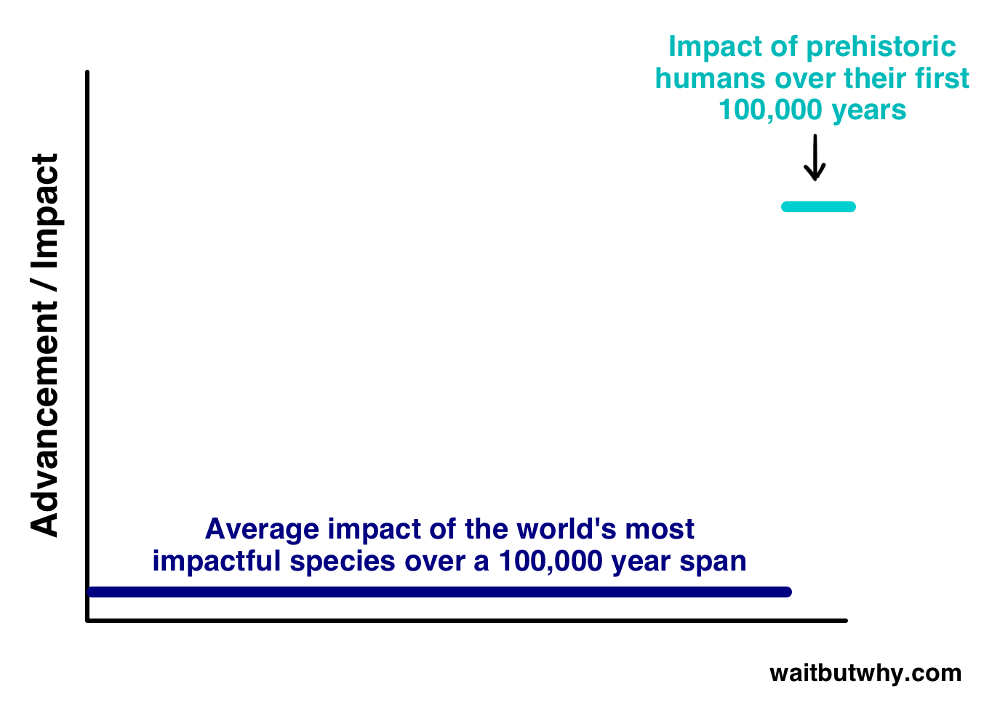](../assets/images/original/img_080_4f44d450.png)

- 拉近一点看，自农业革命以来过去 1 万年人类的进步，比任何此前的 1 万年时期*都要大得多*。

[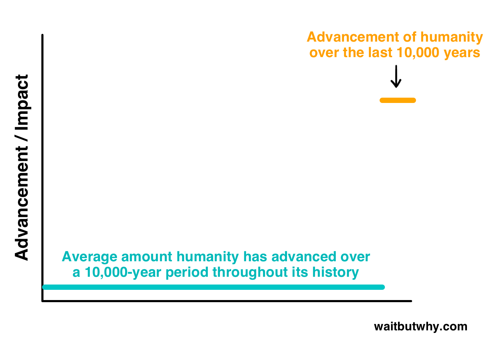](../assets/images/original/img_081_c3172b26.png)

- 再拉近一点看，自工业革命以来过去两个世纪——也就是 1815 年到 2015 年之间——的工业和技术大爆发，*远远超过*此前任何 200 年时期的进步。

[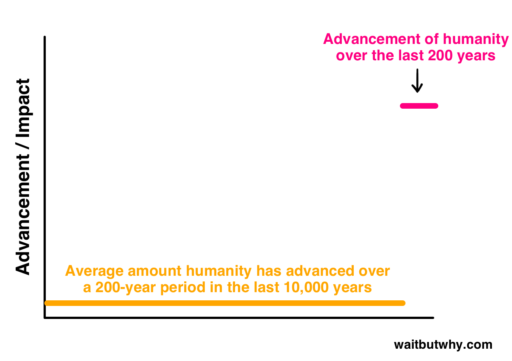](../assets/images/original/img_082_12107a7e.png)

当你把这些图拼到一起，你就得到了一条*货真价实*的指数趋势线：

[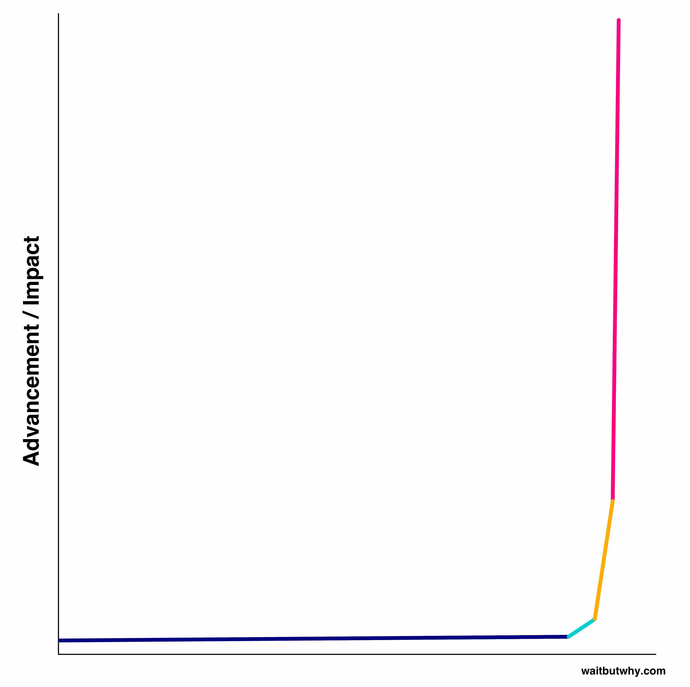](../assets/images/original/img_083_17b32359.jpg)

所以也许我不是天真——也许我们有充分的理由相信，我们正生活在一条生命从未经历过的指数级进步曲线的上升期。而随着进步一起来的是力量，我们这个物种如今拥有了一种前所未有的、足以影响一切的力量。

而在某个时刻，这种力量会大到一种程度——那种原本需要微生物和动物界花上几亿年才能取得的「巨大飞跃」，可以被压缩到一个世纪以内完成。

当一个物种强大到能在不到一个世纪内完成生命级别的巨大飞跃，他们基本上就是神了，只是神的方式有许多种。我们就把那一刻叫做到达「上帝点」。如果进步真的在加速，那一个先进的物种最终命中「上帝点」是合乎逻辑的，而大量证据似乎表明，人类要么已经到达、要么已经非常接近——太空旅行、人工智能、生物科技、粒子物理、纳米技术、武器等领域的进步，给我们打开了一长串难以想象的、对未来具有戏剧性影响的可能性的大门。

在那份长长的清单上，一系列正面的发展有可能把人类带入「不可灭绝」的地狱，而数量更多的、令人毛骨悚然的[末日场景](https://en.wikipedia.org/wiki/Global_catastrophic_risk#Anthropogenic)则可能把整个物种抹掉、引发一次大灭绝、甚至终结一切生命——从一场[人造瘟疫](http://www.ncbi.nlm.nih.gov/pubmed/12474416)、到一次[对撞机灾难](http://www.themarysue.com/stephen-hawking-god-particle/)、到一次失控的[纳米机器人链式反应](https://io9.com/5836916/when-the-world-ends-will-you-be-covered-in-grey-goo)、到一种意外不友好的[人工超级智能](http://www.nickbostrom.com/ethics/ai.html)、再到[失控的气候变化](https://www.theguardian.com/environment/2006/oct/18/bookextracts.books)、再到现在还无法想象的一大堆事情，因为对应的技术还差临门一脚。

今天讨论的这些好坏参半的「大规模影响」场景中，大多数最终都不会发生，但有些很可能会发生——尤其是随着技术持续进步——而现实是，我们正处在一个可能在有生之年见证*多件*堪比「生命从海洋走向陆地」那种级别事件的时代。我们不仅可能正处在「生命成为多行星物种」这一伟大飞跃的边缘，还可能正处在*其他一连串伟大飞跃*的边缘。

还有一些迹象也都指向这个时代是极不寻常的：

- 在 99.8% 的人类历史中，世界人口不到 10 亿。而在那段历史最近 0.2% 的时间里，人口先后越过了 10 亿、20 亿、30 亿、40 亿、50 亿、60 亿、*和* 70 亿这几个台阶。
- 直到 25 年前，这个星球上从来没有过这种「神一般的、拥有信息访问和连接能力的全球大脑」。今天，我们有了互联网。
- 在人类历史最初的 99,800 年里，我们几乎没怎么用能量，但在过去 200 年里，我们突然一头扎进了「化石燃料时代」，把地底下储存的大量碳能源一通猛烧，却没完全理解这么做的后果。
- 在过去 1,000 个世纪中的 999 个里，人类靠走路或骑马出行。在这个世纪，我们开车、开飞机、还登上了月球。
- 如果有地外生命在宇宙中寻找其他生命，那它们要找到我们，这个世纪会远远比以往任何一个世纪都容易——我们正在向太空发射出几百万条信号。
- 既然动物出现以来平均每 1 亿年就有一次大灭绝事件，那我们*可能*正在不小心地亲手制造第六次。

如果我们退后一步、只看着眼前的局势，那有一点应该是清楚的：*现在正在发生的所有事情，没有一件是正常的。*当代人类所拥有的力量，远远超过地球上出现过的任何一种生命，而非常可能的情形是：十亿年后，如果有个外星的历史学本科生要写一篇关于地球生命史的学期论文，无论如何，我们当下这个时代都会是那篇论文的重要组成部分。

而这，就是 Zurple 和 Quignee 此刻紧盯屏幕的原因。他们看了一眼手机，看到 IntelligenceWatch APP 上弹出了一条新的提醒：

*143-Snoogie 上的生命已达到上帝点。*

Zurple 和 Quignee 并不在等某颗小行星撞过来、或者太阳燃尽、或者附近有超新星爆发——*他们在等着看接下来 100 年会发生什么。*

他们的赌约赌的就是这个。当一颗行星上的生命达到高智能，通常意味着距离它们的「生死存亡时刻」还有大概几十万年。它们的进步会越加越快，直到最终撞上「上帝点」——那一刻，它们会同时获得两种力量，一种是让物种从此不再脆弱、另一种是让自己一不小心走向灭绝——而赌的就是哪个先来。

这就是为什么第一条 IntelligenceWatch 提醒说的是 143-Snoogie 上的生命已达到「胎儿期智力」——因为放到一个拉远了的镜头下看，最初达到智能只是「受孕」那一刻，而只有抵达「上帝点」才会决定这是一次「流产」还是一个新的、长期存在的智慧物种的「诞生」。那些撞上「上帝点」之后进入了那段不可避免的混乱、并且不知怎么从另一头活着爬出来的物种，算是「闯关成功」，他们可以正式加入宇宙里那些「成年、不朽、智慧物种」的俱乐部。

Zurple 和 Quignee 因为赌约的缘故，对 143-Snoogie 关注有一阵子了，但任何一颗银河系里的生命撞上「上帝点」都是一件大事、都是一场绝佳的观赏赛事，所以最近，143-Snoogie 成了 Uvuvuwu 全境的大新闻，每个人都追着这个故事看，就为了看 143-Snoogie 上的生命到底能不能闯关成功。

而哪怕只有一点点可能性，假设我说的是对的，我们真的撞上了某种进阶的「临界点」——一个我们拥有了各种新力量、后果未知且不可预测、而我们又是头一回拥有这种力量的小白阶段——

***那么现在，难道不是一个备份硬盘的好时候吗？***

你只需要换位到 Quignee 那一头——想象一下你在给某个遥远的物种唱衰。你押了*大把*的钱，你是*真心*希望它们灭绝。在这种情况下，那个物种要是真的成功成为多行星物种了，你该有多*泄气*？人类殖民火星，是 Quignee 最*不想*看到的事。没错，某些类型的灾难即使在人类跨行星分布后依然能把物种抹掉，但当所有的鸡蛋都被困在同一个篮子里时，一个物种要灭绝起来总是*容易*得多——而把硬盘备份一份，会是对他胜算的沉重一击。

与此同时，桌子的另一头，Zurple 正死死盯着屏幕，嘴里念念有词：「快点快点快点快点……」。他的屏幕被放大到加州霍桑市的一栋工业风建筑上——SpaceX 的总部。

___________

思考火星这件事的，不止马斯克一个。

斯蒂芬·霍金说过：[13](#footnote2-13-3902)

*我不认为人类种族能在下一个一千年里幸存下来，除非我们扩展到太空中……我们面对着各种各样威胁我们生存的东西——核战争、灾难性的全球变暖、基因工程病毒；随着新技术的发展、新出错方式的出现，这类威胁的数量未来很可能会增加……我们需要把我们的视野扩展到地球这颗行星之外，如果我们想要一个长期的未来——扩展到太空中，扩展到其他恒星——这样一来，地球上的某场灾难就不至于意味着人类种族的终结。……一旦我们扩展到太空、建立独立的殖民地，我们的未来就应该安全了。*

普林斯顿大学教授 J. Richard Gott：[14](#footnote2-14-3902)

*1970 年的时候大家都觉得现在我们早该把人送上火星了，但我们没有抓住那个机会。我们应该尽快去做这件事，因为殖民其他世界是我们对冲风险、改善我们这个物种生存前景的最佳机会。如果我们一直待在一颗行星上，迟早会有什么东西把我们干掉。等我们陷入麻烦、再后悔没在火星上建好那个殖民地的时候，可能就太晚了。*

NASA 局长 Michael Griffin：[15](#footnote2-15-3902)

*从长远来看，一个单行星物种是不会存续的……如果人类想要再存活几十万年、几百万年，我们就必须最终去到其他行星上殖民……总有一天，生活在地球之外的人类会比生活在地球上的更多。*

科幻作家 Larry Niven 的概括也许最到位：[16](#footnote2-16-3902) *恐龙之所以灭绝，是因为它们没有太空计划。而我们如果因为没有太空计划而走向灭绝，那也是活该！*

最让马斯克担心的是[费米悖论](https://waitbutwhy.com/2014/05/fermi-paradox.html)。我们从未见过任何外星生命存在的证据，这一诡异的事实让他怀疑，宇宙中「有一大堆单行星灭绝文明」。他警告说：「如果我们是极少数，那我们就得赶紧进入多行星的局面，因为如果文明本身就很脆弱，那我们就必须尽一切所能，让我们那已经很低的生存概率得到显著改善。」

那是 2001 年马斯克的想法，当时一个朋友问他 PayPal 之后打算干什么。马斯克回忆那场对话：「我说，我一直都对太空很感兴趣，但我不觉得作为个体我能做什么。但是，我接着说，看起来我们显然是要把人送上火星的。突然我就开始想，这事儿为什么到现在还没发生？后来我跑去 NASA 的官网，想看看我们到底安排在什么时候去。」[17](#footnote2-17-3902)

但当他把那个网站翻了个遍之后，他震惊地发现……啥都没有。自 70 年代初 NASA 预算第一轮被大幅削减以来，火星计划一次又一次被推迟，争取更多预算的斗争屡屡失败。如今，根本没有任何计划。

所以马斯克想出一个办法来帮一把——他要在火星上放一株植物。那个计划叫做「火星绿洲」——执行一次慈善性质的火星任务，把一个小型的机器人温室送上火星。温室会用一只机械臂挖起一些火星土壤、播下一颗种子，然后等植物长出来之后，温室会把马斯克口中「那张最值钱的照片」发回来——一张长在异星红色背景中、健壮的绿色植物的照片，也就是火星上的第一株（已知的）生命。

这个计划的设想是：这场秀会吸引大量关注、再次唤醒世人对太空旅行的热情、激励一大帮孩子投身航空航天事业——最终，马斯克希望，这种被重新点燃的公众兴趣会带来 NASA 预算的增加。马斯克相信——他至今仍然相信——美国 GDP 的 0.25% 左右、或者预算的 1%，应当被专门用于太空。他也明确表示，他并不是在说要回到 60 年代那种「4% 预算」的日子——只是从今天不到 0.5% 的水平往上调一调。「只要 1%，」他说，「我们就买得起一份生命保险。」

马斯克当时正在收尾 PayPal 那一摊事，eBay 对 PayPal 的收购在即，他把一支太空团队聚拢到一起，和他一起做火星绿洲。要做成这件事，他们需要一枚火箭，马斯克会拿他 PayPal 赚来的钱中的一部分去买。当时美国最便宜的火箭要 6,500 万美元，但在俄罗斯，一枚用过的火箭只需要这个价格的一个零头——于是马斯克飞往俄罗斯，去谈三枚翻新的洲际弹道导弹的采购。马斯克愿意为这三枚一共出价 2,000 万美元，但俄罗斯人开的价更高。他两手空空离开了俄罗斯。

也就是在那一刻，他做了个决定——他自己来做。

不是那个植物项目——是那个*大*项目。

他花了好几个月疯狂地阅读关于火箭技术的资料，研究要自己造火箭需要些什么，他相信这是可能的。

他要送 1,000,000 人上火星。

[第 3 部分：如何殖民火星 →](https://waitbutwhy.com/2015/08/how-and-why-spacex-will-colonize-mars.html/3)

-

- 小行星和彗星在大多数情况下是同一种东西，区别在于小行星是由*岩石*和*金属*组成的，而彗星是由*岩石*和*冰*组成的。绝大多数小行星位于火星和木星之间的小行星带里，而绝大多数彗星位于柯伊伯带或者奥尔特云——这就是为什么彗星是冰的。冰融化/沸腾产生的水蒸气就是彗星身后那些华丽拖尾的来源。它们中的任何一种都可能要了我们所有人的命。顺便说一句——*流星体*（meteoroid）就是小行星或彗星的一小块，基本上就是「小号小行星」的同义词。*流星*（meteor）是流星体在闯入地球大气、因再入大气摩擦而燃烧的那一刻——这就是它们会划出一道道光的原因——也就是所谓的「流星」，英文是 shooting star。*陨石*（meteorite）是流星的一块在闯入大气层之后活了下来、最终落到地面上的部分。[↩](#note-1-3902)-

- 五岁的 Tim 对 Spaceship Earth 着迷得不行，而当我看到那张照片时，我的心也跟着颤了一下。[↩](#note-2-3902)-

- 顺便说一句，当我问马斯克关于小行星的问题时，他提到一颗长周期彗星——通常来自奥尔特云的那种——其实「比小行星风险大得多」，但他接着意识到自己要赶一个会议必须挂电话，所以我没能追问他更多相关内容，所以我就把它写在这条脚注里，因为我也没搞懂他这话啥意思。[↩](#note-3-3902)-

- 金星的自转也是反的，太阳从西边升起。许多天文学家**[认为](https://www.quora.com/Why-do-Venus-and-Uranus-rotate-clockwise-and-the-rest-of-the-planets-anticlockwise)**这是因为金星是*上下颠倒*的——这可能是它在某次剧烈碰撞中被撞得原地转过来之后的结果。[↩](#note-4-3902)-

- 他那句话的细节：「你得架设一些挡板把太阳遮住、把它降下很大的温、去酸化大气，而一旦它冷却下来，你就会有大量的液态海洋，所以大气的密度会大幅下降——但这事儿确实很棘手。」[↩](#note-5-3902)-

- 当冥王星还是一颗行星的时候，它在更远的 10 AU 之外，所以那时候你可以把太阳系分成相等的四段、每段 10 AU。[↩](#note-6-3902)-

- 对天王星和海王星更时髦的叫法是「冰巨行星」——因为它们由更重的物质组成，在它们所处的温度下这些物质呈冰的形态，而氢和氦——这两种构成大号气态巨行星主体的气体——在天王星和海王星里只占一小部分。这种区分其实挺无聊的，而且这四颗行星反正都没有任何固态表面，所以我们就都叫它们气态巨行星吧。[↩](#note-7-3902)-

- 但我们确实知道木星*听起来*是什么样的，这多亏了旅行者号探测器送回的、让人做噩梦的**[录音](https://www.youtube.com/watch?v=e3fqE01YYWs)**。[↩](#note-8-3902)-

- 一般来说，要让氢变成液体，你得把它降到沸点以下的某个温度。但这里走的是另一条路——把气体分子*死死*挤压在一起，从而*硬逼*着它们变成液体。*热*的液态氢，是个相当反直觉的概念。[↩](#note-9-3902)-

- 在另一次对话中，马斯克说得更具体：「地球多细胞生命的一个高概率灭绝点是环境温度超过蛋白质变性温度（考虑上蒸发冷却以后大约是 60 到 65°C），所以我们大概还剩 2 到 4 亿年。」[↩](#note-10-3902)-

- 图表：[Wikimedia Commons](https://commons.wikimedia.org/wiki/File:Extinction_intensity.svg)；文字：Wait But Why。[↩](#note2-1-3902)-

- 这份清单里的大部分内容在这个 [TED 演讲](http://www.ted.com/talks/stephen_petranek_counts_down_to_armageddon?language=en#t-1408639)里有更详细的讨论。[↩](#note2-2-3902)-

- [http://www.space.com/6638-supernova.html](http://www.space.com/6638-supernova.html)[↩](#note2-3-3902)-

- [http://original.futurehumanevolution.com/risks_greater_forces.php](http://original.futurehumanevolution.com/risks_greater_forces.php)[↩](#note2-4-3902)-

- [http://www-th.bo.infn.it/tunguska/aah2886.pdf](http://www-th.bo.infn.it/tunguska/aah2886.pdf)[↩](#note2-5-3902)-

- 图片来自：[Wikimedia Commons](https://en.wikipedia.org/wiki/Comet_Shoemaker–Levy_9#/media/File:Jupiter_showing_SL9_impact_sites.jpg)。[↩](#note2-6-3902)-

- 行星图片的来源在你点击图片时有超链接。[↩](#note2-7-3902)-

- [http://scitation.aip.org/content/aip/proceeding/aipcp/10.1063/1.1541418](http://scitation.aip.org/content/aip/proceeding/aipcp/10.1063/1.1541418)[↩](#note2-8-3902)-

- 图片来自：[http://beforeitsnews.com/conspiracy-theories/2015/03/olympus-mons-on-mars-the-tallest-planetary-mountain-in-the-solar-system-2468752.html](http://beforeitsnews.com/conspiracy-theories/2015/03/olympus-mons-on-mars-the-tallest-planetary-mountain-in-the-solar-system-2468752.html)[↩](#note2-9-3902)-

- 图片来自：[http://www.pianeta-marte.it/marte_in_cifre/english_guinnes_of_mars.htm](http://www.pianeta-marte.it/marte_in_cifre/english_guinnes_of_mars.htm)[↩](#note2-10-3902)-

- 图片来自：[http://www.pianeta-marte.it/marte_in_cifre/english_guinnes_of_mars.htm](http://www.pianeta-marte.it/marte_in_cifre/english_guinnes_of_mars.htm)[↩](#note2-11-3902)-

- 我知道按理说我不应该引用维基百科，因为这样会让严肃的记者们难过，通常我也不这么做，但在这种情况下，维基百科的「[遥远未来的时间线](https://en.wikipedia.org/wiki/Timeline_of_the_far_future)」一文堪称完美，特别适合用来感受一下我们什么时候会死、为什么会死。超压抑的清单——推荐你去看一眼。[↩](#note2-12-3902)-

- [http://www.telegraph.co.uk/news/uknews/1359562/Colonies-in-space-may-be-only-hope-says-Hawking.html](http://www.telegraph.co.uk/news/uknews/1359562/Colonies-in-space-may-be-only-hope-says-Hawking.html); [https://www.linkedin.com/pulse/frantically-futuring-polymath-amazon-com-author-agostini](https://www.linkedin.com/pulse/frantically-futuring-polymath-amazon-com-author-agostini)[↩](#note2-13-3902)-

- [http://www.nytimes.com/2007/07/17/science/17tier.html?ex=1342324800&en=ccf375ae9f268470&ei=5090&partner=rssuserland&emc=rss&_r=0](http://www.nytimes.com/2007/07/17/science/17tier.html?ex=1342324800&en=ccf375ae9f268470&ei=5090&partner=rssuserland&emc=rss&_r=0)[↩](#note2-14-3902)-

- [http://www.washingtonpost.com/wp-dyn/content/article/2005/09/23/AR2005092301691.html](http://www.washingtonpost.com/wp-dyn/content/article/2005/09/23/AR2005092301691.html)[↩](#note2-15-3902)-

- [http://www.goodreads.com/quotes/16687-the-dinosaurs-became-extinct-because-they-didn-t-have-a-space](http://www.goodreads.com/quotes/16687-the-dinosaurs-became-extinct-because-they-didn-t-have-a-space)[↩](#note2-16-3902)-

- [http://www.wired.com/2012/10/ff-elon-musk-qa/all/](http://www.wired.com/2012/10/ff-elon-musk-qa/all/)[↩](#note2-17-3902) 页码：1 [2](https://waitbutwhy.com/2015/08/how-and-why-spacex-will-colonize-mars.html) [3](https://waitbutwhy.com/2015/08/how-and-why-spacex-will-colonize-mars.html/3) [4](https://waitbutwhy.com/2015/08/how-and-why-spacex-will-colonize-mars.html/4) [5](https://waitbutwhy.com/2015/08/how-and-why-spacex-will-colonize-mars.html/5)

[Tweet](https://twitter.com/share)

 SpaceX Will Colonize Mars)
