# 第 3 部分：如何殖民火星

人生中有一些"从 A 到 B"的过程相当难熬。从 A）不敢相信我的闹钟刚刚响了到 B）现在我正坐在工位上。从 A）我的租约下个月就到期了到 B）现在我已经完全搬进新公寓，所有东西都挂上了墙。从 A）我操等等我真的讨厌我老婆到 B）好的现在我有了新老婆一切顺利。这些都很难。

但 A）我想把 100 万人送上火星到 B）现在火星上有 100 万人——这个看起来格外难。

埃隆·马斯克比你更有野心。

从本项目开始以来，我和马斯克聊了六次——不是我数着——其中大量时间都在讨论火星这件事到底要怎样才会真的发生。从他的话听下来，他真正只需要两样东西，然后他就可以万事俱备了：

**1）意愿**

**2）办法**

常识可能会告诉你这就是典型的"有志者事竟成"。我们四十多年前就登上了月球，比第一台个人电脑的出现还早 15 年，所以照理说火星早就该是可行的了——限制因素一定是缺乏意愿。

但马斯克觉得反过来更准确。我们现在有去火星的*办法*，*只是得花一笔天价*。而那样根本无法殖民火星。在马斯克看来，缺的是一个去火星的*便宜*办法。他说美国是"一个探索者的国度"，是"人类探索精神的精华"，他相信如果去火星能便宜得多，那意愿自然就会多起来。但因为这件事从来就没有哪怕一点点的可能性，所以没人聊它，人心里那点火苗完全处于休眠状态。

如果有人告诉我曼哈顿一套带巨大阳台的顶层公寓降价 95%，我肯定有一万个愿意签租约搬进去的冲动。但因为它就是这个价，我对住进去并没有熊熊燃烧的欲望——我甚至压根不会想到它。我之所以不是一边泡着热水澡一边望着纽约天际线写这篇文章，不是因为我没意愿，是因为我没*办法*。

马斯克对火星也是同样的看法。与其说"有志者事竟成"，他似乎更相信"你把它造出来，他们自会来"。

具体来说，马斯克脑海中的模型是：去火星的"航班"由乘客自己买单，就像地球上的公共交通一样——而关键在于把票价压得足够低，让 100 万人愿意买一张。用他对我说的 Musk 风格的话来讲就是：

*必须存在一个交集——愿意去火星的人和负担得起去火星的人这两个集合的交集——如果这个交集的人数等于让火星实现自给自足所需要的人数，那就是关键答案。*

所以差不多就是：

问题在于，现在更像这样：

既然马斯克认为意愿（黄色那个圈）会随着可行的*办法*出现而相应增长，马斯克就认定那个小小的蓝色圈才是关键瓶颈：太空旅行贵得离谱的成本。他相信，修好这一环，就是把 A 和 B 连起来的关键。

于是，2002 年，马斯克进一步探索："我组了一个团队，在一个又一个周六让他们做一份关于如何更高效造火箭的可行性研究。结论很清楚——没有什么能阻止我们做这件事。火箭技术自 60 年代以来没有实质性进步——可以说还退步了！"[1](#footnote2-1-3902) 他兴奋坏了。

但我们先回到现实一秒。如果有人决定"颠覆太空旅行的成本"是某件非常重要事情的关键，他不会说"太棒了！我要干！"，他更可能说："我也不知道这事儿该咋整啊。"为了搞清楚一个人要怎么才能做到这件事，我们来假设我们自己就是要干这个，然后倒推回去：

**问：我怎么才能颠覆太空旅行的成本？**

**答：靠几十年的创新、上百次试错发射、和成千上万个超级聪明的人一起干。** 简单明了，但让人头大。头大是因为：

**问：这钱到底从哪儿来？** 如果政府愿意掏钱，他们早就自己干了。也没有哪个慈善家愿意把几百亿美元砸进一个为期 30 年以上、还不一定干得成的巨型项目。

**答：你让研发部门同时也是一个赚钱的太空快递业务。** 为了测试你的创新技术，你得进行大量发射。在这个过程中，各国政府和公司会付你大笔钱，让你把卫星、货物、人送上太空。一石二鸟。

**问：可是我怎么知道怎么把东西发射到太空？**

**答：你不知道。** 你得花几年时间从零开始学、从头造齐所有飞行器，并且证明你能成功发射，人家才会雇你当快递公司。

**问：可是在最初的学习和研发阶段没有客户，谁来付这个阶段的钱？**

**答：你，创始人。**

**问：我上哪儿弄这笔钱？**

**答：你和别人一起创办 PayPal，然后把它卖掉。**

这就是马斯克早在 2001 年想清楚的逻辑，也正是 SpaceX 商业计划的由来：

[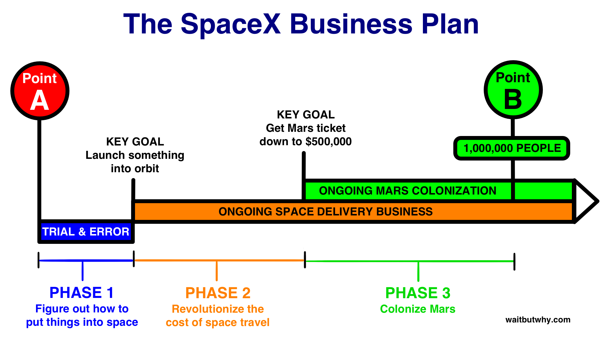](../assets/images/original/img_086_cb563c53.png)

SpaceX 已经干了 13 年了。我们来梳理一下到目前为止发生了什么，以及前方还有什么。

**阶段 1：想办法把东西送入太空**

**主角：**Falcon 1

**目标：** 在马斯克钱花光之前，把东西送入轨道

阶段 1 其实早在 SpaceX 成立之前就开始了，2001 年中，马斯克还在 PayPal。当时他认真考虑把太空作为他的下一站，于是做了任何人想"在一年之内、不上课、就成为世界级火箭科学家"时都会做的事——他读了一些书。

他读了像[这本](https://www.amazon.com/Rocket-Propulsion-Elements-George-Sutton/dp/0470080248?tag=bisafetynet-20) 和[这本](https://www.amazon.com/Aerothermodynamics-Turbine-Rocket-Propulsion-Education/dp/0930403347/ref=sr_1_2?tag=bisafetynet-20) 和[这本](https://www.amazon.com/Fundamentals-Astrodynamics-Dover-Aeronautical-Engineering/dp/0486600610/ref=sr_1_2?tag=bisafetynet-20) 和[这本](https://www.amazon.com/International-Reference-Launch-Systems-Library/dp/156347591X/ref=sr_1_1?tag=bisafetynet-20) 这样的书，然后基本把它们都背了下来。火箭专家 Jim Cantrell 在那时结识了马斯克，后来还和他一起去了那次失败的对俄之旅，他说："他能一字不差地引用这些书里的段落。他对材料变得非常熟稔。"[2](#footnote2-2-3902)

作为读书的补充，马斯克逮着各种人问了一大堆问题。Cantrell 称马斯克是"我共事过的所有人里最聪明的，没有之一"，他说马斯克"雇了我在火箭和航天器领域的同事们当中所有愿意给他当顾问的人"，还说"感觉他要把他们身上的经验全部吸走一样。"[3](#footnote2-3-3902)

当马斯克开始越来越认真地把太空作为他的下一件大事时，他的朋友们都为他担心。换你你不担心吗？想象一下，你朋友刚把一个互联网公司卖了一大笔钱，然后跑来告诉你他打算把几乎所有钱都砸进去，争取成为第一个成功造出火箭的创业者——因为让人类变成多行星物种这件事很重要。你听了不会好受。有一个朋友竭尽全力想劝他放弃这个疯狂的项目，方法是剪了一段[火箭爆炸的集锦](https://youtu.be/m6qJh9upqW8?t=2m46s)逼马斯克看完。

但马斯克是个怪人，他毫不为之所动，继续推进。[1](#footnote-1-3902) 在给自己装上了一根粗壮的知识树干之后，就该把别人也装进来了。当我问到马斯克关于做生意的知识时，他把我训了一顿："我不懂什么叫生意。一家公司就是一群人凑在一起，做一个产品或一项服务。生意这东西根本不存在，只有目标的追求——一群人在追求一个目标。"

于是他开始把他能找到的最聪明的那群人攒到一起，SpaceX 就这样诞生了。

然后这帮全明星核心团队（包括著名火箭工程师 [Tom Mueller](https://www.linkedin.com/pub/thomas-mueller/3b/451/209)）开始招人。SpaceX 早期的一些招聘政策：

**不招混蛋。** 马斯克说，如果你讨厌你的同事或老板，你就不想来上班，也不会愿意长时间待在公司。

**按纯天赋而非经验招聘（和提拔）。** 马斯克说过他不太在意研究生学位、大学学位、甚至高中学位——只在意纯天赋、性格、和对 SpaceX 使命的热爱。我和 SpaceX 的运载器工程副总裁 Mark Juncosa 坐下来聊过，意外发现他就是个典型的加州*兄弟*。他看起来像那种我会当哥们儿的傻小子，不像火箭科学大佬。他告诉我他上学时是个糟糕的学生，眼看就要变成一个废人，结果在他大学的车友俱乐部里[玩赛车][2](#footnote-2-3902) 玩出了感觉。事实证明他在这方面是个天才，毕业之后有人把他介绍给马斯克，马斯克直接把他招了进来。Juncosa 在公司里迅速晋升，现在 30 出头，就掌管着公司几大部门之一，手下管着几百个比他经验多得多的人。

类似的故事似乎有一大堆，反映出 SpaceX 异常精英主义——我和发射工程高级总监 Zach Dunn 聊过，他看起来大概 12 岁。Dunn 告诉我他几年前刚来的时候就是个实习生。早期，他以为马斯克根本不认识他，结果马斯克突然告诉他，自己认为他是一个非常强的工程师，这让 Dunn 意识到马斯克对公司里的每一个人都了如指掌。几年之后，Dunn 就被任命为发射工程的负责人，手下管着 100 多号人。

**马斯克亲自面试每一个人，包括清洁工，而且面得像个怪人。** 这条规矩在公司头八年几乎没破过例外，一直执行到公司有 1000 名员工的时候。根据马斯克的[传记](http://amzn.to/1TZLPGn)："每个员工在去见马斯克之前都会收到一个提醒。他或她会被告知，这次面试可能持续 30 秒到 15 分钟不等。*马斯克很可能会在面试开头继续写邮件、继续工作、不怎么说话。别慌，那很正常。最终，他会转过椅子面对你。但即便到了那时，他可能也不会真的和你有眼神交流，也不会完全承认你的存在。别慌，那很正常。合适的时候，他会开口和你说话。*"[3](#footnote-3-3902)

公司本身，像 Tesla 一样，高度纵向一体化。这意味着，火箭制造的多数环节，SpaceX 不会外包给第三方供应商，而是几乎所有主要部分都自己来，对供应链的大部分环节都保持着所有权和掌控权。这在航空航天业是极其罕见的——正如 Ashlee Vance 所[解释](http://amzn.to/1TZLPGn)："这个工厂是一座供奉 SpaceX 视为其在火箭制造游戏中的主要武器——自主生产——的殿堂。SpaceX 自己制造 80% 到 90% 的火箭、引擎、电子元件……还自己设计主板、电路、用于探测震动的传感器、飞行计算机和太阳能板。" 老派工业家们，比如安德鲁·卡内基和亨利·福特，都推崇纵向整合，当今的苹果在很多方面也是如此。如今大多数公司都不愿承担纵向整合所要求的那种巨大体量，但对像马斯克或乔布斯这种质量控制的偏执狂来说，这是他们唯一能接受的方式。

除了把流程中的众多环节合并到 SpaceX 的大屋顶下之外，这些环节在物理上也交织在同一栋楼里，就像在 Tesla 一样——工程师们坐在电脑前，要么被布置在设计和生产区域中间，要么坐在全玻璃的办公室里，四周都是看得见的装配过程。

随着团队壮大和部门成形，马斯克以一种极其不寻常的方式，几乎事无巨细地参与每一个流程。有的老板叫"微观管理者"——在马斯克的公司里，他的介入程度让他得了一个"纳米管理者"的名号。

**埃隆·马斯克懂很多事 蓝框**

我在 Tesla 和 SpaceX 谈过的几乎每一个人都强调，马斯克对他们的具体领域是多么在行，无论是车电池、汽车设计、电机、火箭结构、火箭引擎、火箭电子（"航电"）还是航空航天工程。他之所以能这样，靠的是他极其深厚的物理和工程基础理解的树干，再加上他在学习过程中以天才级别保留信息的能力。

正是这种疯狂的博学广度，让马斯克能够对两家公司里发生的每一件事保持着异常高的控制。关于 SpaceX 的火箭，马斯克说："我对我的火箭了如指掌，从里到外、从外到里。我能告诉你蒙皮材料的热处理状态、哪里会变化、为什么我们选这种材料、焊接工艺……一直讲到最细枝末节。"[4](#footnote2-4-3902)

我问了 SpaceX 的软件工程副总裁 Jinnah Hosein 关于马斯克的纳米管理。他是这样说的：

*对任何刚加入公司的人来说，最大的惊讶是——SpaceX 上下会到处说"纳米管理者"这个词，你会想，"行吧，他喜欢钻到细节里，挺酷"——但你完全不知道那是什么量级。作为公司 CEO，他脑子里有极其深的一摞东西——所有信息都为他所有，他可以随时就任何一件具体的事钻到底，而且他经常这样。他在为公司做着非常低层次的决策和非常低层次的路线指引，精度极高，我完全想不出这套打法换一个人在另一家公司会行得通。一个人同时是这么多事情的关键决策点，这在我看来是惊人的——他能把这一切都装在脑子里，并在需要时实时按需调用，以便做出好的决定。*

好了，现在到了 2002 年中，这个疯狂的想法开始变成一个真实的存在。有明确的使命、有团队、有一个能改变自然的 CEO。下一步——火箭。

在我们聊 SpaceX 的第一枚火箭之前，先把术语搞清楚：

几乎任何一次太空发射的目的，都是把某样东西送上太空。你要送的东西叫做**载荷**。载荷可以是卫星、货物、人、一只猴子[4](#footnote-4-3902)——任何东西。

为了扛住通往太空的粗暴旅途，载荷有时会被装在一个保护壳里，叫做**整流罩**。其他时候，载荷需要在太空中被操纵、导航、对接，甚至被带回地球。这时候，载荷就会被装在一个**航天器**里——如果你是九岁小孩，就叫**太空飞船**。

然后就是**火箭**。火箭是发射时那个大家伙本体，它只有一个任务：把载荷和它的容器一起穿过大气层、送进太空。火箭大部分都是一个巨大的燃料箱，在火箭的底部是一台或几台狂猛强劲的钟形**引擎**。它们提供把成吨的重量推离地球大气层所需的巨大力量——也就是**推力**。有时候火箭是由多个较小的火箭组合而成，叫做**级**。对了，上面我描述的一切，如果载荷是武器，那就变成导弹了。

最后，**rocketship**（火箭船）这个东西是不存在的。"Rocketship" 是用来让一个四岁小孩对生活产生兴奋感的词——仅此而已。

阿波罗任务是用一枚叫做土星五号的巨型火箭登上月球的。土星五号重 3000 吨——大约相当于七架波音 747 摞起来——高度相当于一栋 35 层的大楼。[5](#footnote2-5-3902)

[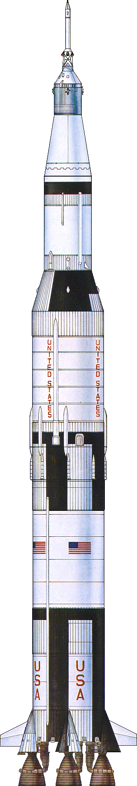](../assets/images/original/img_087_f20e0423.gif)

土星五号就像那种让人过瘾的俄罗斯[套娃](http://previews.123rf.com/images/nineeak/nineeak1108/nineeak110800011/10313040-russian-doll-babushka-single-row--Stock-Photo.jpg)，一层比一层小。所有部件如下：[6](#footnote2-6-3902)

[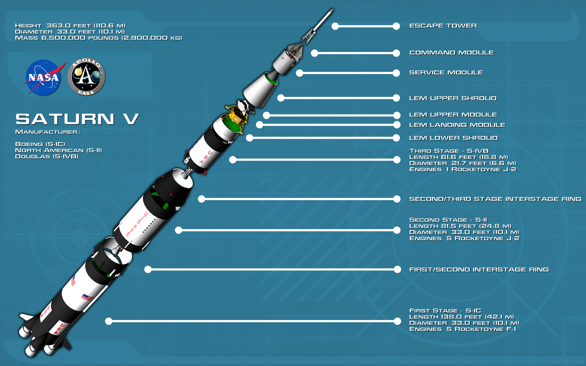](../assets/images/original/img_088_5f22472f.jpg)

航天飞机只干到近地轨道就行，活儿简单得多，它走的是完全不同的路子。

航天飞机没有用一枚大的一级火箭，而是用两枚火箭（叫做固体火箭助推器）[5](#footnote-5-3902) 来完成上升段最重的那部分活儿，载荷——人和设备——则坐在航天飞机这个太空船里，他们真的把它造得像一个典型的太空船。火箭脱落之后，航天飞机用那个大得莫名其妙、橙色的燃料箱里的燃料提供剩下的推力。通常情况下，返回的航天器[6](#footnote-6-3902) 是用降落伞落在海面上的，但航天飞机用了更体面的方式——像一架飞机一样降落在跑道上：[7](#footnote2-7-3902)

[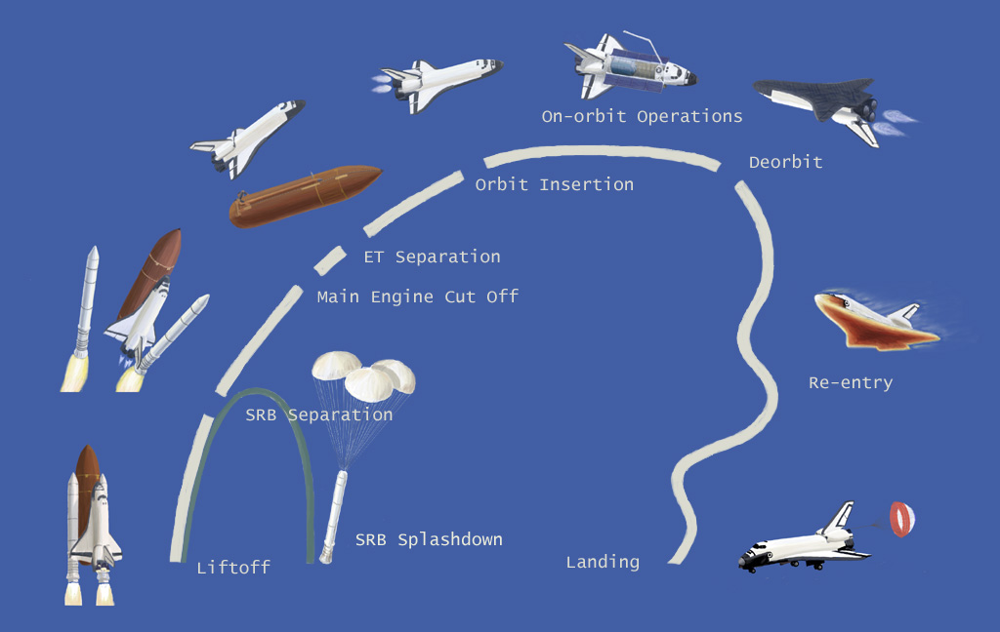](../assets/images/original/img_089_f7fa982d.jpg)

当 SpaceX 造他们的第一枚火箭时，他们并不打算搞有史以来最大最狠的那一种。相反，他们造了一枚更像是他们练手用的火箭——一枚又小又直接的火箭，马斯克把它命名为 **Falcon 1**（以《星球大战》中的千年隼号命名）。它是一枚高 70 英尺（21 米）的两级火箭，底部装着一台超级强劲的引擎——SpaceX 自己的发明，Merlin 引擎。[8](#footnote2-8-3902)

[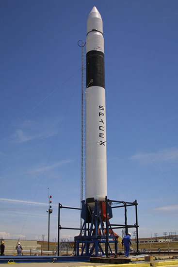](../assets/images/original/img_090_c768d5de.jpg)

尽管尺寸和能力都很温和，Falcon 1 满是创新性的新技术。主要目标是让把小载荷送入太空的成本比以往任何时候都低——这不仅因为马斯克把降本视为把人送上火星的途径，更因为在他看来，这是当前太空旅行中*唯一*可以在有意义层面得到改善的方面。他说："火箭的速度永远都差不多。便利性和舒适度也都差不多。可靠性……这方面的提升也不会太大。所以技术进步真正能用一个关键参数来衡量，那就是成本。"

马斯克指出了成本一直居高不下的两个原因：

**1）航空航天业里只有大公司，而大公司厌恶风险。** 他说："有一股强烈的偏见反对冒险。每个人都在努力优化自己的推卸责任……即便有更好的技术，他们仍然在用过时的部件，常常是 60 年代开发的那些……[很多]用的是 60 年代造的俄罗斯引擎。我不是说它们的设计来自 60 年代——我是说他们用的引擎是字面意义上 60 年代造的，装着、藏在西伯利亚的什么地方。"

**2）纵向整合不够。** 我们前面提到过 SpaceX 的纵向整合和它给马斯克带来的对 SpaceX 一切事务的完全掌控，但马斯克也相信这种纵向结构对保持低成本至关重要，他批评业内其他人没有这样做："大航空航天公司有把一切都外包出去的趋势……他们外包给分包商，分包商又外包给二级分包商，等等。你得往下找四五层才能找到一个真正在干活的——真的在切金属、塑原子。每一层往上都叠加利润——简直是五重管理费用。"[9](#footnote2-9-3902)

没有那种有着悠久历史的大公司所背负的包袱，SpaceX 才能够"从白纸开始、从零开始[设计和开发 Falcon 1]"，早期 SpaceX 员工 Max Vozoff 这样说，[10](#footnote2-10-3902) 你可以在马斯克从零开始的思考方式中看到这种"白纸"思维："[我问自己]，火箭是由什么造的？航天级铝合金，加上一些钛、铜和碳纤维。然后我又问，这些材料在大宗商品市场上的价值是多少？结果发现，火箭的材料成本大约是通常售价的 2%——对于一个大型机械产品来说，这个比例是疯了……所以我想，鉴于这些材料成本，我们应该能造一枚便宜得多的火箭。"[11](#footnote2-11-3902)

这一切听起来都很美好——但这并不是一家有着正常预算和开发周期的普通公司。这是一项几乎没有任何理智的投资者愿意碰的冒险，公司得以存在很大程度上靠的是埃隆·马斯克个人的银行账户。等到 2006 年的时候，马斯克决定把颠覆汽车行业也作为一个副业，同时把他的 PayPal 财富里的 $70 million 投到了 Tesla，这给 SpaceX 留下了大约 $100 million。马斯克说这个钱够"三四次发射"用。SpaceX 会有这么多次机会来证明自己配得上付费客户。既然付费客户想要的，是 SpaceX 把他们的载荷送入轨道，那就是 SpaceX 必须做到的事——成功地把东西送入轨道，向世界证明他们是来真的。

所以这场游戏很简单——在三次或者顶多四次尝试内把载荷送入轨道，否则公司就完了。当时，在众多曾经尝试把东西送入轨道的私营公司中（参见[这张名单](https://en.wikipedia.org/wiki/List_of_private_spaceflight_companies)上"运营中"那一栏的稀少），只有一家成功过（Orbital Sciences）。

要理解为什么这件事这么难，我们必须先理解*什么叫*轨道。

**什么是轨道？**

凭直觉，我们很容易把把物体送入轨道的挑战等同于"把它*送上去*"的难度，就像我们凭直觉会认为国际空间站里的宇航员之所以飘起来，是因为他们所处的太空位置没有重力。这是个该停掉直觉的时机。

我们快进回高中一秒。这是我们用来算重力的公式：

[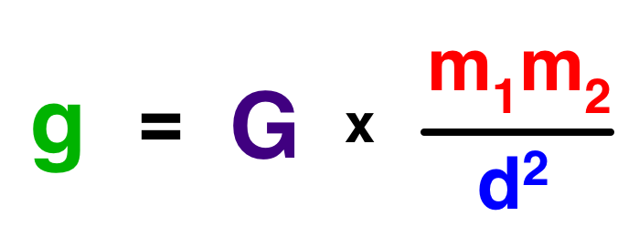](../assets/images/original/img_091_e32668d2.png)

**G** 是引力常数，一个相当恶心的数字，在这个练习里我们可以忽略它。

**m1 和 m2** 是两个物体的质量。是两个物体，因为引力不是单向的——任意两个物体之间都会以同样大小的力相互吸引。就你和地球而言，你理解的"你的体重"*就是*你和地球之间的引力，这个力以同等大小作用在你和地球上。[7](#footnote-7-3902) 因为两个质量在分子上，所以当它们变大时，引力也会随之变大（与它们的乘积成正比）。所以如果我把你的质量翻倍，你的体重也翻倍。如果我让你的质量不变，但把地球的质量翻倍——同样，你的体重翻倍。如果我把你和地球的质量*都*翻倍——你的体重会变成四倍。在本篇里我们不需要具体算质量。

我们在乎的是 **d2** 这一项。*d* 是两个物体之间的距离——更准确地说，是两个物体的*质心*之间的距离。就地球而言，质量是对称分布的，所以质心就是地球的球心。地球的半径是 3,959 英里（6,371 公里），所以当你站在地球表面时，这个数就是用来算你受到的重力的 *d*。因为 *d* 在分母上，所以 *d* 越大，引力就越小。

为了把这一切说清楚，我要把地球缩小到它原来大小的约 1300 万分之一，让它正好是一米直径：

[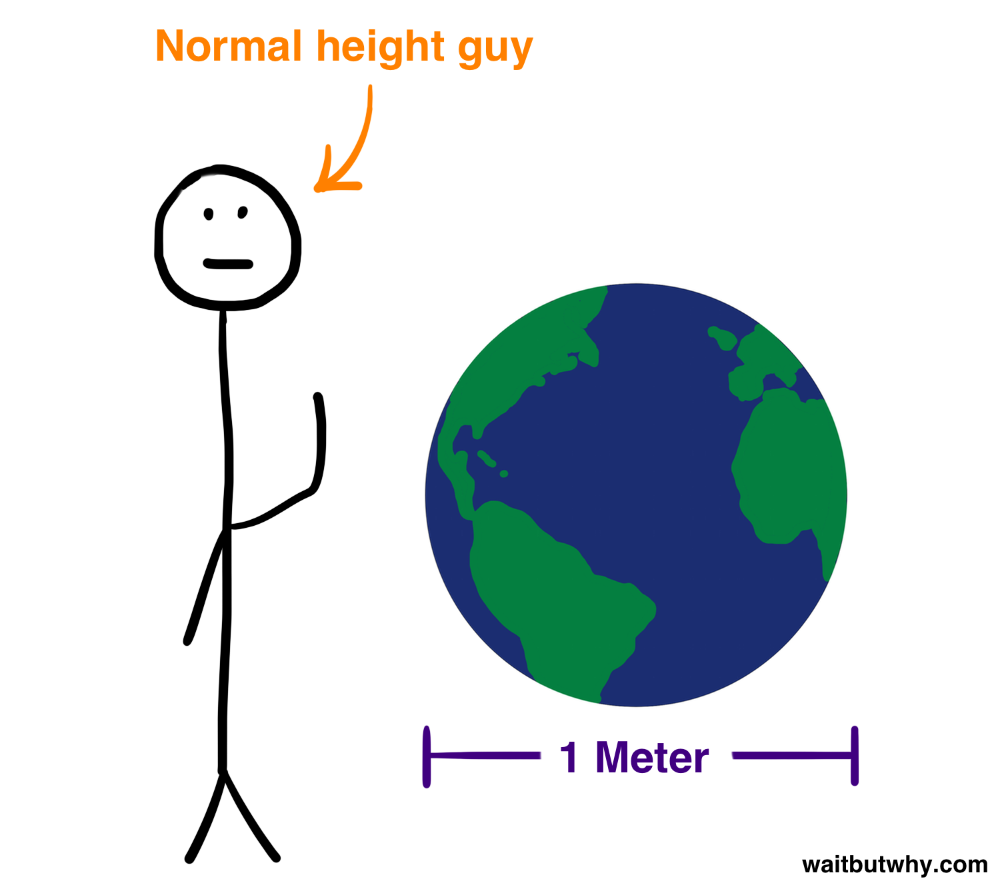](../assets/images/original/img_092_a9013b76.png)

如果我们把 *d* 翻倍——离开地表一个地球半径的距离（半米），*d2* 就变成 4 倍，所以引力和你的体重就会变成地表上的四分之一。如果你挪到整整一米远——也就是你可以把一个完整的地球塞在你和地球之间——*d* 就变成三倍，你的引力就只剩地球上的 1/9。[8](#footnote-8-3902)

那 ISS 在这一切中又位于哪里呢？

它在距地面 205 到 255 英里之间，换算到我们这个一米地球仪上就是离地表大约 2-3 厘米，也就是*一英寸*多一点点。如果有个乒乓球粘在这个地球仪上，ISS（和一大堆卫星）都会撞到它。（顺带一提，普遍公认的"太空"起点是[卡门线](https://en.wikipedia.org/wiki/K%C3%A1rm%C3%A1n_line)，62 英里（100 公里）高空，在我们这个地球仪上就是地表以上 7.8 毫米——大约是一支铅笔的宽度。而一架飞机就在距地表 0.84 毫米的高度飞行——大约是一粒沙的高度。）

那这对近地轨道上的重力——比如 ISS 那个高度——意味着什么呢？

我们取 ISS 平均高度的中间值（230 英里），就会发现，这个高度只比地表正常的 *d* 多出 5.8%，这只能把地表重力减少大约 10%。

[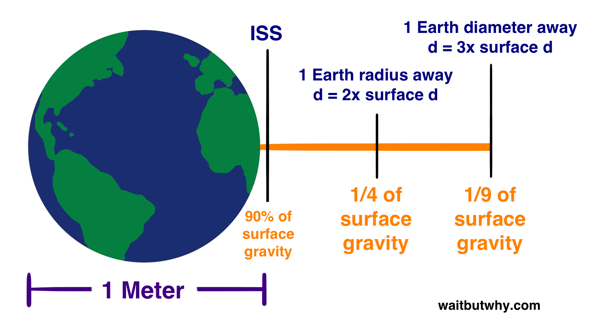](../assets/images/original/img_093_90c9b857.png)

所以 ISS 上的宇航员本来应该几乎感受不到重力的差别。然而，他们就是飘着的。

原因是他们处于自由落体中。

我曾有一次机会和一位不管不顾的飞行员一起坐上一架小飞机，他把飞机拉到 4000 英尺后急速掉到了 2000 英尺。掉下来之前，他递给我一支笔，让我在张开的手掌上放稳。掉的过程中，我那 8% 没在屎尿屁状态的大脑看到那支笔悬停在我手前，然后轻轻地飘向一边，最后在我们重新在 2000 英尺拉平时一头栽进我大腿。这就是 ISS 里面每时每刻都在发生的事。

原因如下：想象你站在一颗比地球小、表面比地球光滑、而且没有大气层的行星的一座悬崖上——然后你用尽全身力气把一颗棒球扔出去。

它的轨迹大概会是这样：

那如果让一个职棒大联盟的投手来试一下呢。可能看起来是这样：

[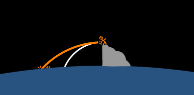](../assets/images/original/img_096_3cac7ec2.png)

那如果你用大炮把球射出去呢？它会飞得更远。

[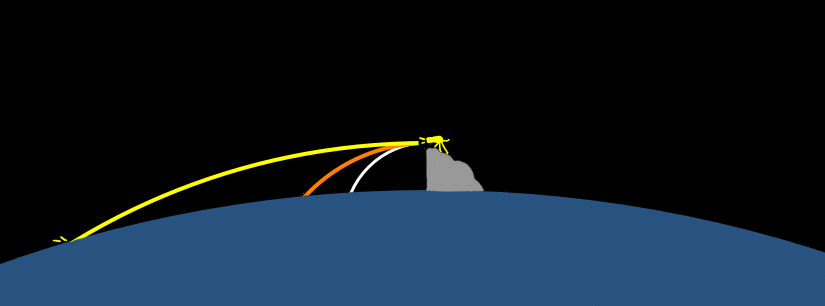](../assets/images/original/img_097_9ff70eba.png)

这些球在落地之前，都沿着一条曲线飞。如果行星表面没有挡住它们的去路，这些轨迹会延伸成一条长长的椭圆。为了简单起见，我们把每条轨迹和一条能很好匹配这条轨迹弧度的圆对齐一下：

[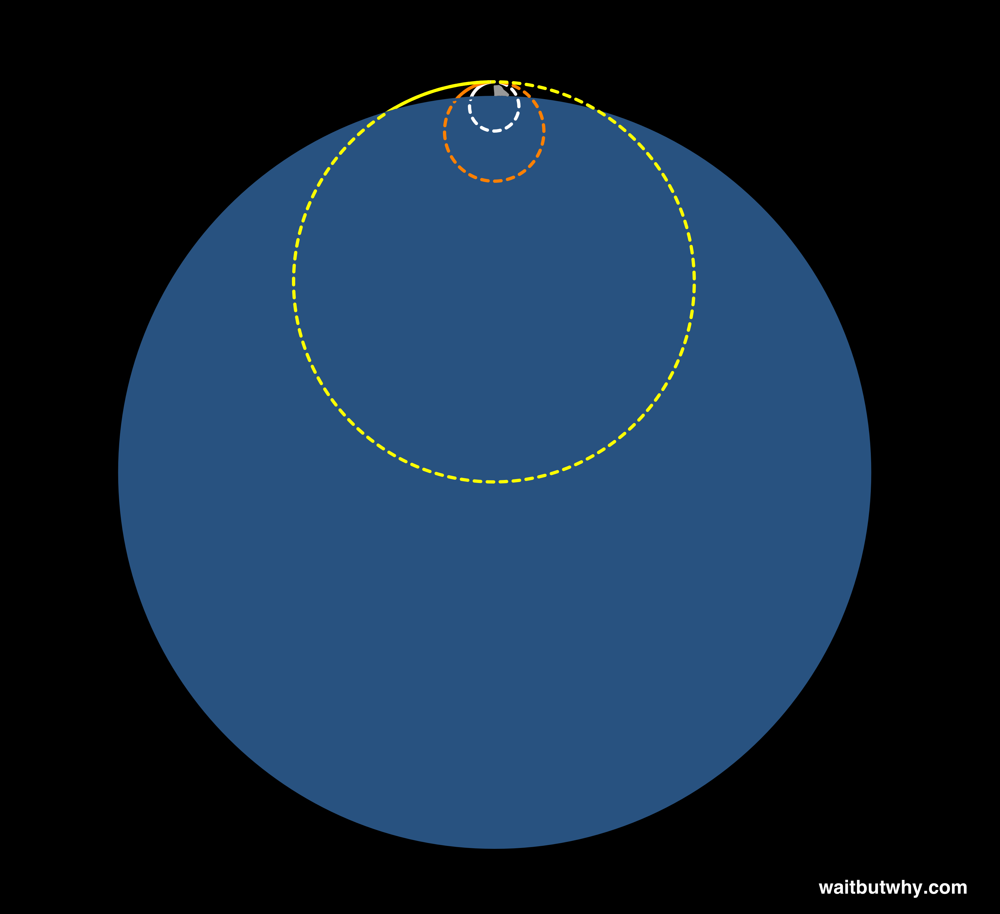](../assets/images/original/img_098_7465fde6.png)

现在我们用一门口径更大的炮，它会打出这样：

[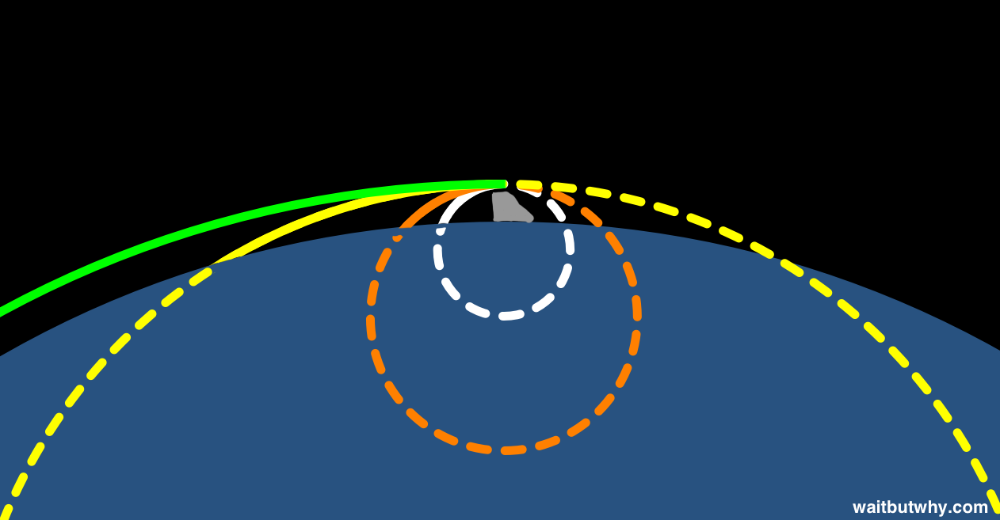](../assets/images/original/img_099_763935f5.png)

看起来正常，但注意看，弧线的曲率正在和行星的形状匹配。所以最后发生的事是这样：

[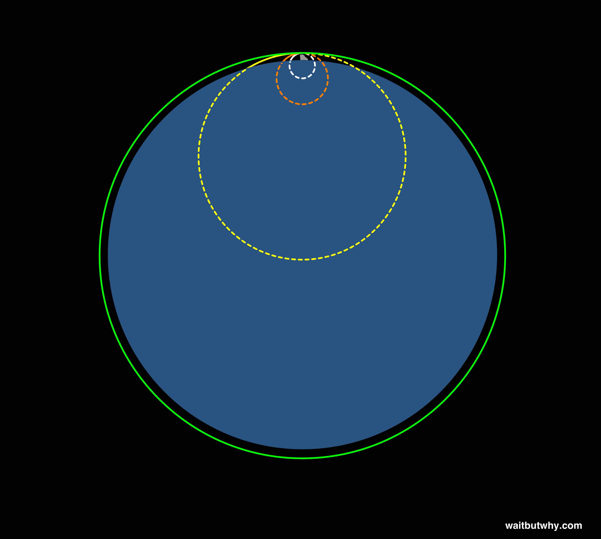](../assets/images/original/img_100_4446c820.jpg)

这颗球会绕着行星一圈，撞上炮的屁股。如果那里没有东西挡住它，这颗球就会一直"落"下去，永远落不到地。因为这颗球的轨迹弧度——以及对应的那个圆——和行星的曲率完全吻合，所以当这颗球试图落向地面时，行星本身也在从球的下方不断"落"走。你已经把球送入轨道了。

如果有一颗任意大小的、表面完全光滑的行星，而且它完全没有任何大气，那理论上你可以在紧贴地面的高度把东西送入轨道。但因为地球有厚厚的大气层（还有高低不平的地表和山脉），所以不管你把球射得多猛，靠近地表发射时大气都会把它减速，让它的轨迹曲率越收越紧，直到它从轨道上掉下来砸到地上。这就是为什么我们送入轨道的所有东西都在很高的地方——那里的大气稀薄到不会让物体减速。在没有摩擦力干扰的情况下，牛顿惯性定律接管，它就会永远绕着行星转。[9](#footnote-9-3902)

为了让一个物体能"落"入绕地球的轨道，它必须以*难以置信的*高速运动。但又不能*太*快。为什么？因为那样弧线就*太*宽了，对应的圆会比行星更大，然后就会发生这种事：

[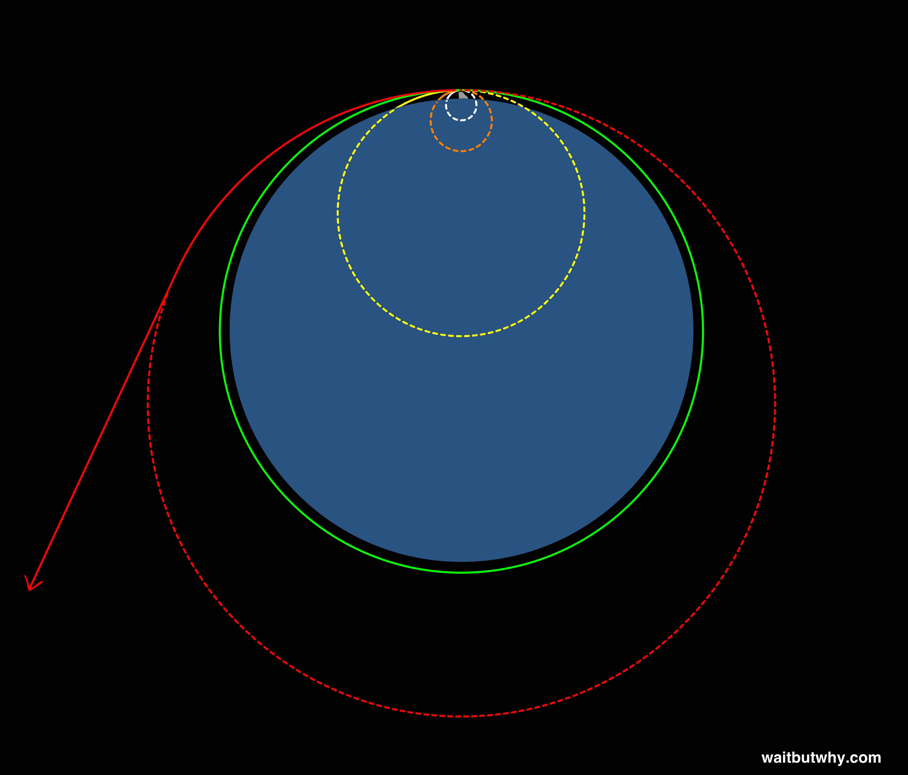](../assets/images/original/img_101_1d2bbfeb.jpg)

这就是为什么人们会讲"达到轨道速度"才能留在轨道上，以及"逃逸速度"才能逃离地球引力井、飞向外太空。逃逸速度只不过是说，那条轨迹形成的弧比行星的曲率更宽。

那在 ISS 所在的 230 英里高度上，轨道速度是多少呢？17,150 英里/小时（27,600 公里/小时）。或者说每秒 4.76 英里 / 7.66 公里。这就是"刚刚好"的速度，能让一个物体在那个高度留在轨道上。

为了感受这个速度有多快，如果你以这个速度从海滩把球扔进大海，它会嗖地一下就射出去、越过地平线、消失在视野中，整个过程大概只要半秒。在这个速度下，ISS 每 90 分钟绕地球一圈（然而，因为速度是相对的，ISS 里的宇航员根本不觉得自己在动，就像你在飞机上一样）。

回到 SpaceX。鉴于上面那个蓝框，把 SpaceX 的挑战说成是本质上"把一个载荷扔到轨道上去"是合理的。人们以为火箭发射是*往上飞*，但其实它是在把一个东西以极大的力*往侧面*扔，这就是为什么火箭的轨迹看起来是这样：[12](#footnote2-12-3902)

[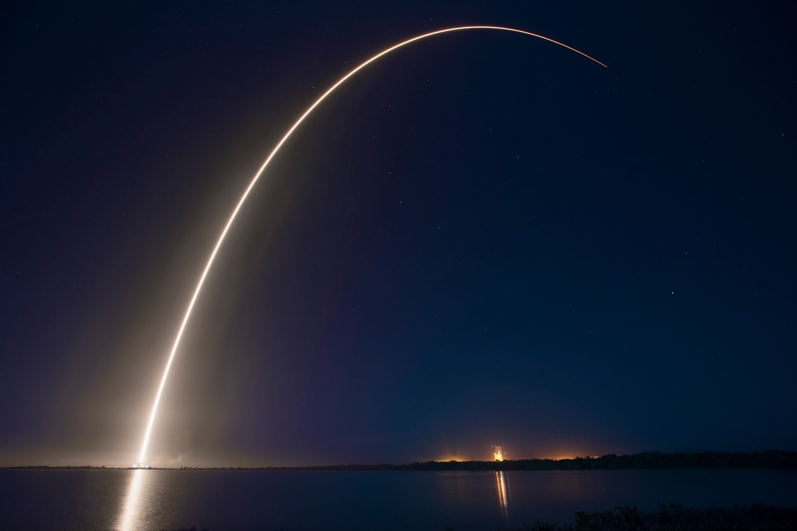](../assets/images/original/img_102_0d26961e.jpg)

就像我们上面的那些例子，火箭就像一个巨人的手，正在把载荷扔出去：

[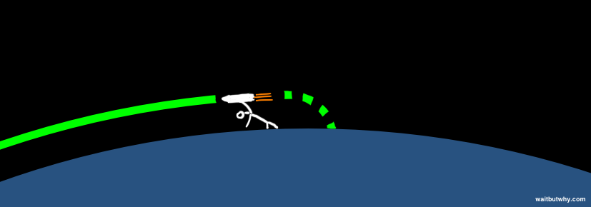](../assets/images/original/img_104_f039a71f.png)

只不过在现实世界里，火箭公司没有胳膊和手，他们要靠一座七层楼高、40 吨[10](#footnote-10-3902) 重的金属塔把载荷扔出去，这座塔会"轰"地一声从地球拔地而起，并且需要在*刚刚好*的合适高度、*刚刚好*的合适速度，把一台精密的机器打出去。

让事情更难的是，"这一扔"是从海平面的大气层开始的，那里既黏稠得像糖浆，又充满了"运动部件"（也就是天气）。这就像你的手从几英尺的水流下面开始，还得精确地把球扔出去。SpaceX 的运载器工程负责人 Mark Juncosa 这样形容引导火箭穿过大气层的挑战："火箭就像一根湿面条，而你正试图把它顶到太空去。它扑腾得厉害。你甚至没法通过测量火箭上任何一点的轨迹来弄清它要去哪——你得测几个点。"

再加上如此巨大的力量在起作用——火箭的重量、速度、稠密的大气——任何一个微小的设备故障都能立刻让任务报废。问题在于，你没法可靠地测试设备到底能不能扛住，除非它真正发射那一刻。

SpaceX 是用最痛苦的方式学到这一切的。

2006：第一次发射——失败

2007：第二次发射——失败

2008：第三次发射——失败

糟糕的时光。

这些失败都是些小得不能再小的事引起的。具体来说，是一个被腐蚀的螺母没能扛住压力、火箭里的液体晃得比预想的厉害、还有一级引擎在分级时关机晚了那么几秒。你可以做到 99.9% 都对，最后那 0.1% 就足以让火箭在一次灾难性故障中炸成碎片。太空是难的。

每一个发射火箭的政府或公司——每一个、毫无例外——都有过失败。这是这行的一部分。通常你会深吸一口气、卷起袖子、搞清楚哪儿出了问题、然后继续准备下一次发射。但 SpaceX 当时有特殊的情况——公司的钱只够"三四次发射"，三次失败之后，他们手里只剩"或者四次"的那一次了。它被安排在第三次发射失败后不到两个月发射。这是最后的机会。

马斯克的一个朋友 Adeo Ressi 是这样描述的："一切都押在这次发射上了……如果它成功，辉煌的胜利。如果它失败——哪怕有一件事出了岔子导致失败——彻底的失败。没有中间地带，没有半分功劳。他已经连续失败三次了。本来就完了。我们说的是哈佛商学院的案例研究——一个有钱人跑去搞火箭生意然后输得精光。"[13](#footnote2-13-3902)[11](#footnote-11-3902)

但在 2008 年 9 月 28 日，SpaceX 点火进行了第四次发射——而且*稳稳拿下*。[12](#footnote-12-3902) 他们把一个模拟载荷顺利送入轨道，成为史上第二家做到这件事的私营公司。

Falcon 1 也成为发射史上最划算的火箭——定价 $7.9 million，成本还不到当时美国最佳替代方案的三分之一。

NASA 留意到了。成功的第四次发射足以让他们相信 SpaceX 值得托付，2008 年底，NASA 给马斯克打电话，告诉他他们想给 SpaceX 一份 $1.6 billion 的合同，让他们为 NASA 向 ISS 做 12 次货物运送。

马斯克的钱完成了它的使命。SpaceX 现在有客户了，前方路还长。

[阶段 2：彻底改变太空旅行的成本 →](https://waitbutwhy.com/2015/08/how-and-why-spacex-will-colonize-mars.html/4)

-

"unfazed" 这个词拼成这样也太蠢了吧。[↩](#note-1-3902)-

拼写检查在告诉我 racecar 不是一个词。但既然如此，它又怎么会是一个这么有名的回文例子呢？[↩](#note-2-3902)-

这本传记还描述了一个谜题，马斯克在每次面试工程师时都会问："你站在地球表面。你向南走一英里，向西走一英里，再向北走一英里。你正好回到起点。你在哪？"其中一个答案是北极，大多数工程师能立刻答对。这时马斯克会追问："还有哪里？"另一个答案是离南极不远的一个地方，如果你向南走一英里，那一圈地球的周长就正好是一英里。能答出第二个答案的工程师更少，马斯克会很乐意带着他们把这个谜题和其他谜题过一遍，并在解释时引用任何相关公式。他关心的往往不是这个人能不能答对，而是他们如何描述问题、怎么入手解决。"我把这个题发到了 WBW 的 Facebook 主页上，有几个人指出，其实答案是无穷多个——因为在南极这种情形下，你向南走一英里所到达的纬度圈，只要它的周长是 1 英里的整数分之一（1/2、1/3、1/4 英里等等）都能成立。你会绕不止一圈，但最终落到同一个地方。现在我已经在脑子里把这个问题想得清清楚楚、答案完美细致了，结果写到这一段的时候，我开始幻想被马斯克面试、这样我就可以装出第一次听到这个题、假装苦思三秒钟、然后自信满满地说"答案是无穷多个"再一一解释为什么。[↩](#note-3-3902)-

2014 年，SpaceX [把 20 只老鼠发射上了太空](http://www.nasa.gov/mission_pages/station/research/news/rodent_research)，并把它们送到了 ISS，去参加那里的一系列实验。我非常享受想象那群老鼠在它们的小舱里突然失重、挥舞着它们那小小的四肢、试图弄明白地面跑哪儿去了的画面。此外，马斯克管它们叫 mousetronauts（鼠航员）。我对这一切感到非常愉悦。[↩](#note-4-3902)-

"固体"两个字的意思是燃料处于固态，不是液体。这种燃料最大的缺点就是一旦点燃，你什么都做不了、停不下来。SpaceX 的火箭和土星五号一样都用液体燃料，所以它们能开能关——但液体也通常意味着更容易出问题。我之前犹豫过要不要跳过这条脚注，因为你其实并不在乎我刚才给你解释的这些。但你看，咱们还是聊到这儿了。[↩](#note-5-3902)-

Spacecraft 的复数形式就是 spacecraft。就这俩词。[↩](#note-6-3902)-

以防你忘了：我们平时把"重量"和"质量"混着说，但它们是完全不同的概念。质量是组成你的"东西"的量——也就是你身上所有原子的质量加在一起。这个质量不管你在宇宙的哪里都一样。重量是你所受到的下向作用力，源自地球的引力。如果你站在月球上，那里的引力大约是地球的 1/6，你的质量不会变，但你的重量会变成你在地球上的 1/6。千克是质量的单位，磅是*力*（重量）的单位。公制下重量的单位是牛顿，英制下质量的单位叫 *slug*。唉。**英制就是这么[尴尬](http://i.imgur.com/fGoMwBn.png)。[↩](#note-7-3902)-

在地球到月球的距离上，地球的引力只有地表的 1/3,758，但月球的质量大约是人的 10^21 倍，所以地球和月球之间的引力仍然是你现在所受引力的 100 多万亿倍。月球之所以有足够的引力推动我们的海洋、产生潮汐，是因为月球和海洋的质量都相当大，所以它们的 m1m2 乘积让两者之间的引力有了点"肌肉"。月球的引力并没有把地球上小池塘的水掀到空中，因为池塘的质量小得多，对应的引力也就成比例地小下去。[↩](#note-8-3902)-

对于绕地球运行的物体来说，由于在离地球这么近的地方并非完全真空，还是*有一点*小阻力的，所以物体最终确实会从轨道上掉下来。[↩](#note-9-3902)-

我马上要大量使用"吨"这个单位。我喜欢吨是因为：A）对于大型物体来说，"70 吨"这种数字比"140,000 磅"对我来说更容易理解；B）这样我就免去做磅/千克的换算。一吨（英制）和一公吨（公制）是相当接近的量，所以全世界对"吨"这个词都有一个大致相同的概念。我会使用英制吨，即 2,000 磅（907 千克）。一吨大约是公吨（1,000 千克）的 90%。理解吨的一个好办法是：一辆车大概两吨。所以当你听到某物重 20 吨时，把它想象成 10 辆车摞起来，是一个很好理解这个重量的方式。[↩](#note-10-3902)-

至少 Tesla 在这段时期没有同时陷入倒闭。哦，等等，它确实。[↩](#note-11-3902)-

让人失望透顶的第三次发射和让人大获成功的第四次发射，唯一的区别在于：第四次发射里，级间分离顺顺利利；而在第三次里，一级引擎多开了几秒，在脱落前一头撞上了二级的屁股，搞砸了一切——我把两次发射的视频精确地剪到了级间分离那一刻：[第三次](https://youtu.be/Qz0yJ8N3cA0?t=2m50s)、[第四次](https://youtu.be/8FQhtMrUQlE?t=21m17s)（你能在第二个视频里听到 SpaceX 员工在成功分离后那种兴奋到爆的声音）。[↩](#note-12-3902)-

[http://www.wired.com/2012/10/ff-elon-musk-qa/all/](http://www.wired.com/2012/10/ff-elon-musk-qa/all/)[↩](#note2-1-3902)-

[http://www.businessinsider.com/how-elon-musk-learned-rocket-science-for-spacex-2014-10#ixzz3gvgY0l60](http://www.businessinsider.com/how-elon-musk-learned-rocket-science-for-spacex-2014-10#ixzz3gvgY0l60)[↩](#note2-2-3902)-

[http://www.quora.com/How-did-Elon-Musk-learn-enough-about-rockets-to-run-SpaceX](https://www.quora.com/How-did-Elon-Musk-learn-enough-about-rockets-to-run-SpaceX)[↩](#note2-3-3902)-

[https://leanpub.com/theengineer](https://leanpub.com/theengineer)[↩](#note2-4-3902)-

图：[http://abyss.uoregon.edu/~js/space/lectures/lec14.html](http://abyss.uoregon.edu/~js/space/lectures/lec14.html)[↩](#note2-5-3902)-

[图片来源](http://www.pinstopin.com/vostok-1-ortho-new-by-unusualsuspex/ZmMwMypkZXZpYW50YXJ0Km5ldHxmczcwfGZ8MjAxNHwxOTV8NnxlfHZvc3Rva18xX29ydGhvX19uZXdfX2J5X3VudXN1YWxzdXNwZXgtZDdxOWxscypqcGc_dW51c3VhbHN1c3BleCpkZXZpYW50YXJ0KmNvbXxhcnR8Vm9zdG9rLTEtb3J0aG8tbmV3LTQ2NzM4MTE1Mg/)[↩](#note2-6-3902)-

图：[Wikipedia Commons](https://en.wikipedia.org/wiki/Space_Shuttle#/media/File:Space_shuttle_mission_profile.jpg)[↩](#note2-7-3902)-

图：[http://www.defenseindustrydaily.com/falcon1-rocket-fails-after-launch-02069/](http://www.defenseindustrydaily.com/falcon1-rocket-fails-after-launch-02069/)[↩](#note2-8-3902)-

[http://www.wired.com/2012/10/ff-elon-musk-qa/all/](http://www.wired.com/2012/10/ff-elon-musk-qa/all/)[↩](#note2-9-3902)-

[http://spaceflightnow.com/falcon/004/](http://spaceflightnow.com/falcon/004/)[↩](#note2-10-3902)-

[http://www.wired.com/2012/10/ff-elon-musk-qa/all/](http://www.wired.com/2012/10/ff-elon-musk-qa/all/)[↩](#note2-11-3902)-

图：[https://www.flickr.com/photos/spacexphotos/16510243060/](https://www.flickr.com/photos/spacexphotos/16510243060/)[↩](#note2-12-3902)-

[http://www.esquire.com/news-politics/a16681/elon-musk-interview-1212/](http://www.esquire.com/news-politics/a16681/elon-musk-interview-1212/)[↩](#note2-13-3902)- 页码：[1](https://waitbutwhy.com/2015/08/how-and-why-spacex-will-colonize-mars.html) [2](https://waitbutwhy.com/2015/08/how-and-why-spacex-will-colonize-mars.html/2) 3 [4](https://waitbutwhy.com/2015/08/how-and-why-spacex-will-colonize-mars.html/4) [5](https://waitbutwhy.com/2015/08/how-and-why-spacex-will-colonize-mars.html/5)

[Tweet](https://twitter.com/share)

 SpaceX Will Colonize Mars)