## 阶段 2：革命化太空旅行的成本

**主要角色：**Falcon 9、Dragon、Falcon Heavy
**目标：** 把去火星的票价压到 50 万美元/座

[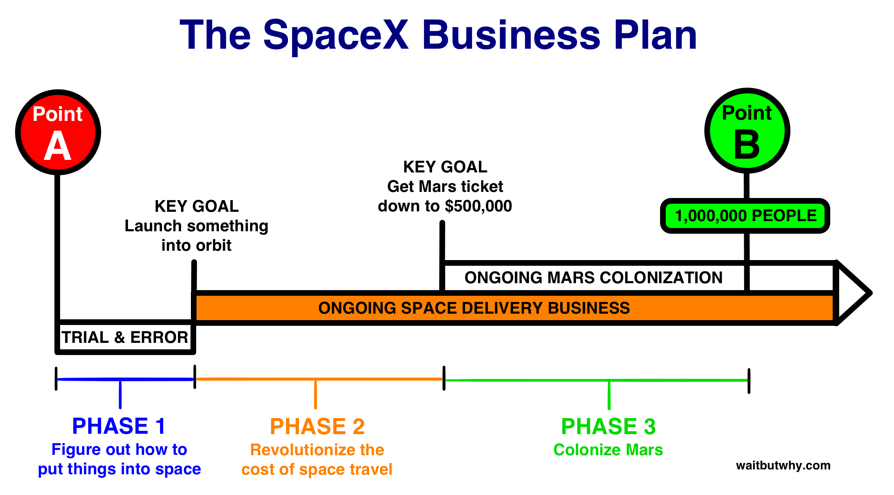](../assets/images/original/img_105_89bf8f94.png)

今天，很多人都听过 SpaceX。很少人知道 SpaceX 在做什么。更少的人知道 SpaceX *真正*在做什么。

SpaceX 在做的事情是这样的：拿钱帮人把东西送入太空。
正如我们前面确立的，SpaceX *真正*在做的事情是这样的：它是一台创新机器，试着解决一个巨大的问题——太空旅行的高得离谱的成本——因为这是让人类成为跨星球文明、能在其他「硬盘」上给自己备份的关键。它靠「拿钱帮人把东西送入太空」来养活自己。

我们稍后会再聊*真正*在做的事。先看看「拿钱帮人把东西送入太空」到底意味着什么。

**Falcon 9**

2008 年，SpaceX 成功完成了一次入轨发射，一大批新客户急切地想签约使用它那种「便宜得反常」的太空快递服务——是时候让 SpaceX 摘掉辅助轮，给自己造一辆「哈雷摩托」了。来认识 [Falcon 9](http://www.spacex.com/falcon9)：[1](#footnote2-1-3902)

[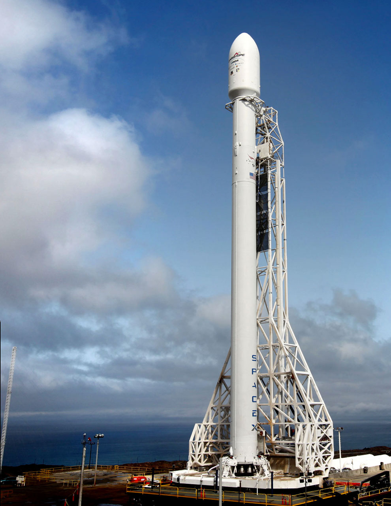](../assets/images/original/img_106_7b62826f.jpg)

我们直接先把这事说开了——Falcon 9 是全世界最大的「男性生殖器形状」的雕塑。这是每一个 SpaceX 员工都学会忍受的事情，一个笼罩在他们职业生涯之上、不可言说的事实，也是我们都不得不共同面对的事实。

先把这个梗放在一边，Falcon 9 是全世界最先进的火箭，是 Falcon 1 的巨大升级。Falcon 9 体积 [很大](https://www.flickr.com/photos/spacexphotos/17108097439/)——高 224 英尺（68 米），是 Falcon 1 高度的三倍多，相当于一栋 20 层楼。横放下来，能跨过一个橄榄球场四分之三的长度。Falcon 1 只能把不到一吨的载荷送入轨道，Falcon 9 能运 13 吨。在每一个维度上，Falcon 9 都让 SpaceX 跻身了「大家伙」行列。[2](#footnote2-2-3902)

[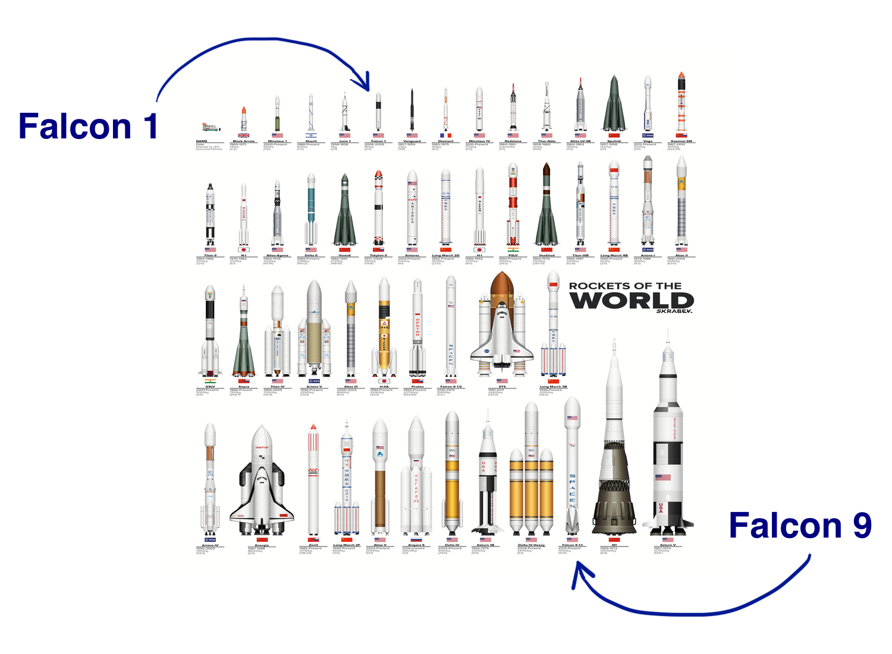](http://i.dailymail.co.uk/i/graahics/2015/02/space_shuttles_triple/images/small/small.png)

了解一下火箭，你会被火箭的实力震撼到。火箭必须难以置信地结实——它是一个 1,000 吨的大家伙，里面装满爆炸性材料，要以疯狂的速度穿越飓风级大风飞行——但同时它又必须被精确到毫米级地设计，因为它内部装着很多非常「不结实」的东西，比如计算机电路板、精密的卫星，以及活生生的人。对于这样一个特别的对象，常规制造方法并不总是管用——在 SpaceX 工厂，我看到过形状诡异的 Falcon 9 零件，只能用 3D 打印（并且 [3D 设计](https://www.youtube.com/watch?v=xNqs_S-zEBY&feature=youtu.be)）来制造，因为没有其他方法能做得刚刚好。[1](#footnote-1-3902)

但既然这些细节都不是我们要操心的事，我们就把它们全忽略、简单粗暴地讲讲：[3](#footnote2-3-3902)

[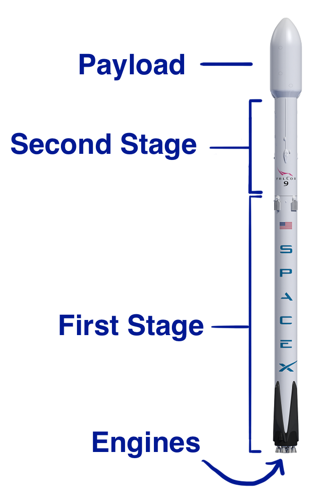](../assets/images/original/img_108_1d9bdf1b.png)

**第一级**

第一级有一个非常重要、工作时间只有 3 分钟的任务——把第二级和顶上的载荷推到大约 100 公里的高度，然后说拜拜、掉进海里。[4](#footnote2-4-3902)

[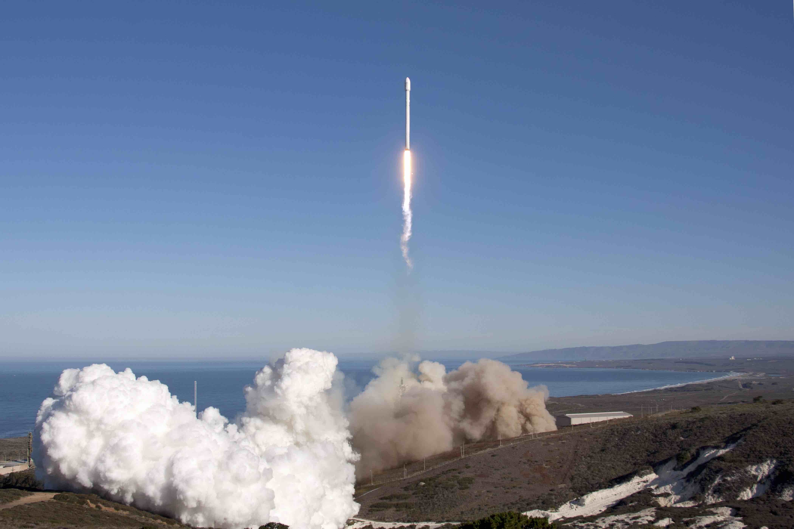](../assets/images/original/img_109_2b380496.jpg)

第一级和 Falcon 9 的几乎所有部件一样，都在 SpaceX 加州总部制造（这里有一个 [快进视频](https://www.youtube.com/watch?v=vrR31nHCV-U) 展示制造过程）。

第一级大部分是一个大燃料箱，里面有两个关键部分：一个巨大的 [火箭级煤油](https://en.wikipedia.org/wiki/RP-1) 储箱，旁边是一个巨大的液氧储箱。火箭不能像飞机那样从空气中吸取氧气——原因很多，其中之一是火箭很快就会飞到空气非常稀薄的高度。所以它必须自带氧气。氧气在零下 297.3°F（零下 183°C）变成液态，一旦液化，密度大约是气态氧气的 1,000 倍——所以可以装下很多。这两种原料混合在一起，就成了爆炸性的推进剂。

**火箭发动机的工作原理**

那个对 [自己的汽车公司](https://waitbutwhy.com/2015/06/how-tesla-will-change-your-life.html) 极其不愿意烧化石燃料的家伙，每次发射却要在他的火箭公司里烧掉几百吨化石燃料——看起来挺违和。问题在于火箭*必须*烧燃料——马斯克甚至说过，他认为未来所有交通都会电动化，*除了*火箭。

原因就是牛顿第三定律：*每一个作用力都有一个大小相等、方向相反的反作用力。*

牛顿第三定律解释了为什么一个正在放气的气球会往它喷气的反方向飞，为什么一把枪在射击时会往后跳，为什么这个笨手笨脚的家伙的小船在他朝码头跑的时候反而离码头越来越远：[5](#footnote2-5-3902)

[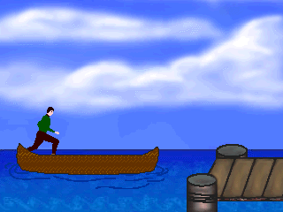](../assets/images/original/img_110_022586e1.gif)

当你思考如何推进一个载具时，就想想这个道理。

一种让载具移动的方法是用螺旋桨。螺旋桨通过把空气往一个方向推，从而把螺旋桨和与之相连的东西往另一个方向推——有点像你站在离墙一英尺远的地方用手推墙——这会把你自己的身体往远离墙的方向推。问题是，在太空中没有空气可以让螺旋桨去推，所以在太空里用螺旋桨就像你站在一个远离墙壁的房间里，像个怪人一样把手伸向虚空推——这不会把你往后推。即使在高层大气里，那里仍然有一些空气，如果空气太稀薄，就像你把手伸进一块挂着的窗帘想获得一个大的反推力——不好使。

另一方面，如果你在太空里给一个气球放气，气球*会*往反方向飞——和它在地球上一样——因为这种情况下的力不是由「推气球外面的空气」（像螺旋桨那样）产生的，而是由气球内部气压远高于外部、气压差把空气从气球里挤出来所产生的。事实上，如果你漂在太空正中央，手里有一个充满空气的气球，你可以通过让气球往相反方向放气来让自己移动一点点——在气球放气的那几秒钟里，气球本身就是一台发动机。

Falcon 9 底部的那些发动机，就是更猛的「正在放气的气球」。一团火热的爆炸产生极高的温度和压力，让爆炸产生的气体想要快速*膨胀*进周围气压较低的空间。如果有东西在一片空旷的田地中央爆炸，它可以向除下方以外的所有方向膨胀：[6](#footnote2-6-3902)

[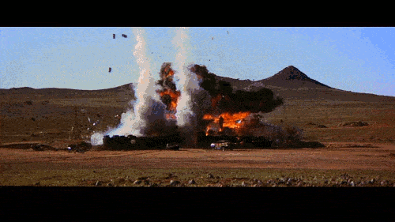](../assets/images/original/img_111_35156808.gif)

火箭发动机产生的爆炸想做同样的事——但发动机像气球一样，不让这股力往除*一个*方向以外的方向扩散。其他所有方向上的力「被拒绝」反而让这股力变得更大：[7](#footnote2-7-3902)

[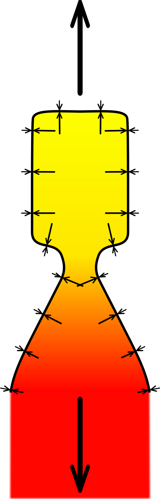](../assets/images/original/img_112_091ba158.png)

这就是为什么火箭发动机在真空中也能工作。它们不需要任何外部的东西（比如空气）来往下推——通过喷出一团热气，它们本质上是在往下*推那一团热气*。

马斯克当然更希望有比「炸燃料」更好的办法来给火箭提供动力，但他不确定我们能不能找到。我问过他这个问题，他说：「要让火箭电动化，估计得先颁几个诺贝尔奖。」

**Merlin 发动机**

Falcon 1 升空的全部动力来自一台 SpaceX 自研的狂暴发动机，叫做 [Merlin](http://www.spacex.com/news/2013/03/26/merlin-engines)。[8](#footnote2-8-3902)

[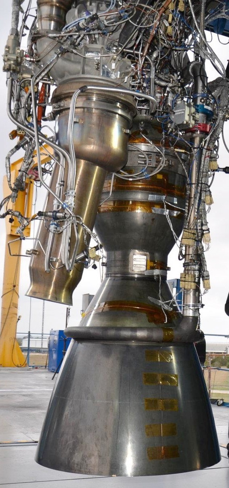](../assets/images/original/img_113_27ae9dfb.jpg)

Merlin 真的超酷。一台 Merlin 发动机的推力超过 73 吨——也就是说它能举起 73 吨的重量——这意味着如果你把 40 辆汽车堆在那张图里那台发动机上面，它能在大约 3 分钟内把这一整堆车都送进太空。它是世界上最高效、最先进的发动机之一。火箭发动机界有一项重要指标叫做推重比——也就是它能举起自身重量的多少倍。Merlin 自重约半吨，峰值推力超过 80 吨，推重比达到 165:1，把所有同类发动机[远远甩在身后](https://en.wikipedia.org/wiki/Thrust-to-weight_ratio)。下面是一段 Merlin 测试点火：

*

这也太猛了吧。[3](#footnote-3-3902)

现在想象一下九台 Merlin 同时点火。这就是每次 Falcon 9 发射时发生的事——火箭的名字就来自这九台发动机，它们以「八角网」（octaweb）方式排列：[9](#footnote2-9-3902)

[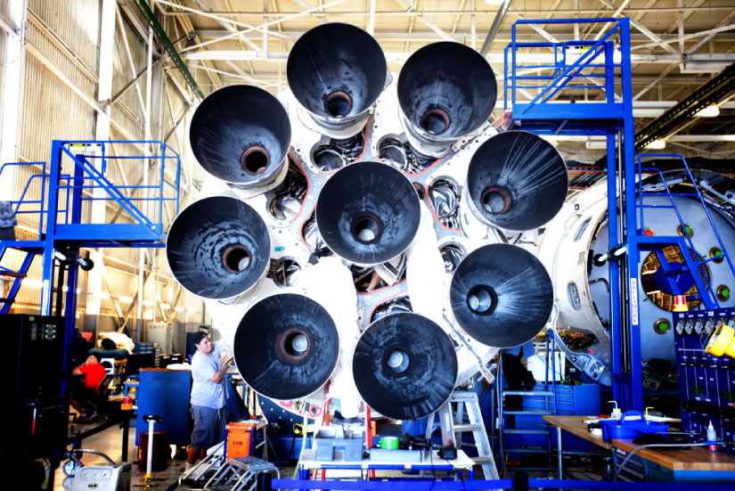](../assets/images/original/img_114_b241a47a.jpg)

九台 Merlin 一起能产生 650 吨推力，足以把一摞 360 辆汽车送进太空（这一摞车会有 [One World Trade Center](https://upload.wikimedia.org/wikipedia/commons/a/ac/OneWorldTradeCenter.jpg) 那么高），它们每秒钟会烧掉合计 540 加仑（2,044 升）的燃料——不到一分钟就能抽干一个游泳池。发动机最终举起的大部分是火箭本身和它的燃料，二者合计 550 吨，但仍然有大量剩余动力，可以在顶上再加一个相当可观的载荷。

**第二级**

发射 3 分钟后，第一级和第二级分离：[10](#footnote2-10-3902)

[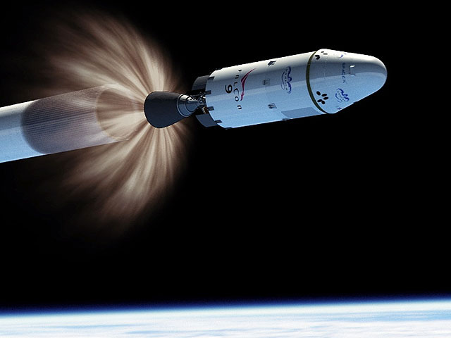](../assets/images/original/img_115_ef6dbf11.jpg)

第一级 [落回](http://images.spaceref.com/news/2010/spacex4.jpg) 地球，第二级的辉煌时刻到来了。第二级只是第一级的缩小版，里面也几乎全是燃料。但它没有九台 Merlin 发动机，只有一台——一台为太空真空环境特殊设计的、带钟形延伸喷管以增加推力的 Merlin 变体。这里需要的发动机少是因为：A）没有浓密的大气；B）少了一级之后它要举的重量大幅减少；C）它本身已经飞得很快，大部分工作已经完成。

第二级的工作可能几分钟就结束，也可能持续好几个小时。它的发动机可以反复开关，并且具备方向机动能力。它的任务是精准地把载荷送到正确的位置和正确的速度。完成之后，它就和载荷分离：[11](#footnote2-11-3902)

[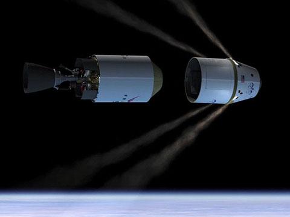](../assets/images/original/img_116_e9a48eb5.jpg)

说到载荷，Falcon 9 的顶部有两种形态，区别在于它装的是什么类型的载荷。第一种形态：[12](#footnote2-12-3902)

[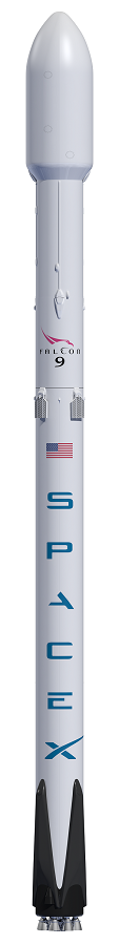](../assets/images/original/img_117_9957092f.png)

看起来像这样的时候，它通常装的是卫星。顶部的鼓起是一个两瓣式保护罩，叫做整流罩。整流罩看起来像浴缸大小，实际上是校车大小：[13](#footnote2-13-3902)

[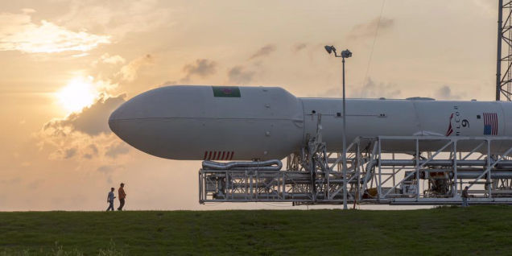](../assets/images/original/img_118_d67c3af1.jpg)

第二级达到一定速度（大约子弹速度的 4 倍）后，整流罩的两半就会分离，落回大气层烧毁。[14](#footnote2-14-3902)

[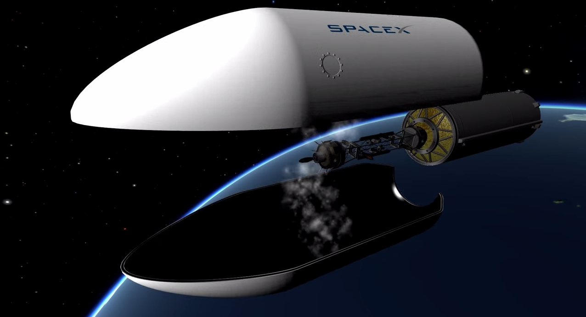](../assets/images/original/img_119_ba99cc22.png)

Falcon 9 顶部的第二种形态是这样的：[15](#footnote2-15-3902)

[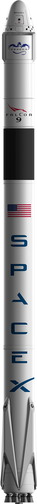](../assets/images/original/img_120_060df825.png)

顶部看起来更像三角形，意味着火箭在装一艘 Dragon 飞船。

**Dragon 飞船**[16](#footnote2-16-3902)

[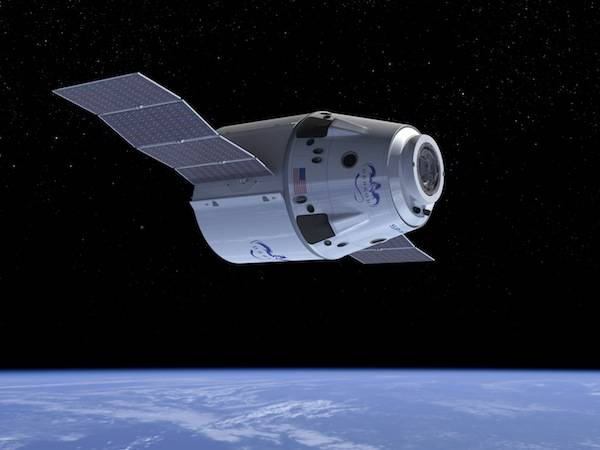](../assets/images/original/img_121_26dce35b.jpg)

[Dragon](http://www.spacex.com/dragon) 大小相当于一辆 SUV，是 SpaceX 的飞船，用来把货物——有朝一日还包括人——运进和运出太空。NASA 在 2008 年给 SpaceX 的大合同是 12 次 Dragon 任务到 ISS。在上图里，右边那个锥形的东西是 Dragon 的加压返回舱，是唯一回到地球的部分。左边那个圆柱形部分是非加压的 trunk 段，可以装更多货物，并且装着太阳能板（这是 Dragon 在太空中的电力来源）。这两部分加在一起可以装大约 6 吨货物。

侧面那些小孔是 Dragon 用来在太空中机动的小推进器发动机，底部是返回大气层用的隔热罩。

**Falcon 9 开启它的职业生涯**

当所有这些新设备都在研发中的时候，Falcon 1 在 2009 年夏天完成了第五次、也是最后一次发射——为马来西亚政府发射一颗卫星，这是 SpaceX 的第一个付费客户、第二次成功发射。但既然更修长、更帅气的 Falcon 9 已经在孕育中，Falcon 1 就不再被需要，被退役了。

Falcon 1 的五次发射都是从太平洋上一个叫 [Kwajalein Atoll（夸贾林环礁）](https://en.wikipedia.org/wiki/Kwajalein_Atoll) 的小岛完成的。但既然 Falcon 9 让 SpaceX 进入了「大家伙俱乐部」，SpaceX 就租下了美国最好的几个发射台——加州的 [范登堡空军基地](https://en.wikipedia.org/wiki/Vandenberg_AFB_Space_Launch_Complex_6)（向南发射）和佛罗里达传奇的 [卡纳维拉尔角](https://www.youtube.com/watch?v=CUmnzaDGifo)（向东发射）。

2010 年夏天，第一枚 Falcon 9 驶向发射台，让路过的几千个司机惊呼：「那他妈是什么玩意儿？」[17](#footnote2-17-3902)

[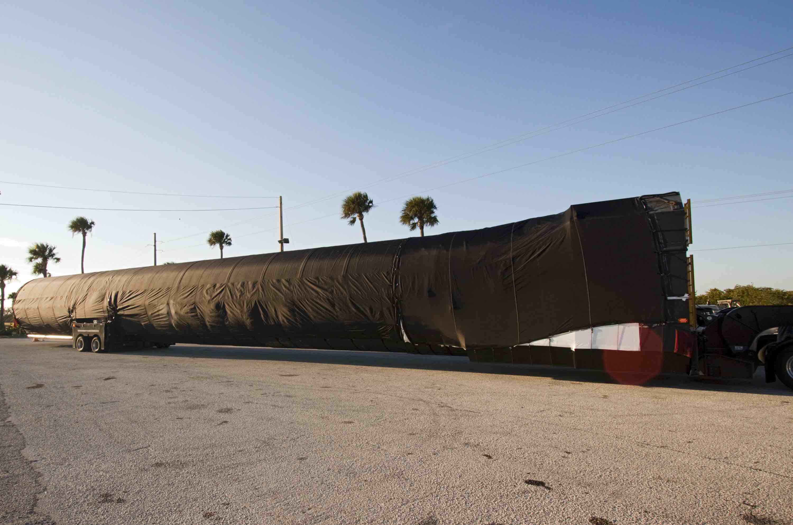](../assets/images/original/img_122_3d91a910.jpg)

它的首航——一次演示飞行——成功了。

然后，SpaceX 开始做那些「商业公司本来不应该会做」的事情。

把飞船送进太空很难——但把它弄回来可能更难。你知道从码头上跳进海里没什么大事（除了水大概很冷，因为大家都喜欢假装把自己泡进冷水里是件挺 OK 的事）——但如果你从桥上跳进海里，你就会死？唯一的差别只是你身体入水时的速度？同样的情况也适用于地球大气层。

你现在感受不到大气层是因为你速度太慢，但你张开手、像神经病一样大力前后挥动手臂，就能感受到大气。再快一点——坐上敞篷车或者快艇——你很快就会被大气糊一脸。但速度不是关于你一个人的事，它是关于你相对于大气的速度。把你的手伸出 50 英里/小时行驶的车窗外，和把车停住、外面有 50 英里/小时的风吹过来，感觉是一样的。所以当一个在轨物体——我们前面说过它必须以大约 17,000 英里/小时（27,300 公里/小时）的速度飞行——决定「我受够了」想要回到地球时，它经历的是一场等效 17,000 英里/小时的飓风。我们官方的飓风「等级」从 1 级（74-95 英里/小时）到 5 级（155 英里/小时起），每多 20 英里/小时就升一级。在地面，17,000 英里/小时等于一场 842 级飓风。842 级飓风的威力在高空稀薄大气层中会减弱一点（物体最初进入大气层时所在的高度）——但仍然很强。

飓风让我们害怕的是它的威力。但在一场三位数等级的飓风里，你有更大的麻烦。飞船在大气层上层的惊人速度意味着迎面而来的空气没有时间「让开」，会被极度压缩并变得炽热。往下，大气层变厚，飞船必须承受来自大气阻力的高温。石头扛不住这种温度——这就是它们变成流星的原因——而造出[一架能扛住的飞船](https://www.quora.com/Why-does-a-spacecraft-heat-up-during-reentry)需要大量高端技术。

到 2010 年为止，只有五个政府曾经成功把飞船送入太空并回收。Falcon 9 的第二次发射把第一艘 Dragon 飞船送入轨道进行演示飞行，绕地球两圈后，Dragon 硬扛了一场 842 级飓风却依然存在，让 SpaceX 成为第一家、也是有史以来第六个成功回收在轨飞船的实体。成立第七次发射就做到这一点，相当不错。

Falcon 9 的第三次发射再次创造历史——在为 NASA 执行的演示任务中，Dragon 成为第一个对接 ISS 的商业飞船。[4](#footnote-4-3902)[18](#footnote2-18-3902)

[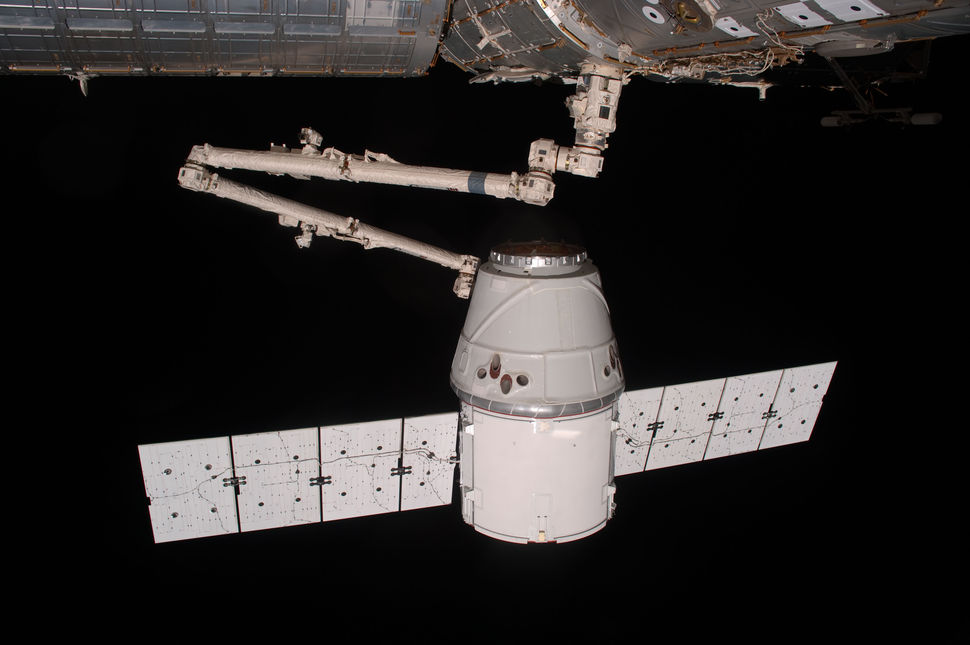](../assets/images/original/img_123_21566b4c.jpg)

SpaceX 还做了一个 [小的高光视频](https://www.youtube.com/watch?v=QwDCWTqNceQ)。

Falcon 9 终于玩真的了。Vance 写道：「从夸贾林发射的 Falcon 1 是初创公司的工作，而从范登堡起飞的 Falcon 9 是航空航天超级大国的工作。」[19](#footnote2-19-3902) 在三次计划中的演示任务完成两次后，NASA 觉得已经看够了，就取消了第三次演示任务，直接开始用 Dragon 执行正式的 ISS 补给任务。

如果你好奇发射到底什么样，这里有一部 CRS-6 任务的视频——一次 ISS 补给任务，2015 年 4 月 14 日从卡纳维拉尔角发射：

要留意的几点：

- 发射前从火箭冒出的白色烟羽是液氧储箱里的氧气——部分液氧以气体形式逸出。
- 离升空大约 5 秒前，一个叫「Niagara」的注水系统会开始向发射场灌水。目的是减弱发动机震耳欲聋的声波——否则声波太猛，会真的把火箭震坏。
- 发动机在升空前几秒就开始点火了。这时候发生的事情是：巨大的夹具把火箭死死夹住，让发动机点火，这样计算机能迅速测试所有发动机是否都正常工作。如果都正常，T-0 时刻夹具松开，火箭升空。
- 发射时间的精度要求到秒。即使差一秒，也会让和 ISS 的对接出问题。
- 发射过程非常混乱。
- 在头三分钟内，从火箭喷出的橙红色火焰流会越来越散开、越来越难看、越来越灰白。这是因为随着高度上升，大气中的氧气变稀薄，火箭外面的燃烧越来越难发生。
- 第一级在 [3:26](https://youtu.be/XfJoDxX0m7s?t=3m26s) 分离。
- 一级分离后，你看到的那个大黑色钟形物是第二级那台唯一的 Merlin 发动机。你看不到火焰是因为在这个高度燃烧是不可能的，气体一离开发动机就立刻熄灭了。
- 接下来七分钟基本没什么事。
- 在 [11:09](https://youtu.be/XfJoDxX0m7s?t=11m9s)，火箭已经进入足够高的轨道，第二级分离。
- 视频剩下的部分主要是从第二级上的相机拍摄的、已经独立的 Dragon 的画面。
- 视频最后 25 秒，你可以看到 Dragon 的太阳能板展开。

经历了五次 Falcon 1 发射和三次 Falcon 9 发射（其中大部分是测试和演示）之后，SpaceX 准备开始它的太空快递服务了。Falcon 9 的第四次发射——第一次正式的 ISS 补给任务——是连续 15 次成功交付的第一发（六次 Dragon 任务给 NASA，九次卫星任务给其他客户），一直持续到 2015 年 5 月——也就是我写下这句话、不小心给整家公司下了咒语的时候：

自从头三次发射失败以来，SpaceX 已经发射了 20 次——全部成功。

第 20 次连续成功之后，马斯克发推说：「火箭发射顺利，卫星进入了地球转移轨道。还是他妈的这么紧张。期待有一天能觉得这事儿稀松平常。」

然后——紧接着的下一次发射——出了这么一档子事：[20](#footnote2-20-3902)

[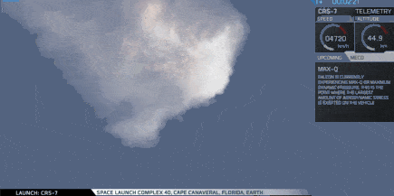](../assets/images/original/img_124_97c469cb.gif)

一次发射失败是件可怕的事，哪怕没有人员伤亡。这就是 SpaceX 副总裁 Mark Juncosa 告诉我「每次发射日都充满持续而折磨人的焦虑」的原因。那感觉有点像一个投手在世界大赛第七场九局两出局的时刻投出一球，只不过这球要几个月才到本垒板，他们得通过电视看球最后到达击球手的那一瞬间。

但毁灭性的失败是「进入太空游戏」所必须接受的一部分。在 Falcon 1 令人沮丧的第三次失败之后，马斯克给员工写了一段话：「值得指出的是，那些最终成功的发射公司当年也都挨过锤。我的一个朋友写信提醒我：Pegasus 前 9 次发射只成功了 5 次；Ariane 前 5 次只成功了 3 次；Atlas 前 20 次只成功了 9 次；Soyuz 前 21 次只成功了 9 次；Proton 前 18 次只成功了 9 次。SpaceX 是在打持久战，无论如何，我们都会把这件事做成。」这让我们能更客观地看待 SpaceX 2015 年 6 月的失败——它更像是一个提醒：SpaceX 24 次发射成功 20 次的开局有多厉害。

失败的好消息是它会准确告诉你薄弱点在哪里。这次失败的「凶手」是一根 2 英尺长、1 英寸粗的钢杆——火箭里这种钢杆有几百根之一——它本来应该承受 5 吨的力，结果只承受了 1 吨就断了。从今往后，SpaceX 会对每一根装进火箭的钢杆单独做测试。你能看到 Dragon 在画面顶部、靠近开始的部分毫发无伤地滑走了——如果它的软件能按计划提前打开降落伞，里面的东西本来能幸存。从今往后，Dragon 会装上这个软件。

然后就到了今天。

在一个充满「中间商加价」和使用几十年旧设备的行业里，SpaceX 严格控制的内部供应链和前沿技术让它成为全球最便宜的太空快递选择。多年来，美国政府一直依赖两大航天公司——波音和洛克希德·马丁，以及他们的合资公司 United Launch Alliance（ULA）——来做国内发射。ULA 向政府——也就是美国纳税人——每次发射收 3.8 亿美元。类似的一次发射，美国政府付给 SpaceX 只需要 1.33 亿美元。对其他没有 NASA 那么多特殊要求的客户，SpaceX 每次发射收 6,000 万美元。

鉴于这个不可思议的便宜价格，SpaceX 自然门庭若市——目前有 50 多次已签约的发射任务，价值超过 50 亿美元。他们正在尽一切努力扩大产能，目标是一年造 40 枚 Falcon 9。马斯克相信在几年内，SpaceX 的成本会降到行业平均的十分之一以下，并且 SpaceX 能拿下全球商业发射的多数份额。

这不仅是 SpaceX 一家的事，对美国也是大事。

美国通过波音，骄傲地成为全球两大客机制造商之一（另一家是欧洲的空客），但不知为何，这个国家却让自己在全球发射行业中变得无足轻重——而欧洲、俄罗斯和中国占据了主导地位。美国发射的主要供应商 ULA 大部分业务来自美国政府，并且它最贵的硬件设备——发动机——是从俄罗斯买的。SpaceX 正在让美国重新成为发射行业的重要玩家，全世界的发射订单源源不断地涌来——而他们几乎所有东西都在美国本土制造。

**更多愤怒的巨人**

虽然 SpaceX 对美国人和太空旅行的未来都是一件大好事，但并不是所有人都对它的登场感到高兴。

还记得上一篇（[Tesla 那一篇](https://waitbutwhy.com/2015/06/how-tesla-will-change-your-life.html)）里我们深入扒了汽车和油气行业的内部运作，发现一切都很乱、人类其实在被不知不觉地宰吗？因为当不透明行业和 government 有着「特殊」关系、又有门槛阻挡挑战者进入时，事情就会变成这样？还记得 Tesla 是怎么揭开这一切、逼迫一个又胖又懒又温顺的行业去创新，那些既得利益者都巴不得马斯克消失吗？

我几乎可以直接把那一段复制粘贴到这里。

太空发射行业就像一个小镇上几家汽修店，每家都收着超过实际成本十倍的价，但因为 A）客户对过程和合理价格一无所知，B）所有同行也都收高价，所以没有升级设备、提高效率、降低价格的压力。SpaceX 就像一个来镇上开汽修店的新人，找到了更新、更好的修车方法，比任何人都努力，能用同样的服务收几分之一的价格。这把镇上其他汽修店的全盘计划都毁了。

2014 年，全球发射行业的主要玩家之一、欧洲的 Arianespace 向欧洲各国政府请求额外补贴，以应对来自 SpaceX 的竞争。一次 Falcon 9 飞向 GTO（最高卫星轨道）的发射现在比中国历来便宜的「长征」火箭还便宜 1,500 万美元。至于发射市场的另一个主要玩家，马斯克说过：「我的家人担心俄罗斯人会暗杀我。」[21](#footnote2-21-3902)

全世界的发射客户都在注意到 SpaceX 在做什么，然后回头看看自己的发射公司，问：「等等，我为什么付这么多钱？」

当我问马斯克关于「所有想往他头上扔钢琴的行业」时，他说：「那是一屋子的脚趾——很难不踩到。」而在 SpaceX 目前踩到的所有脚趾里，踩得最狠的是 ULA。

**ULA 是个王八蛋 蓝色小框**

ULA——波音和洛马的合资公司——收的发射费比谁都高。但他们收多少都无所谓。ULA 不用和全球其他发射市场竞争——因为 ULA 自动就能从美国军方那里获得稳定的业务流。运作方式是这样的：

1) 美国军方需要往太空发射很多东西，所以业务量很大。
2) 因为军事装备和国家安全挂钩，美国希望发射由美国公司执行。
3) 因为太空发射对公众和政客来说都是一个不透明的过程，没人知道 ULA 的发射报价其实可以低很多。
4) ULA 和政府按「成本加成」模式合作，也就是说他们一次发射的收入是发射成本的一个百分比——也就是他们有动机让成本变高，而不是变低。
5) 因为美国[天文数字般](http://www.slate.com/content/dam/slate/blogs/moneybox/2013/01/08/the_defense_budget_is_really_high_the_us_could_spend_way_less/1357651529194.gif.CROP.rectangle3-large.gif)的军费预算，预算多得花不完。
6) 最让人火大的是，美国国防部的很多决策者都是 ULA 高层的「朋友」，ULA 也是国防部官员从政府退休后的常见去处。所以 ULA 更可能从国防部得到点头和眨眼，而不是对其花钱方式的审计。

所有这些加起来，最好的情况是一个「零降低价格压力」的有缺陷系统，最坏的情况是一个大型政府丑闻——全部由美国纳税人买单。

你知道一个 ULA-国防部互相「转」的圈子最不希望看到什么吗？一家像 SpaceX 这样的公司。SpaceX 已经在赢得 NASA 的大部分业务，但要拿到军方发射合同，一家公司需要特殊认证——奇怪的是，SpaceX 一直很难获得这个认证。马斯克在 2014 年把这事捅到国会，直言不讳地指出：「SpaceX 不是来要这些发射合同的。我们只是要一个公平竞争的权利。」[22](#footnote2-22-3902)

但他遇到了很多阻力。尽管有明确证据显示 ULA 的「每磅载荷」收费是 SpaceX 的 6 倍，像阿拉巴马州参议员 Richard Shelby（其最大捐款人之一就是航空航天业[23](#footnote2-23-3902)）这样的政客却辩称这是一个国家安全问题——这个论点挺奇怪的，考虑到 ULA 一直在往俄罗斯砸钱买他们的发动机和其他部件，而 SpaceX 所有的业务都在美国做。几个月前的一次[采访](https://www.youtube.com/watch?t=855&v=gZl_rnHuw4w)里，马斯克发了一通牢骚：「ULA 已经决定，他们连不公平的竞争都怕。他们不要公平竞争。他们连不公平的竞争都不要。他们要的是根本没有竞争……他们怕我们会抢走他们有独享权的那条巨大的肥水流，或者怕那条流不会像现在这么大。」

过去一年 SpaceX 取得了一些进展，已经赢得少量军方发射合同，但只是很小一部分——这场仗 SpaceX 还要打很久。我问马斯克关于和 ULA 竞争的难度，他的回答是：「这些人不是好惹的，是军工复合体。你知道电影里那些干坏事的人吗？对，就是那帮人。」

未来几年，SpaceX 的营收模式会不断增长和扩展。在他们的产品线里，有三件最酷的事情：

**1) Falcon Heavy**

还记得我大费周章地把九台 Merlin 凑在一起、能举起 360 辆汽车高的那堆东西吗？[Falcon Heavy](http://www.spacex.com/falcon-heavy) 就是把 Falcon 9 的一级换成三个。[24](#footnote2-24-3902)

[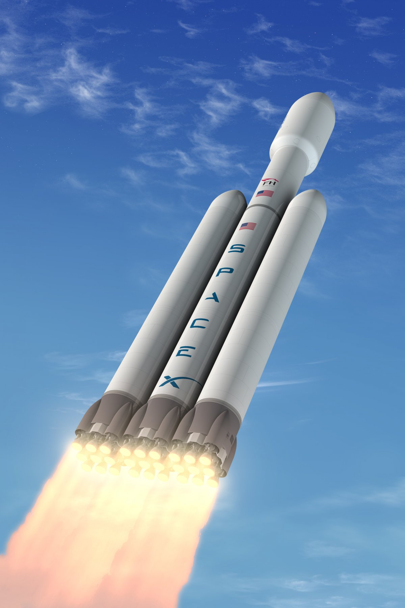](../assets/images/original/img_125_a3390785.jpg)

27 台 Merlin 让 Falcon Heavy 的发动机平台能举起约 2,000 吨的重量——也就是一英里高、1,100 辆汽车的一摞。Falcon Heavy 计划 2016 年首飞，将能把全球任何其他火箭两倍多的载荷送上太空——而且单价是历史上最低（ULA 的每次发射价格是 Falcon Heavy 的 3 倍，载荷却不到一半）。下面是业界最重型火箭的载荷对比：

[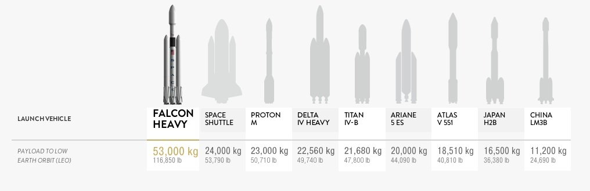](../assets/images/original/img_126_2e885c61.jpg)

**2) 让在轨卫星数量翻两番**

真的，没开玩笑。几个月前，马斯克[宣布](https://www.youtube.com/watch?v=t3qcDW3xkg4) SpaceX 将在西雅图开设卫星生产业务，到 2030 年把 4,000 颗互联网卫星送入近地轨道——是今天在轨 1,300 颗卫星总数的三倍。他的理由：

- **降低成本、提高技术。**今天造一颗卫星通常要 2.5 亿美元，把它送入太空也差不多这个数。这让每次卫星发射都赌得很大，所以公司们都很保守，倾向于用旧的、经过验证的技术，并且确保每颗至少用 15 年以上。结果是，今天为我们服务的很多卫星都是 1990 年造的、用着 25 年前的技术。SpaceX 想用更低成本造卫星，加上它们便宜得多的发射能力，就能把前沿卫星送入轨道，频繁发射，频繁替换。

- **让任何人、任何地方都有互联网。**我采访了 SpaceX 负责卫星项目的航空电子工程副总裁 Rajeev Badyal。他解释道，SpaceX 由 4,000 颗太阳能卫星组成的星座会智能协作，覆盖地球的每一个角落，把闪电般的互联网送到急需的地方。他说地球上只有少数地方（欧洲、美国、印度部分地区、东亚等）真正有良好的互联网覆盖，这对世界上很多其他地方——尤其是最偏远的——将是颠覆性的改变。所需要的只是一个披萨盒大小的接收器，可以放在任何室外，你就能在北极、太平洋中央、珠穆朗玛峰顶——任何地方——用上高速互联网。他还谈了卫星的其他用途——你可以装上摄像头用于犯罪报告、实时 Google Maps、天气——任何用途。

- **更多愤怒的巨人。**Time Warner Cable 和 Comcast 不正是马斯克正在找到竞争方式的「又大又低质量又垄断」公司家族中很好的新成员吗？在他的发布会上，马斯克提到：「在那些被 Time Warner 或 Comcast 卡住的用户的案例里，这会给他们一个离开的机会。」（现场观众爆发出巨大的欢呼。）

- **很赚钱。**通过销售自己造的卫星、和对送入轨道的卫星收取费用，SpaceX 可以从中赚一大笔钱。

- **解决火星的上网问题。**物理线缆是过去式，火星是未来星球。马斯克计划让 SpaceX 制造的互联网卫星未来环绕火星，为未来的火星殖民地提供高速互联网。

**3) 载人航天**

2014 年，美国和俄罗斯吵架了——他们总是这样吵——这次是因为俄罗斯决定把克里米亚并入俄罗斯其实很酷——美国回应是对俄罗斯的太空计划实施制裁。俄罗斯副总理发了这么一条推特：

> 在研究了针对我们太空行业的制裁后，我建议美国用蹦床把他们的宇航员送到 ISS。

漂亮。

这就是当一个曾经强大的太空计划衰落到连自己的宇航员都送不进太空时会发生的事。你不得不依赖你可能闹翻的国家，让自己处于非常糟糕的位置。

唯一另一个能把人送入太空的国家是中国，而美国对他们更恼火——恼火到中国宇航员被禁止在 ISS 的「酷小孩俱乐部」里混。这就像一个镇上有三个互相敌对的黑帮老大，但尴尬的是，只有两个有车，所以第三个得搭其中一人的车去上班。对第三个老大来说可不理想。

埃隆·马斯克不久后也发了自己的一条推：

> 听起来现在是个好时机，可以发布 SpaceX 和 NASA 合作研发的新型 Dragon Mk 2 飞船。不需要蹦床 —— Elon Musk (@elonmusk) 2014 年 4 月 29 日

Space Shuttle 计划在 2011 年退役，开启了一个「美国没有任何载人航天能力」的窗口期。下一个「航天飞机级别」的美国完整太空计划本应是那个富有创意地命名为 [Space Launch System](https://en.wikipedia.org/wiki/Space_Launch_System) 的火箭和它的 [Orion](https://en.wikipedia.org/wiki/Orion_(spacecraft)) 飞船，但延期已经把这个项目的启动推迟到了至少 2021 年。美国不想在 2021 年之前都依赖俄罗斯，所以在这期间，NASA 举办了一场竞赛来选择执行载人发射的私人承包商。NASA 最终把 68 亿美元的合同在波音（拿 42 亿美元）和 SpaceX（拿 26 亿美元）之间分配。[5](#footnote-5-3902)[25](#footnote2-25-3902)

2014 年 5 月，SpaceX [揭幕了](https://www.youtube.com/watch?v=yEQrmDoIRO8) Dragon 的第二代——Dragon 2。[26](#footnote2-26-3902)

[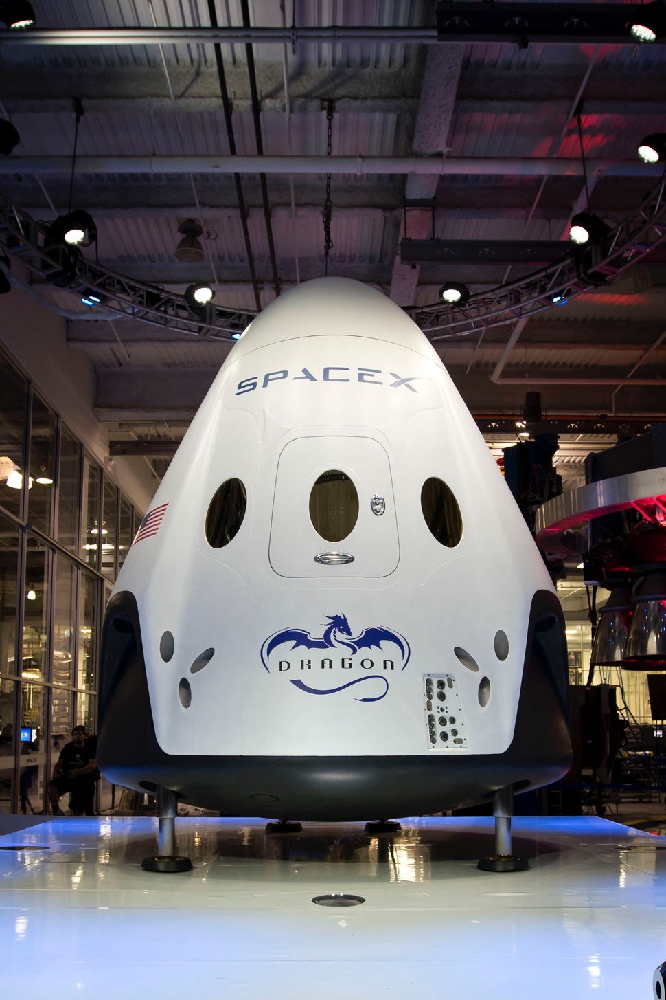](../assets/images/original/img_127_ee662aff.jpg)

第一代 Dragon 很酷——它是目前唯一能完整回到地球的飞船之一，也是现在世界上唯一能从 ISS 带货物返回的现役飞船。[6](#footnote-6-3902) 但 Dragon 2 更酷。

Dragon 2 可以[自己对接 ISS](https://www.youtube.com/watch?v=Cf_-g3UWQ04)，不用像婴儿一样被 ISS 的机械臂拉过去。

Dragon 2 里面有座椅和炫酷的触摸屏（今天的大多数飞船都是 60 年代设计的，仍然像老式收音机一样布满按钮和旋钮）：[27](#footnote2-27-3902)

[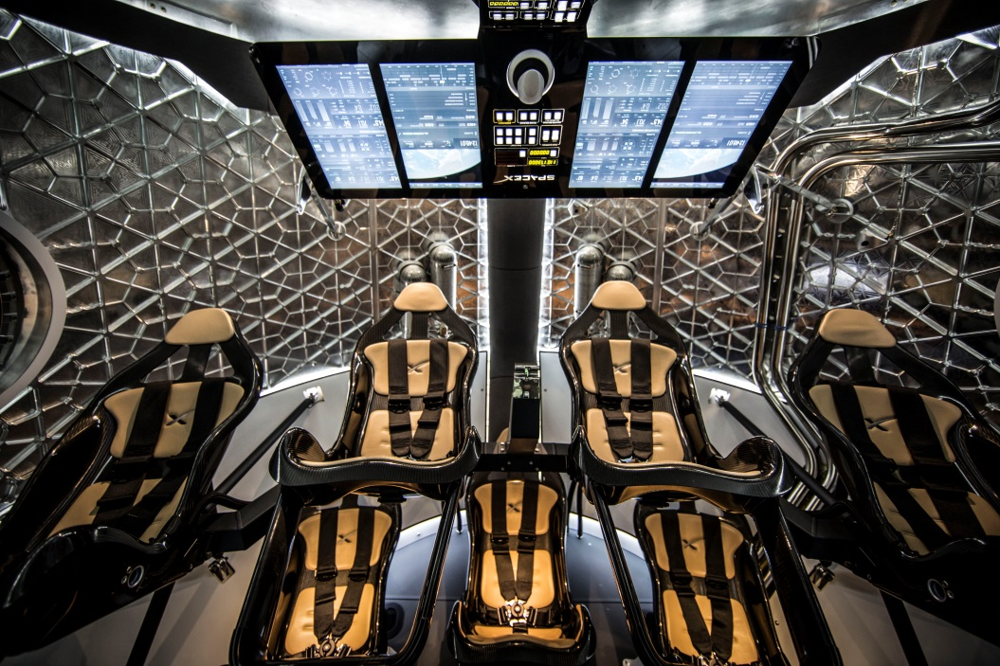](../assets/images/original/img_128_1f295dd4.jpg)

但 Dragon 2 最酷的是它的发动机。飞船有八台超强的小发动机，叫做 SuperDraco，每台能举起四辆汽车。SuperDraco 设计非常特殊，它们完全用 3D 打印制造，是第一批这样制造的火箭发动机。我要再嵌一段发动机点火视频，因为真的太好看了。下面是一台 SuperDraco 正在测试：

Dragon 2 的 SuperDraco 有三个主要用途：

**1) 在太空中机动**
**2) 推进式着陆** —— 下一节会详细讲
**3) 出问题的时候把宇航员救走**

第三点对乘员安全至关重要。再好的火箭有时候也会失败，往往是灾难性的——SpaceX 刚刚给我们演示了——而 Dragon 2 的中止系统能让飞船在爆炸前就远远逃离现场。如果当年两次航天飞机事故有这套系统，宇航员可能就被救下来了。下面是一段 Dragon 2 中止系统实测的视频——不知道为啥，我看的时候觉得有点萌：

那视频里中止系统的威力很难完全体会。8 台 SuperDraco 强到在两秒内把 Dragon 推过一个橄榄球场的距离，5 秒多一点点推过三分之一英里（约半公里）。其他载人飞船虽然也有过中止能力，但那些都只能在发射时中止——Dragon 2 的中止系统一直能用直到入轨。

马斯克还想重新定义「宇航员」这个词，解释说一个人不应该非得是宇航员才能飞上太空。他的愿景是普通人也能在不太多训练或技能的情况下爬上 SpaceX 火箭飞上太空——就像我们今天坐飞机一样（这让我想起曾经只有计算机科学家会用电脑，现在这听起来多落后）。顺着「现在是 2015 年，不是 1965 年」的主题，SpaceX 也在重做太空服的概念——马斯克特别坚持太空服要看起来酷，扔掉「棉花糖人」风格。

时间表上 SpaceX 和波音的首次载人飞行计划在 2017 年——但[目前美国参议院有一股势力](http://www.ibtimes.com/nasa-fuming-after-spacex-boeing-rocket-launches-delayed-2-years-due-proposed-budget-1963372)要砍 NASA 预算，那会让事情至少推迟两年。真是的。

这就是 SpaceX 在做的事情以及它怎么赚钱。快递业务干得不错——SpaceX 是盈利的，应该有很长的跑道继续撑下去。最近 Google 和 Fidelity 的一轮投资给公司估值 120 亿美元。

但马斯克说过，他的噩梦是 SpaceX 最终落入一个「为了短期利润挤奶」的人手里。因为我们在这个 Phase 2 的开头就讲过，我们刚才讨论的所有这些是「SpaceX 在做的事」——但不是「SpaceX 真正在做的事」。

SpaceX 真正在做的事从 Falcon 1 研发时期就开始了，证据就是你今天用 Falcon 9 把东西送进太空、能拿到的难以置信的便宜价格。

但 SpaceX 的低价格仍然只能算是「渐进式改进」——不算变革性的游戏规则改变。

SpaceX 真正在做的事情要宏大得多——他们正在研发的创新如此具有突破性，如果他们能做到，他们能把火箭发射成本再降 100 倍，彻底改变人类在太空的未来——并让多星球未来成为可能。

**改变游戏规则**

还记得前面这个东西吗？

[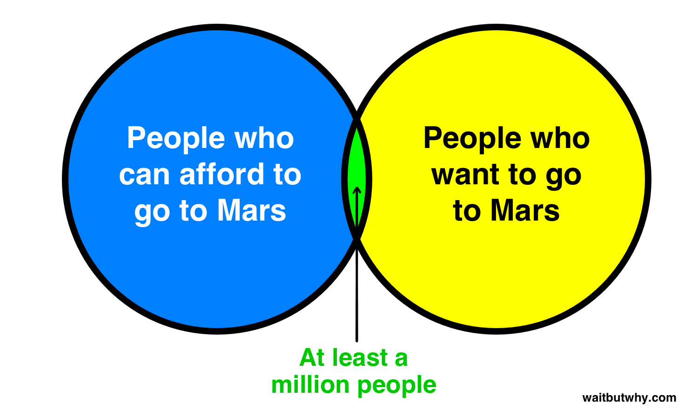](../assets/images/original/img_084_4df7294c.png)

马斯克估计 50 万美元一张去火星的票可能是让蓝色圆圈大到「绿色区域」能覆盖 100 万人的那个神奇数字。他这样形容：50 万美元一张票，就像在加州买一套中产阶级房子，「发达国家大多数人，在他们四十五岁左右的年纪，能攒够钱去这一趟。」[28](#footnote2-28-3902)

那我们离这个目标有多近？1989 年，老布什提出把美国宇航员送上火星的倡议时，NASA 估计要花 4,500 亿美元。为了送 4-6 名宇航员。约合每座 1,000 亿美元。[29](#footnote2-29-3902)

接近了。只是马斯克 50 万美元目标的 20 万倍。

2004 年，小布什也琢磨送美国人上火星。NASA 说要花 500 亿美元。每座 100 亿美元。还是 20,000 倍。

那到底怎么把任何东西的价格砍 20,000 倍？

马斯克的计划是从两个角度下手。

**1) 把很多人装在一起**

Falcon 火箭家族是 SpaceX 的摇钱树，但 Falcon 和 Dragon 都不会送人去火星。

一来，Dragon 只有 SUV 那么大——去火星至少要 3 个月。这不是一个好主意。

二来，如果你要大老远跑去火星，你应该搞个大拼车。

这就是为什么 SpaceX 有一个长期计划，要造一枚让 Falcon 9 看起来像一根热狗的火箭——

火星殖民运输器（Mars Colonial Transporter，MCT）。

MCT 火箭将是一个巨无霸，由一台更强大的 SpaceX 发动机驱动，叫做 Raptor，正在研发中——它的飞船将能装至少 100 人。

所以只要 SpaceX 能做到这一步，他们就已经把当前的「每座成本估算」至少砍了 20 倍。

现在我们离目标还差 1,000 倍。

但还有一件事——SpaceX 通过 Falcon 系列的创新，已经把发射成本降到了行业标准的五分之一，而马斯克相信未来几年会降到十分之一。因为小布什那个数字假设的是行业标准成本，这就让差距缩小到只有 100 倍。

更大的飞船能帮助降低去火星的「每座成本」，但它对今天的商业发射行业毫无改变、它不能让我们接近「让大量人上火星」的便宜程度、它也解决不了马斯克所谓的「太空探索的根本问题」。

那这个我一直在卖关子、改变游戏规则的创新到底是什么？

**2) 复用**

想象一下航空业有一个关键不同：飞机只飞一次。每次飞行的都是一架全新的飞机，乘客下飞机之后，飞机被拆成废铁，可能可用的零件被送去翻修供未来的飞机用。

一架飞机建造成本大约 3 亿美元。在这个新模式里，除了机组的时间和燃料成本，航空公司每次飞行还得额外花 3 亿美元来造一架飞机。这会带来什么变化？

首先，可用的航班会非常少——航班时刻会受飞机生产速度的限制。第二，芝加哥到旧金山的经济舱往返机票将变成每人大约 150 万美元。

空军一号还是会存在。富国会有一个小型军用机队。一些政府会为了某些科学实验飞一飞。有 100 亿美元的人可能会飞不少，但只有 10 亿美元的人基本飞不起。而你？会生下来，活一辈子，死去，从来没坐过飞机。

如果事情是这样，人们可能会看着这个「不存在的航空业」得出结论：显然，公众没有坐飞机出行的意愿。政客会反对把政府大笔资金投到这种奢侈活动上。大多数人甚至不太懂飞机怎么工作，他们也不会浪费时间想象「如果每个人都能用」世界会是什么样。这会变成一个「无人在意」的话题。我们会开车、坐火车、坐船出行，就那么回事。

你看到我想说什么了吧？

历史上——不是美国、不是苏联、更不是 ULA 那些停滞的肥猫——没有人搞出来怎么让火箭复用。火箭花几个月造好，飞上太空，要么在大气中烧毁、要么坠入海里变成废铁。不是没人试过——美国和苏联都已经往这个问题上砸了几百亿美元——而是没人真正解决过。

航天飞机系统号称是「可复用」的。但一架航天飞机有三部分——飞船本身，确实是可复用的；助推火箭，技术上可复用但需要 9 个月的翻修，等于抵消了成本效益；那个大的橙色燃料箱，完全不可复用，发射后就直接变成垃圾。所以是 3 选 1，结果是航天飞机任务每次花 [16 亿美元](http://www.space.com/12166-space-shuttle-program-cost-promises-209-billion.html)（每名宇航员超过 2 亿美元）——这是个笑柄。

更大的飞船加上 SpaceX 的成本节约创新，理论上已经把成本压到了目标「两个数量级」以内——每人 5,000 万美元。而且这个成本是假设「每次飞行都得造一枚新的 MCT」。

SpaceX 的第一场游戏是搞清楚怎么把东西送入轨道。现在他们在玩一个新的、更难的游戏——复用。如果 SpaceX 能造出他们所说的「完全且快速可复用的火箭系统」——让发射成本只剩下燃料、维护和内部支持系统，*就像一架飞机*——太空旅行成本会被砍掉 100 倍。甚至更多。

那具体怎么做？

首先，你需要一种更好的*着陆*方式。马斯克描述了火箭和飞船着陆的三种方式：

**着陆方式 1（最基础）：用降落伞落进海里**

这是今天几乎所有飞船的着陆方式——如果它们还着陆的话。

**问题：** 降落伞在没有空气的地方（比如月球）不工作；落进腐蚀性的盐水里会严重损坏设备；而且不体面（想象一个外星人试图通过「落进我们的海里、用降落伞、然后游到岸上」来威吓我们）。

**着陆方式 2（中级）：带机翼和机轮落到跑道上**

这是航天飞机着陆的方式。

**问题：** 机翼在没有空气的地方（比如月球[7](#footnote-7-3902)），或没有跑道的地方（除了地球以外的所有地方）不工作；这种方式可以用在飞船上，但用在火箭上要难得多——而完全复用意味着要*同时*让飞船和火箭都着陆。

**着陆方式 3（高级）：推进式着陆**

推进式着陆意味着用和火箭起飞一样的方式下来。这就是阿波罗登月舱（比如阿波罗 11 号的「鹰号」）在月球上着陆的方式。

推进式着陆能让你把火箭或飞船稳稳地落到一个着陆平台上，对载具的损伤最小。

更容易想象飞船做推进式着陆，因为我们已经见过飞船这么做了。Dragon 2 正在被设计为「着陆专家」——那些 Dragon 2 用来紧急中止的 SuperDraco 发动机也会用来着陆，Dragon 将能在太阳系任何固体天体上着陆，就像直升机能在地球上着陆一样。火箭*这样*着陆是更陌生的概念，也难得多。

这是 SpaceX 对 Falcon 和 Dragon 复用的愿景——值得一看：

如果能成功，火箭和飞船可以着陆、加油、几小时之内再飞上去。再说一次——就像一架飞机。

Juncosa 跟我解释说，第一步也是最重要的一步，是学会只让 Falcon 的一级着陆。这一步最重要是因为一级的造价和一架大型喷气客机差不多，占火箭总成本的大头（特别是发动机）——如果他们能做到，这就是巨大的一步。他们还要向全世界——包括目前极其怀疑的航天工业——证明「复用」是真正可能的。他们会画出一张蓝图，让其他火箭制造商也能砍自己的成本——并开启太空旅行的新时代。

这是第一级着陆应该发生的过程（点击看大图）：[30](#footnote2-30-3902)

[)

当它说「点火」（burn）时，意思是一台主发动机点火（中间那台）。由于重量在发射时是极其关键的因素（几乎没空间装额外重量，否则火箭无法把载荷送入轨道），火箭只有刚好够三次点火的燃料。第一次用来让火箭脱离它的弹道轨迹（即它本来要走的那条自然弧线），并把它导向着陆点。[8](#footnote-8-3902) 第二次用来减速——从 3,000 英里/小时降到 550 英里/小时（885 公里/小时）——这样它不会在大气中烧毁。第三次在着陆平台正上方使用，让它减速到 5 英里/小时（8 公里/小时）。

由于天气是变化的和不可预测的，火箭里有很多软件来感知外部力量并调整轨迹。火箭上有叫「栅格翼」（grid fins）的小翼板，展开后用来操控火箭（栅格翼和着陆腿也会给火箭减速，把终端速度砍一半）。栅格翼在大气层内有用，但在太空里没有空气，栅格翼就没用了，所以火箭用「冷气推进器」（cold gas thrusters）来操控——就是从火箭里喷出的小股氮气。

如果一切按计划进行，发射后大约 9 分钟，火箭就会降落在距发射台 200 英里外的海上浮动平台上：[9](#footnote-9-3902)[31](#footnote2-31-3902)

[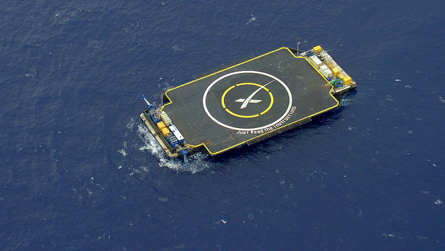](../assets/images/original/img_130_b8c41a1c.jpg)

这*很难*。如果你把所有的尺寸按比例缩小，这就像从一栋摩天大楼顶上发射一支铅笔、然后试图在大风天让它落到地面上的一个鞋盒里。SpaceX 把「在大气中控制下降」比作「在风暴中心用一只手平衡一根橡胶扫帚」。Popular Mechanics [称这是](http://www.popularmechanics.com/space/rockets/a14028/why-the-spacex-platform-rocket-landing-is-so-damn-hard/)「一场紧张的杂耍，几千个运动部件中的任何一个都可能把整个系统推入混乱。如果火箭真的软着陆到驳船上，那是因为数百万次令人发指的细节微调让 Falcon 9 在穿越混乱时保持了镇定。」

为了打磨这项技术，SpaceX 造了一枚叫 Grasshopper 的一级火箭。2012 年，他们能把 Grasshopper 发射到 12 层楼高，在那里悬停几秒钟，然后落回发射台：

接下来的两年，他们把 Grasshopper 发射得 [越来越高](https://www.youtube.com/watch?v=eGimzB5QM1M)、[越来越高](https://www.youtube.com/watch?v=9ZDkItO-0a4)，直到最后把一枚真正的 Falcon 9 一级发射到 [1 公里高](https://www.youtube.com/watch?v=ZwwS4YOTbbw) 并让它飞回平台。

最后，是时候实战了——在一次真正的发射上。2015 年 1 月，SpaceX 执行了一次常规发射，让第一级穿过大气层并尝试着陆。发生的事是这样的（带声音，挺有趣）：

接近了！差不多！SpaceX 的人称之为 RUD——「快速未预定拆解」（rapid unscheduled disassembly）。

他们打算下一次发射（2 月）再试，但因天气取消。他们终于在 4 月得到第二次机会，结果是这样的（视频加速了）：[32](#footnote2-32-3902)

[)

*就……差一点……**就差一点点*……但火箭像个混蛋一样翻倒然后爆炸了。

第三次本应在 6 月……但我们都知道 6 月发生了什么。

所以如果你是刚刚才关注到这些，你应该感到庆幸——这事*还没*成功。从现在开始关注，当你看到他们第一次创造历史时就能亲眼见证（我能保持 SpaceX 发射时间表方向感的最好方法是这个 [Wikipedia 页面](https://en.wikipedia.org/wiki/List_of_Falcon_9_and_Falcon_Heavy_launches)，而跟踪重大进展、找到发射直播链接的最好方法是在 Twitter 上关注 [SpaceX](https://twitter.com/spacex)）。2015 年应该还会有好几次尝试。如果历史可借鉴，一旦 SpaceX 第一次成功，他们可能就能次次成功。

**更新：** 2015 年 12 月 21 日，SpaceX 在 2015 年 6 月那次失败后首次发射。不仅任务完美完成（把 11 颗卫星送入轨道），*他们还成功让火箭着陆了*。他们真的*做到了*。我非常幸运当时在 SpaceX 总部亲眼见证（我当时是网络直播的客座主持人），那是我见过 1,000 多人的房间里最激动的一次。[这是完整网络直播](https://youtu.be/O5bTbVbe4e4?t=1s)（发射在大约 23:00，着陆的兴奋从大约 31:00 开始）。

就在我研究这篇文章时，为了确认马斯克真的是认真的 50 万美元一张火星票，我给他发了一封邮件，列出了我理解的逻辑，看看这是否真的就是他想的。这是他的回复：

*是的，这些看起来像是荒唐的百分比改进，但并非不可能。解决方案的关键要素是火箭复用和低成本推进剂（CH4 和 O2 的 O/F 比约 3.8）。当然，还要在火星上制造返程推进剂——火星有方便的 CO2 大气和大量冻在土壤里的 H2O。*

*设计目标严格来说是每次飞行 100+ 公吨有效载荷，所以可能可以载 100+ 人。取决于每个人需要多少支持质量和允许的行李量。*

*航空电子、传感器、通信、载具结构的某些部分、着陆平台以及其他一些东西会随规模变好，而且坐邮轮比坐公交更有趣，所以我怀疑每飞 100 人的数字会随时间大幅增加，可能到几百人。我们也可以用对头等舱收更高价来补贴经济舱。*

*综合以上所有因素，最终把成本压到 10 万美元/吨或每人以下是可以想象的，因为这样一来旅行成本主要由推进剂决定，而推进剂主要是液氧，每吨只要 40 美元（尽管每有效吨货物需要很多）。那真的会非常棒！*

*就一艘负担得起的去火星的邮轮，没什么大不了的。*[10](#footnote-10-3902)

让这一切成为可能是 Phase 2 的工作，而 SpaceX 似乎正走在完成的路上——也许在未来十年内。一旦他们做到了，他们就能开始他们任务的最后阶段——那个将改变一切的阶段。

[阶段 3：殖民火星 →](https://waitbutwhy.com/2015/08/how-and-why-spacex-will-colonize-mars.html/5)

---

## 脚注

- 连火箭上涂的 SpaceX 标志都讲究——我被告知如果它比现在更大，会产生静电问题。[↩](#note-1-3902)

- 我最初写的是「最」如何如何，但这篇文章的早期草稿不知怎么泄露到 Reddit 后，评论里有人为这事发了点小脾气，说在某些定义下它只是「最高效、最先进」的之一。我看了不少资料，没找到任何更先进的同类发动机，但我加上个保险的「之一」以防万一。[↩](#note-2-3902)

- Musk 的[传记](http://amzn.to/1LQnmQS)里有一段搞笑的，描述在附近农场测试发动机时会发生什么：「『奶牛有一种天然的防御机制——它们会聚到一起、开始绕圈跑，』Hollman 说。『每次我们点火，奶牛就四散开来，然后形成那个圈，把小牛放在中间。我们设了一个牛摄像头来观察它们。』」[↩](#note-3-3902)

- 严格说，SpaceX 是「靠泊」（berthed）到 ISS，不是「对接」（docked）。靠泊是飞船靠近后被空间站的机械臂拉进去，对接是飞船自己接上去。Dragon 只能靠泊 ISS，但即将推出的 Dragon 2 将能对接。[↩](#note-4-3902)

- Musk 对 SpaceX 被选中感到高兴，对两家公司能互相竞争也高兴，但对波音在政府那里的特殊待遇明显很不满，阴阳怪气地回应：「其实我并不介意波音拿比 SpaceX 多一倍的钱、还造更差的技术、达到同样的 NASA 要求。两家公司参与对人 类航天事业的进步更好。」[↩](#note-5-3902)

- 俄罗斯的 *Soyuz* 飞船——目前载美国人上太空的那艘——在把人送回来时能带回*一点点*货物，但带不了多少。其他所有现役飞船在重返大气层时都是设计成烧毁的。[↩](#note-6-3902)

- 对那些好奇的，Randall Munroe 详细[列举了](https://what-if.xkcd.com/30/) 机翼在哪些地方能用、哪些地方不能用。[↩](#note-7-3902)

- 搞清楚什么时候用「sight」什么时候用「site」是生活中很烦的部分。[↩](#note-8-3902)

- 最终，它会在陆地上着陆，但陆地上爆炸性坠毁对公司的公关不利，所以他们会等自己练好了再把着陆点搬到陆地上。[↩](#note-9-3902)

- 记得你以为自己很有野心的那个时候吗？[↩](#note-10-3902)

- 图片来自：[http://www.space.com/22994-spacex-falcon-9-rocket-launch-test-photos-california.html](http://www.space.com/22994-spacex-falcon-9-rocket-launch-test-photos-california.html)[↩](#note2-1-3902)

- 图片来自：[http://i.dailymail.co.uk/i/graphics/2015/02/space_shuttles_triple/images/small/small.png](http://i.dailymail.co.uk/i/graphics/2015/02/space_shuttles_triple/images/small/small.png)[↩](#note2-2-3902)

- 图片来自：[SpaceX](http://www.spacex.com/falcon9)[↩](#note2-3-3902)

- [图片来自：https://www.flickr.com/photos/spacexphotos/16510243060/](https://www.flickr.com/photos/spacexphotos/16510243060/)[↩](#note2-4-3902)

- GIF：[http://www.allstar.fiu.edu/aero/rocket1a.htm](http://www.allstar.fiu.edu/aero/rocket1a.htm)[↩](#note2-5-3902)

- GIF：[http://bavatuesdays.com/dawn-of-the-dead-and-road-warrior-animated-gifs/](http://bavatuesdays.com/dawn-of-the-dead-and-road-warrior-animated-gifs/)[↩](#note2-6-3902)

- 图片来自：[Wikimedia Commons](https://en.wikipedia.org/wiki/File:Rocket_thrust.svg)[↩](#note2-7-3902)

- 图片来自：[https://www.reddit.com/r/spacex/comments/2ww1ci/the_100th_merlin_1d_rocket_engine_helped_launch/](https://www.reddit.com/r/spacex/comments/2ww1ci/the_100th_merlin_1d_rocket_engine_helped_launch/)[↩](#note2-8-3902)

- 图片来自：[http://www.space.com/22992-spacex-private-falcon9-rocket-test-launch.html](http://www.space.com/22992-spacex-private-falcon9-rocket-test-launch.html)[↩](#note2-9-3902)

- 图片来自：[http://www.space.com/18962-spacex-falcon-9.html](http://www.space.com/18962-spacex-falcon-9.html)[↩](#note2-10-3902)

- 图片来自：[http://www.spaceref.com/news/viewpr.html?pid=28044](http://www.spaceref.com/news/viewpr.html?pid=28044)[↩](#note2-11-3902)

- 图片来自：[SpaceX](http://www.spacex.com/falcon9)[↩](#note2-12-3902)

- 图片来自：[http://gizmodo.com/spacex-prepares-falcon-9-for-launch-and-reminds-us-how-1700344182](https://gizmodo.com/spacex-prepares-falcon-9-for-launch-and-reminds-us-how-1700344182)[↩](#note2-13-3902)

- 图片来自：[https://www.youtube.com/watch?v=tfXa-zItqjU](https://www.youtube.com/watch?v=tfXa-zItqjU) 视频截图[↩](#note2-14-3902)

- 图片来自：[SpaceX](http://www.spacex.com/falcon9)[↩](#note2-15-3902)

- 图片来自：[http://www.theregister.co.uk/2012/10/10/dragon_docks_iss/](http://www.theregister.co.uk/2012/10/10/dragon_docks_iss/)[↩](#note2-16-3902)

- 图片来自：[Wikimedia Commons](https://upload.wikimedia.org/wikipedia/commons/e/e8/Falcon_9_first_stage_arrives_by_truck_at_Cape_Canaveral_-_CRS-2_(KSC-2012-6529).jpg)[↩](#note2-17-3902)

- 图片来自：[https://www.flickr.com/photos/spacexphotos/16510243060/](https://www.flickr.com/photos/spacexphotos/16510243060/)[↩](#note2-18-3902)

- Ashlee Vance：《Elon Musk: Tesla, SpaceX, and the Quest for a Fantastic Future》[（链接）](http://amzn.to/1LQnmQS)，215 页。[↩](#note2-19-3902)

- GIF：[http://www.popularmechanics.com/space/rockets/a16226/space-third-barge-landing-fail/](http://www.popularmechanics.com/space/rockets/a16226/space-third-barge-landing-fail/)[↩](#note2-20-3902)

- [Ashlee Vance：《Elon Musk: Tesla, SpaceX, and the Quest for a Fantastic Future》](http://amzn.to/1LQnmQS)，15 页。[↩](#note2-21-3902)

- [http://www.freedomtolaunch.com/SpaceXAnnouncementRegardingComplaintFiling.pdf](http://www.freedomtolaunch.com/SpaceXAnnouncementRegardingComplaintFiling.pdf)[↩](#note2-22-3902)

- Ashlee Vance：《Elon Musk: Tesla, SpaceX, and the Quest for a Fantastic Future》[（链接）](http://amzn.to/1LQnmQS)，252 页。[↩](#note2-23-3902)

- 图片来自：[SpaceX](http://www.spacex.com/falcon-heavy)[↩](#note2-24-3902)

- Ashlee Vance：《Elon Musk: Tesla, SpaceX, and the Quest for a Fantastic Future》[（链接）](http://amzn.to/1LQnmQS)，253 页。[↩](#note2-25-3902)

- 图片来自：[https://www.flickr.com/photos/spacexphotos/16510243060/](https://www.flickr.com/photos/spacexphotos/16510243060/)[↩](#note2-26-3902)

- 图片来自：[https://www.flickr.com/photos/spacexphotos/16763231836/in/photostream/](https://www.flickr.com/photos/spacexphotos/16763231836/in/photostream/)[↩](#note2-27-3902)

- [http://news.yahoo.com/huge-mars-colony-eyed-spacex-founder-elon-musk-120626263.html](http://news.yahoo.com/huge-mars-colony-eyed-spacex-founder-elon-musk-120626263.html)[↩](#note2-28-3902)

- [http://home.marssociety.org/outreach/political/usa/resources/Bush_Space_Plan_TMS_Estimated_Costs_2Mar2004.pdf](http://home.marssociety.org/outreach/political/usa/resources/Bush_Space_Plan_TMS_Estimated_Costs_2Mar2004.pdf)[↩](#note2-29-3902)

- 图片来自：[https://www.flickr.com/photos/spacexphotos/16510243060/](https://www.flickr.com/photos/spacexphotos/16510243060/)[↩](#note2-30-3902)

- 图片来自：[https://www.flickr.com/photos/spacexphotos/16510243060/](https://www.flickr.com/photos/spacexphotos/16510243060/)[↩](#note2-31-3902)

- [https://www.youtube.com/watch?v=BhMSzC1crr0](https://www.youtube.com/watch?v=BhMSzC1crr0)[↩](#note2-32-3902)
