## 阶段 3：殖民火星

**主要角色：**火星殖民运输器（MCT）
**目标：** 把 100 万人送上火星

[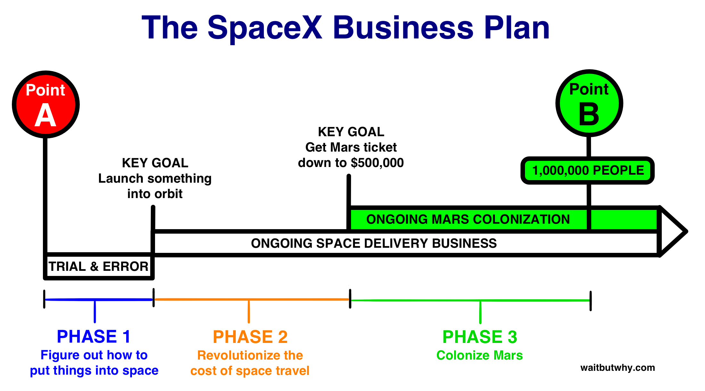](../assets/images/original/img_132_28a9553a.png)

今天，没人谈火星，很少有人把火星看作近期未来的一个相关部分。但除非我错过了什么大事或有什么意想不到的事情发生，否则在大约 10-20 年内，*人们将开始前往火星*。你这辈子可以去火星。疯狂的事情就在地平线上。

这是一个很难消化的话题，因为当你想它的时候，你的大脑会一直飘回到「得了吧」。了解 SpaceX 在做什么和他们为什么做这件事，可以让你从「人类移居火星简直荒唐可笑」走到「接受这个逻辑——这是一件应该做的、可能发生的、甚至很可能发生的事」。但那和真正*相信*它会发生是不一样的。当你看这篇文章时，即使你同意你读到的内容，如果要你快速下注 1,000 美元赌「20 年内人们会不会搬去火星」，你很可能赌不会，因为在你内心深处，你的大脑还没*真正*接受。这很公平——你的大脑根据经验判断事物，经验告诉它「搬去火星不是人会做的事」。

但我相当确定，在未来几十年里，你的大脑会迎来一些*大*惊喜，原因很多，如果你愿意接受这种可能性，试着接受这个事实：一个叫做「阶段 3：殖民火星」的小节可能真的——*真的*——是基于现实的。

从这里开始的一切都基于马斯克和该领域其他人的猜测。下面是这些人对「这一切会如何展开」的最佳预测：

在任何涉及人的事情开始之前，会有一个预备阶段——SpaceX 发射飞船去火星但不带任何人。第一步，马斯克告诉我，会是「先送一艘自动飞船到火星，只是为了确认你能把什么东西送过去再送回来」——这应该在 2020 年之前发生。然后，会有几次无人货运任务，把设备、居住舱和补给运过去，这样当第一批人开始到达时，他们能不死——他们需要获得水、住处、把火星上的化合物转化为氧气的工具、种植庄稼的肥料等。[1](#footnote-1-3902)

然后会有大事发生。有人——很可能是 SpaceX，大概在十年后——会把第一批人送上火星。对任何 50 岁以下、为自己没能在 1969 年活着、清醒地赶上登月的兴奋而遗憾的人来说——你的日子终于来了。在地球的某个地方，现在，就有火星的尼尔·阿姆斯特朗。没人知道他是谁——他们自己可能都不知道自己是谁——但地球上的每个人很快都会知道他们的名字。

这会是件*大事*。

除了是人类首次踏上另一颗行星之外，这还*远远*是人类到过的离地球最远的地方。

ISS 离地球表面大约 250 英里（402 公里）。月球比 ISS 远约 1,000 倍（239,000 英里 / 384,000 公里）。火星更复杂。把地球和火星想成两个在跑道上跑步的人。火星在外道，绕跑道一圈大约要地球在内道所需时间的两倍。两颗行星通常在「跑道」完全不同的位置，彼此相距极远。但每 26 个月，地球「套圈」火星、它们在跑道上擦肩而过——这是你想往返地球和火星的时刻。

根据它们擦肩时各自在轨道上的位置，它们可以近到 3,400 万英里（5,500 万公里）相距。其他时候[它们擦肩时](http://www.lunarplanner.com/HCpages/Mars2003.html)只相距约 6,000 万英里（1 亿公里）。

即使在最好情况下，火星也[很远](http://www.distancetomars.com/)。做个对比，让我们把直径 1 米的地球拿出来。如果地球直径 1 米，ISS 离地面大约 1 英寸（2.5 厘米）。月球大约 100 英尺（30 米）远。而火星，根据年份不同，在 2.5 到 5 英里（4-8 公里）远。*和去月球完全是两码事。*如果去月球是横渡英吉利海峡最窄处，去火星就是横渡大西洋（去 ISS 就像从海滩涉水出去 117 英尺（35 米））。

另一种看它的方式是理解一光秒是什么：

[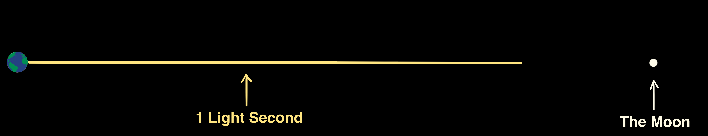](../assets/images/original/img_133_d8364025.png)

然后意识到火星，最近时，是 3 光*分*多一点。

地球下一次「套圈」火星、它们并排，是 2016 年——那时候做不了什么。但当这件事在 2018 年夏天再次发生时，如果一辆印着 SpaceX 标志的飞行器降落到火星上，别惊讶。马斯克粗略预测 2025 或 2027 年，火星的尼尔·阿姆斯特朗将迈出那著名的第一步。[2](#footnote-2-3902)

但和尼尔·阿姆斯特朗那著名的一步一样，这将是人类的伟大*成就*——不是巨大的飞跃。巨大的飞跃在后面。

___________

所以随着票价暴跌、第一次载人火星任务打开了闸门，我们就准备好开始殖民了。最大的问题会是：「谁愿意先花几十万美元，去进行一次可能非常危险的、为期三个月的旅行，到一个比南极还冷、空气不能呼吸、不能被太阳照到脸上的地方？？」

还有一件我们没提到的事是那个*黄色*圆圈：

[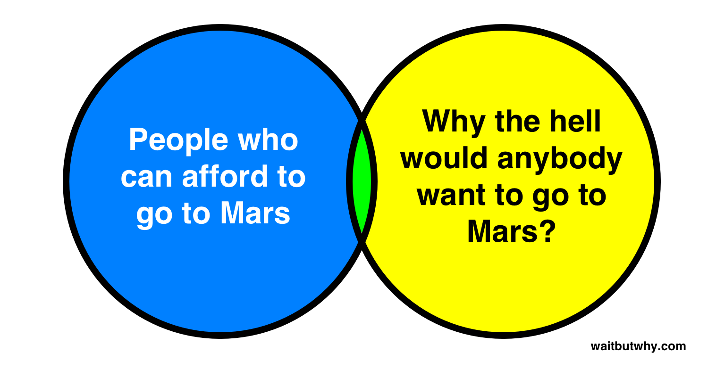](../assets/images/original/img_134_623d9f77.png)

我们费了这么大劲把价格压到可承受的范围，但我们有点忘了问马斯克为什么觉得首先会有人愿意去。

马斯克意识到了这个问题，一直在认真思考黄色圆圈。在上面那封邮件里，他提到「坐邮轮比坐公交更有趣，所以我怀疑每飞 100 人的数字会随时间大幅增加，可能到几百人」——这是他在思考黄色圆圈。当他谈到让回地球的旅程对任何火星居民都可用且免费时，那是他在思考黄色圆圈。当 SpaceX 做出[这样](https://www.flickr.com/photos/spacexphotos/17504334828/)、[这样](https://www.flickr.com/photos/spacexphotos/17504602910/) 和 [这样](https://www.flickr.com/photos/spacexphotos/17071818163/) 的艺术作品时——那是他们在思考黄色圆圈。

看待「百万人去火星」这个使命的简单方法是：世界很快会有 80 亿人。在 21 世纪这段时间里，假设总共会有 200 亿人活着。要在这段时间内把 100 万人送上火星，你需要每 20,000 人中有 1 人落入这个维恩图的中间。所以假设那些想去火星的人在社会经济光谱上均匀分布，这就变成了一个简单的公式：

[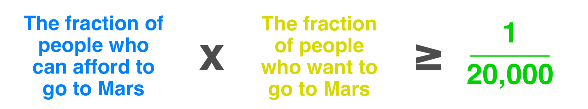](../assets/images/original/img_135_cd76d6c7.png)

当去火星刚刚开始成为选项时，价格还没降到 50 万美元/人，几乎所有人都会被「真的卖掉所有东西、然后发射到另一颗行星」这个想法吓坏——所以这两个分数都会小得离谱。

但没关系——我们不需要绿色区域里有 100 万人就能让事情启动。美国变得很了不起，但在 1605 年，「殖民新世界」维恩图上的绿色区域很小。定居在詹姆斯敦和普利茅斯的人是相当极端的——第一批去火星的人也会是这样。

没人确切知道交通运输会怎么运作，但它很可能是这样的：火星殖民运输器（MCT）将包含两部分——巨大的、动力强劲的第一级，以及既是第二级也是飞船的上面级。第一级会把一艘飞船送入地球轨道，然后下来（推进式着陆）、加油、稍微维护一下，再带另一艘飞船上去。在地球和火星轨道并排的窗口期前的几周里，这种情况会一直持续。然后 SpaceX 会派一艘某种形式的「加油机」去给每艘在轨飞船补充燃料（这些飞船同时也充当第二级火箭，所以它们会为了把自己送入轨道烧掉很多燃料）。

到行星就位时，会有一个 MCT 飞船编队——马斯克称之为「殖民舰队」——环绕地球，加满燃料、准备就绪，就在那个恰到好处的瞬间，整个舰队出发飞向火星。

三到六个月后，飞船抵达火星，穿过大气层，推进式着陆。人们走出来，可能受到现有居民举办的欢迎仪式，然后在接下来几周内把一切卸下来。

大约两年后，当行星再次对齐、恰好地球正在发射下一支殖民舰队的时候，两年前到达火星的那批飞船将启程返回地球，载着任何「受够了」的火星人。

三到六个月后，飞船回到地球，推进式着陆，送去维护，准备好再过两年飞回火星。

循环往复。

最早的拓荒者会有一份艰难的工作——就像最早的拓荒者总是那样——他们要给自己建一个能活下去的环境，然后最终开始建设第一座火星城市。出于这个原因，马斯克估计在早期，每艘载人去火星的飞船，*需要*十艘运载物资。[3](#footnote-3-3902)

他们最初需要的一些东西：

- **能源。**核能是一种可能，但马斯克认为主要是太阳能。早期，太阳能板需要从地球运过去，马斯克有个想法是把它们做成柔性的、可充气的，这样能像派对上那种 [令人哭笑不得的口哨](https://whatsthepont.files.wordpress.com/2014/07/20140720-123334-45214815.jpg) 一样卷起来。
- **氧气。**会需要一个制氧厂。原材料极其丰富——大气中的 CO2 和地下的 H2O——所以制氧不会太难。
- **水。**极地有大量冰，理论上其他纬度也有，还有地下冰，所以我相信这会是个让人头疼的事，但他们能建一套管道系统，把大量液态水输送到定居点。
- **食物。**需要农民和植物学家，还需要肥料和一个加压温室。
- **室内空间。**没有太空服你不能在火星上外出，否则大气压力不足会让你的血沸腾，温度会把你冻死，而太阳辐射——因为几乎没有大气或磁场来阻挡——会像连环杀手一样剥掉你的皮肤。我是一个在地球上极其拥护室内活动的人，但在火星上，室内就是生活发生的地方。至少头几十年，火星城市会在巨大的圆顶里。早期拓荒者会先建一个较小的 [hab 居住舱](http://www.marshome.org/images2/albums/Unsorted%20Images/Temporary/normal_MallonDay-base1.jpg) 居住，一边工作一边建造更大的圆顶综合体。还需要其他室内空间——储藏、施工、学校、医院、人类需要的其他东西。
- **火箭燃料。**这样飞船才能返回地球。MCT 会用甲烷作为燃料（原因很多，我不想解释、你也不太想听）。甲烷就是 CH4，所以同样，靠火星的 CO2 和 H2O，这是可以做到的。他们还需要为火星上的地面交通制造燃料——比如火星车之类。
- **互联网。**这会由卫星解决（很可能是 SpaceX 在西雅图业务制造的卫星），而且会非常快。
- **其他明显需要的设备。**用于通信、医疗、施工等等。

这是一个满足「初期关键生存目的」的最小清单。但随着时间推移，更多人会迁移过来，城市会越来越发达，定居者会开始建造那些「让生活有质量」的东西：餐厅、酒吧、电影院、体育设施，等等。

然后，会有事情开始发生。

最艰难的部分过去了，更多人会想去。

第一批返航飞船会载着人回到地球，让地球上每个人都知道「这不是一张单程票」——更多人就会想去。

回到地球的人会因为他们的勇气受到表彰，火星上的一些人会写关于他们经历的畅销书，还有些人会拍一部关于早期定居的电视真人秀、在地球上变得家喻户晓——更多人就会想去。

地球上的人会看到火星人在奥林帕斯山和水手谷徒步旅行的绝美照片——那座山和那条峡谷比地球上任何山任何峡谷都大得多——更多人就会想去。

人们会听说「从 20 英尺高的悬崖跳下来不会受伤」、会看到只有火星 38% 重力才能玩的新型极限运动的病毒式 YouTube 视频——更多人就会想去。

如果你在想这会不会是一次「度假之旅」，马斯克解释说：「这不会是一次度假之旅。这会是把所有的钱都存起来、把所有的家当都卖掉，就像当初人们移居到美洲早期殖民地时那样。」[1](#footnote2-1-3902) 但他也指出了「在新土地上建立新世界」的兴奋和新奇——这种体验在几个世纪前就从地球上消失了：「对任何想创造新事物的人来说，都会有很多有趣的机会——从第一家披萨店到第一家铁矿石冶炼厂，再到所有『第一』。对那些想成为文明创造者一部分的人来说，这将是一件真正令人兴奋的事。」[4](#footnote2-4-3902)

同时，随着渴望度上升、黄色圆圈变大，SpaceX 会继续创新，每 26 个月一个周期，票价都会比上一个周期更低——而*蓝色*圆圈会变大。

当 SpaceX 开始证明「送人去火星是一个可行的商业机会」时，其他实体可能会跳进来竞争。马斯克不认为世界上现在有任何实体在认真严肃地推进这个问题（他不把 [Mars One](http://www.mars-one.com/) 当回事），但如果有其他人——不管是私人公司还是 ESA 或中国航天局这样的大型航天机构——出于自己的私利加入这个努力，他认为那对这项事业是有帮助的。

这一切加起来就是：一旦第一批船员登陆火星，似乎可能的是，在之后的每一次地火同步之后，选择迁移的人数都会增长——也许是指数级增长。到 2040 年，马斯克认为会有一座繁荣的殖民地火星城市。

然后在那之后的某一天，未来某个时间点，一支到达火星的舰队会让这颗星球的人口首次突破 100 万。

我们就到了 B 点。

___________

马斯克大概活不到看到我们到达 B 点。他估计这至少需要 40 或 50 年的舰队迁移，如果一切从 2020 年代中期开始，那就到 2070 年左右，马斯克 99 岁。但他可能有机会在高科技的火星城市里待一段时间。他说他想晚年去一次，然后回到地球，最终再次前往火星并在那里退休、永远留下——但只有一个条件：「如果我确信 SpaceX 没有我也能良好运转、那条路会继续走下去，我就去。」[2](#footnote2-2-3902)

比任何具体的火星人口目标更重要的是，马斯克想死的时候知道我们正在走向他所说的「那个阈值——即使来自地球的飞船不再来，定居点也不会慢慢消亡」。他说，那个阈值「是我们作为文明、不会加入那可能数量庞大的『单星球死亡文明』的关键门槛」。100 万人是他对「这个阈值在哪里」的粗略估计，但没人确切知道。

当我们有朝一日——如果真有那一天——到达那个点，我们才算真正实现了尼尔·阿姆斯特朗所说的「人类的巨大飞跃」。人类的未来会更有保障、更可能长久地存续。硬盘会被备份。在某个地方，Quignee 会厌恶地把餐巾纸扔掉。

是时候把 Barney Frank 重新请回来了。当你理解 SpaceX 为什么要送人去火星背后的原因后，那些像 Frank 一样的政客——把这种追求称为「彻头彻尾的浪费钱」——是不是显得有点短视？

当我听到一个政府说：「我们现在先别操心去火星，地球上有这么多问题没解决」——这在我听来像一个人在说：「我现在先不操心健康，等我不用付这么多账单再说。」地球上的重要问题*永远*、*永远*都存在，但如果我们让「眼前的紧急」阻止我们去处理「大图景里的重要」，我们就是在让自己冒巨大的存在性风险。

**去火星的另一个原因**

马斯克想让我们去火星，有两个主要原因，备份硬盘只是其中之一。我让 Elon 自己用一则一分钟的片段告诉你另一个——来自我在 SpaceX 食堂和他的第一次讨论（[这里是片段](https://soundcloud.com/waitbutwhy/2-reasons-to-go-to-mars) 如果播放器显示不出来）：[5](#footnote-5-3902)

*

在这篇文章里，我们大部分时间在谈第一个、非常长期的去火星理由——马斯克称之为「防御性理由」——为了看清这为什么重要，我们必须把视野拉得非常远。但当他谈到去火星的另一个原因——因为他相信这将是「历史上最伟大的冒险」——马斯克把视野拉得非常近。第二个原因不是关于遥远的未来和物种的命运，而是关于此刻活着的每一个人、以及我们将如何全部被卷入这场冒险——即使我们自己毫无去火星的兴趣——以及这可能会改变我们对世界和我们生活的感觉。

为了把这一点讲透，马斯克引用了阿波罗任务：[3](#footnote2-3-3902) 「生活必须不仅仅是解决问题。必须有一些能启发你的事——让你为身为人类的一员而骄傲的事。阿波罗计划无疑就是这样一个例子。去过月球的只有一小撮人——然而，事实上我们所有人都去过了月球。我们通过他们身临其境地参与了那场冒险。我们分享了那场冒险。我不觉得会有人说那是个坏主意、那不伟大。我们需要更多那样的事——至少我们需要*一些那样的事*。」[6](#footnote2-6-3902)

太空曾经激发过每个人的灵感——这就是为什么 1970 年那么多孩子想当宇航员。但我是在 80 年代和 90 年代长大的，那是一个世界注意力回到地球、太空重新变成小众余兴的时代——我认识的人里没谁真的想过要当宇航员。正如 Ashlee Vance 写的：「这似乎不可想象，但太空行业的其他人把太空搞无聊了。」[4](#footnote2-4-3902)

我一直很羡慕那些在 60 年代末登月兴奋期活着的人。当我想到「人类与太空的故事」时，60 年代一直像是在一个原本平静而稳定的故事中、一个带来极端兴奋的反常十年：

[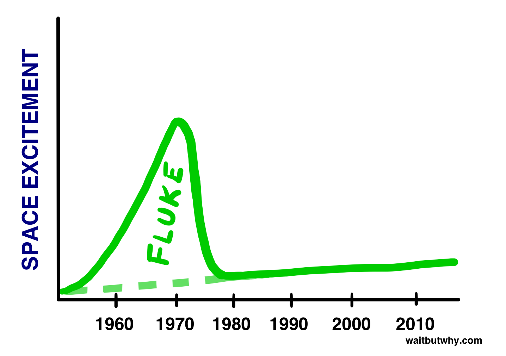](../assets/images/original/img_136_d57de0f7.png)

但现在，我把登月更多地看作某件*大得多*事情的前奏。我们没有意识到，我们可能正站在生物史上一次伟大飞跃的悬崖边上，而登月可能后来会被视为「地球生命全新纪元」诞生时的第一次产前阵痛。不知怎么地，我们可能真的还活着、见证这个新纪元的到来。

[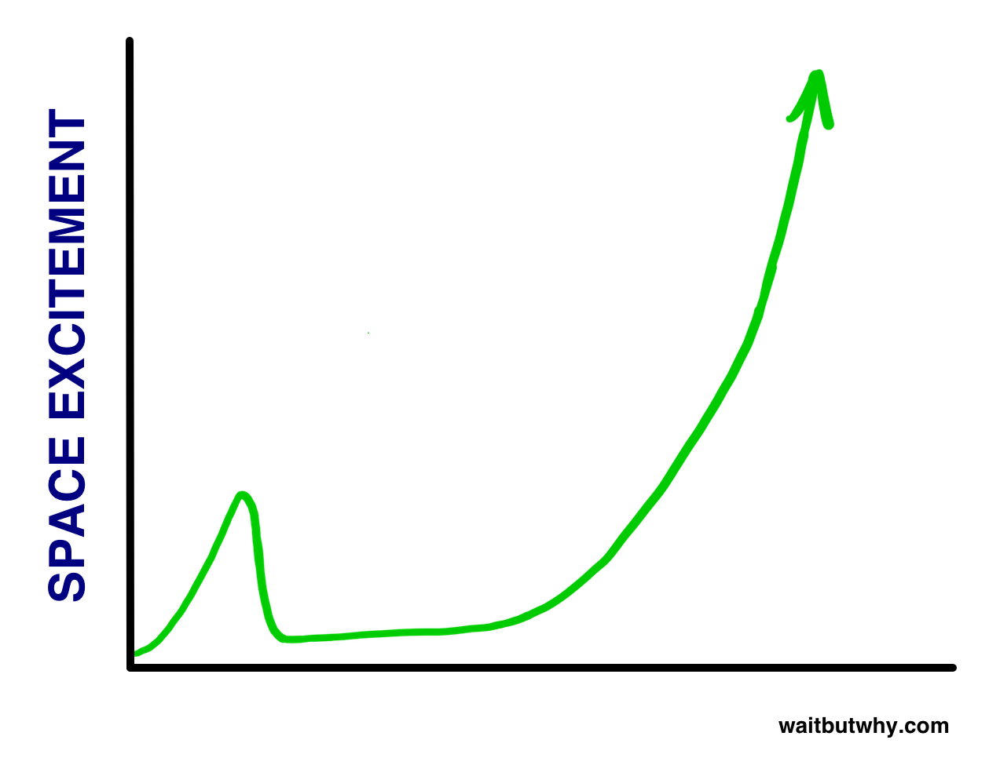](../assets/images/original/img_137_846eb4df.png)

当然，这是一个乐观的故事——在一篇关于 SpaceX、主要信源是埃隆·马斯克的文章里，你期待听到的就是这个。这件事还有许多不那么令人愉快的展开方式。也许 50 万美元一张火星票被证明完全不可能。也许马斯克对「如果他能给世界提供一个办法、就会有足够意愿」这个假设是错的。也许火星上的生活是一场活生生的地狱，滋生疯狂，迅速堕入无法无天的噩梦。没人能确定。

这就是故事——你不知道那些你还没读到的页里会发生什么。

但我的直觉告诉我，我们很可能离「人类与太空的故事」的*开始*比中间或结尾要近得多。我们好像正好在「第一章：困在地球」的结尾——也许就在最后一页。随着故事向前推进，它可能开始发生在一个比地球宽广得多的舞台上，让「人类与太空的故事」最终与「人类的故事」变得无法区分。

要预测那些章节里会发生什么，就像让公元前 2500 年美索不达米亚的一个农民想象我们今天的世界一样不可能，但 SpaceX——世界上最有野心的公司——正带着使命去书写第二章的前几页、把故事推向一个充满希望的方向（假设你认为长寿的人类物种是一个充满希望的概念）。[7](#footnote2-7-3902) 让我们以想象「如果他们成功了会发生什么」来结束这篇文章。

**一个 SpaceX 的未来**

思考 SpaceX 的未来从这个问题开始：「如果我们把 100 万人送上火星……接下来会发生什么？」以下是一些可能性：

**一个蓝绿火星**

鱼需要在海洋里生活。它们整个生命规划都基于在海洋中。如果你把一条鱼从海洋里拿出来，它会痛苦地挣扎几分钟然后死掉。

地球大气层是人类的海洋。我们身体的每个细胞都被设计成在地球表面存在的精确条件下工作——而我们站在火星表面的状态，就像一条被钓起来、在一只船的桶里扑腾的鱼。

当你买一条鱼当宠物时，你会买一个鱼缸，在家里为鱼创造一小片海洋让它生活。我们刚搬到火星时，会住在一个人类鱼缸里——可能是这样的：[5](#footnote2-5-3902)

[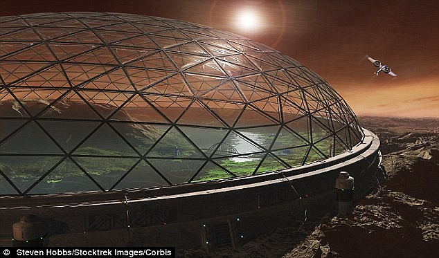](../assets/images/original/img_138_627c438c.jpg)

我们的人类鱼缸会是一小片地球表面条件，调节温度、气压、氧气含量和到达的太阳辐射，让它们*刚好*是我们喜欢的样子——也是我们要种的农作物喜欢的样子。如果不是头顶上方那遥远的玻璃天花板、外面是红色的天空[8](#footnote2-8-3902)，再加上你能跳得特别高，你可能会忘记自己不在地球上。

作为一个临时方案，人类鱼缸是管用的。但火星上的生活不是一项临时活动——这个想法是让一个不断增长的人类种群在那里生活几千年。这就是为什么马斯克称火星是「一个需要修缮的星球」。[6](#footnote2-6-3902)

所以在殖民火星之后，下一个挑战会更难——我们必须把火星变成我们的*家*。

我们有一个词来形容这件事。地球化改造。地球化改造一颗星球意味着改变它的条件以匹配地球。这就是技术的能力——只要有足够的技术，我们真的可以「地球化」整个*星球*。

具体怎么做当然是高度猜测性的，目前我们有的只是一些潜在策略。但基本过程应该是这样的：

**1) 融化火星南极的大量冰。**

火星上的冰如果全部融化，足以把整颗星球覆盖一层 36 英尺（11 米）深的海洋。如果我们能融化它，就会引发一连串反应。我们会融化一部分冰，释放出目前被封在冰里的大量 CO2，以及新形成的液态海洋蒸发出的水蒸气。这些温室气体会让大气变稠密，开始截留更多太阳能量，进一步加热环境。更多热量融化更多冰，释放更多 CO2 和水蒸气，截留更多阳光，进一步加热。整个过程只需升温 7°F（4°C）就足以触发这种失控的温室效应。

关于如何启动这个失控过程，有大量想法——从在太空放置镜子向火星引导更多阳光，到在极地引爆核弹[9](#footnote-9-3902)，再到把一颗富含氨的小行星引导去撞这颗星球。[7](#footnote2-7-3902)

**2) 通过向大气泵入超强温室气体来加速进程。**

人类可以通过建造工厂把火星上的元素转化为温室气体来加速这一过程。CO2 可以用，但科学家们还有另一些特制的气体，它们在截留太阳能量方面效力强得多——比如甲烷或氯氟烃（CFCs）。[8](#footnote2-8-3902)

**3) 种植东西**

我们可以从能在南极那种地方生存的微生物开始，然后是像苔藓这样的简单植物，最终是广袤的常绿森林。

然后，事情会自己开始动起来。NASA 行星科学家 Chris McKay 说：「你不是在建造火星，你只是把它变暖、扔些种子。」[9](#footnote2-9-3902) 换句话说，如果你做了上面 1-3 步，最终，这种事会发生：[10](#footnote2-10-3902)

[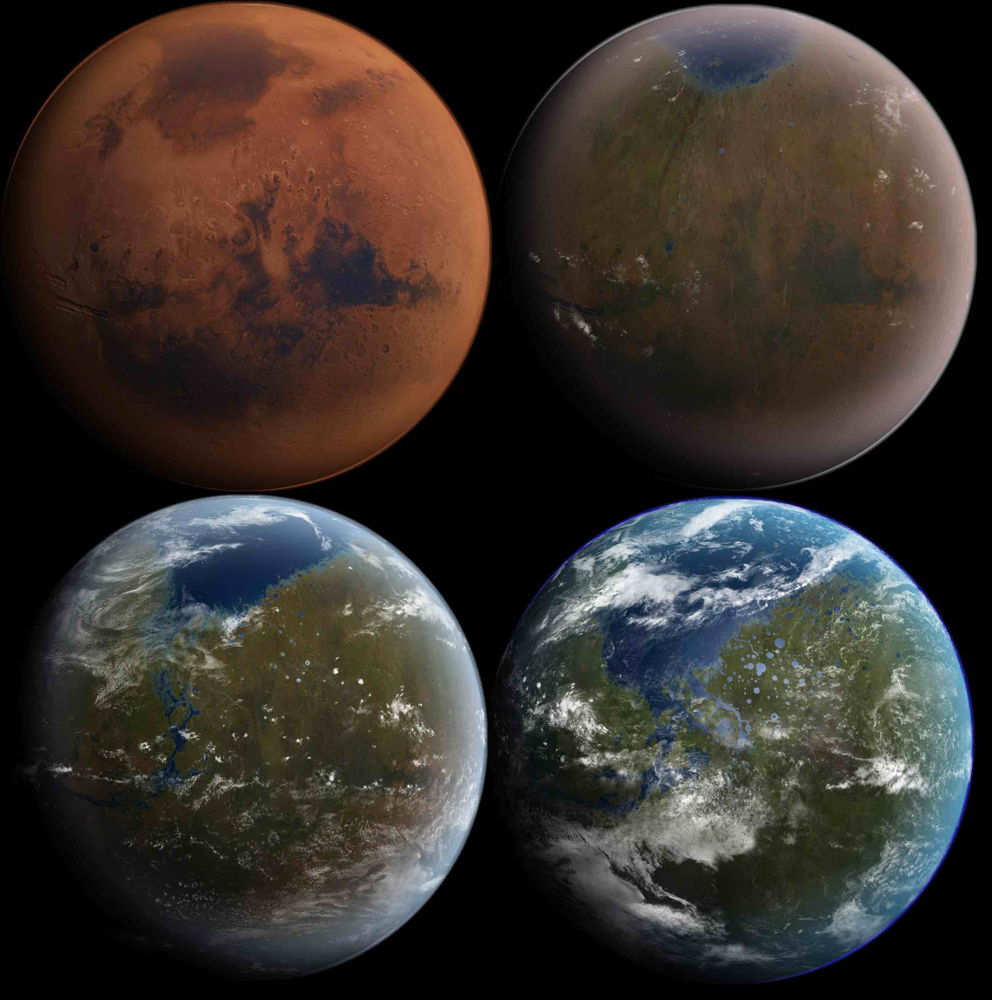](../assets/images/original/img_139_d4f46cc2.jpg)

当这个过程开始时，火星上的生活问题会一个一个地开始被解决。火星会有天气，温度会冷但能住人，气压会低但能住人——这些事情每过一年都会越来越好。人们将能不穿太空服在户外行走。但在很长一段时间里，还是得戴口罩。这就引出了地球化改造最困难的部分——

**4) 让空气可以呼吸。**

由于我们将建造的光合作用工厂和新植物带来的真实光合作用，火星上的氧气水平会增加。但很慢。这是以我们目前的技术在一两百年内无法做到的一步。科学家估计火星空气变得可呼吸的时间从 300 年到几千年不等。[11](#footnote2-11-3902) 所以除非有技术突破，否则在很多代人的时间里，火星上的生活都意味着在外面戴口罩。

有一天——可能是 1,000 多年以后——火星会完全被地球化。当那天到来时，你会看到这样一张图——[12](#footnote2-12-3902)

[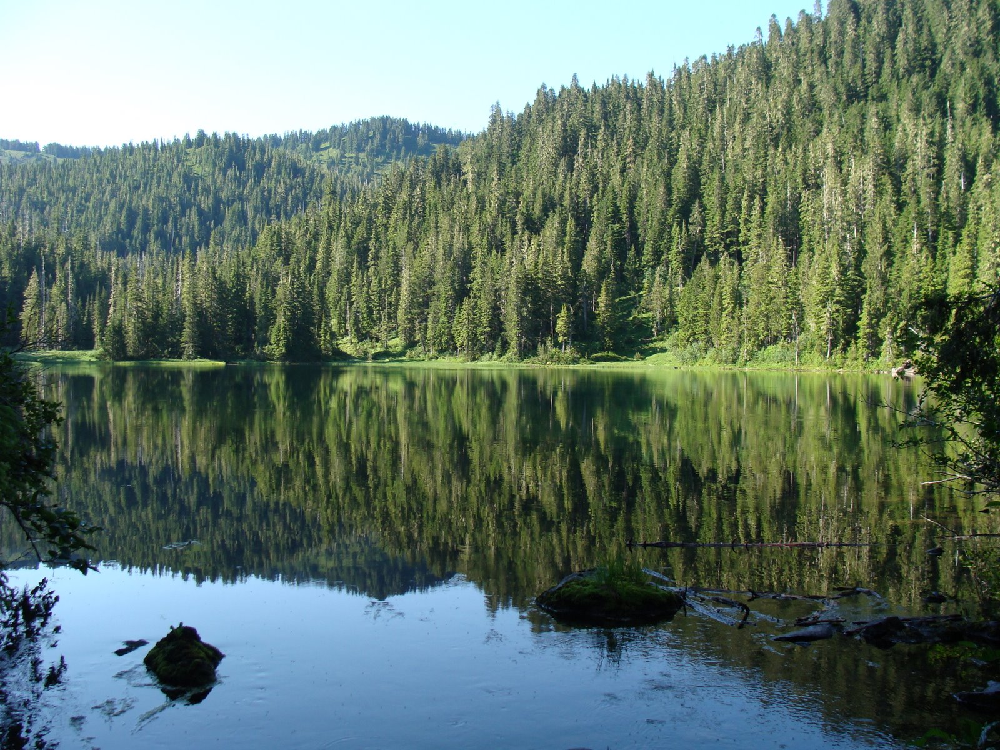](../assets/images/original/img_140_a633c99c.jpg)

——你不会知道你在看的是哪颗星球。地球和火星会变成两个正常的地方，中间要花三个月旅行——就像 100 年前只有飞机出现之前的美国和欧洲一样。有人可能选择在地球生活但去火星上大学。一对火星上的退休夫妇可能决定去地球旅行作为一次长途旅行。商业公司可以在每个星球都设总部。地球人和火星人会保持密切联系，互发邮件、发短信、互相看对方的电影和电视剧（但不会有电话或 Skype 对话——因为数据传输受光速限制，从一个星球发出的消息需要 3 到 22 分钟才能到另一个星球，取决于两星位置[10](#footnote-10-3902)）。

这一切都是可能的。在一篇关于这个主题的[论文](http://www.users.globalnet.co.uk/~mfogg/zubrin.htm)里，航天专家 Christopher McKay 和 Robert Zubrin 得出结论：「使用 21 世纪的技术，可以实现火星条件的剧烈改变。」

**超越火星**

有一天，这段视频可能成真：

当作家 Ross Andersen 问马斯克关于「超越火星、移居太阳系其他地方」的前景时，马斯克是乐观的：「如果我们能建立火星殖民地，我们几乎肯定能殖民整个太阳系，因为我们会创造一个强大的经济驱动力来改进太空旅行。我们会前往木星的卫星，至少其中一些外圈卫星肯定，还有土星的泰坦，以及小行星。一旦我们有了那个驱动力，加上地火经济，我们会覆盖整个太阳系。」

但他补充说：「关键是我们必须让火星这件事行得通。如果我们要获得把东西送到其他恒星系的任何机会，我们必须专注于成为多星球文明。那是下一步。」

从这个意义上说，殖民火星之所以重要，不仅是因为我们向外扩展、备份了硬盘，还因为殖民火星让我们成为一个*知道如何扩张到新星球并地球化它们*的物种。它让我们获得了一个物种要长期生存可能最重要的技能。

给我们足够的时间，我们会移居到太阳系很多其他天体上，并把每一个地球化成人能称之为家的地方。这打开了一些*诡异*的可能性。比如在木星悬在头顶的森林里徒步：[13](#footnote2-13-3902)

[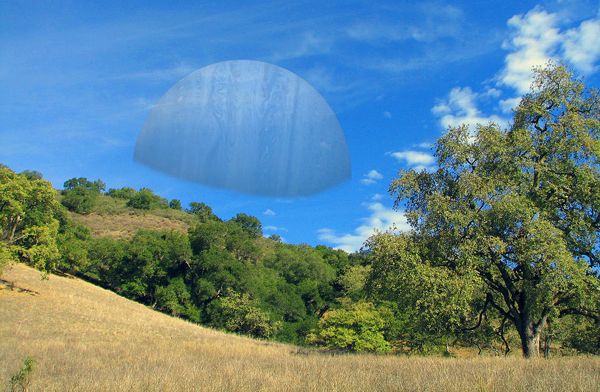](../assets/images/original/img_141_d6ef7c1e.jpg)

或者在海滩上晒太阳，地平线尽头是土星：[14](#footnote2-14-3902)

[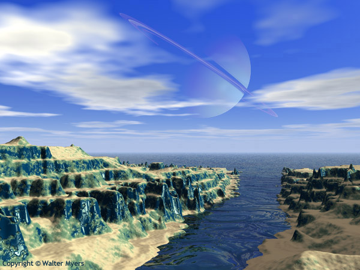](http://www.arcadiastreet.com/cgvistas/beyond/beyond_0600.htm)

太阳系可以变成人类的广阔世界。也许木星的卫星欧罗巴会成为太阳系的技术中心，而土星的泰坦会变成「你如果真的想在娱乐行业发展、就必须搬去」的地方。也许有些人会一辈子只待在一个天体上，其他人则是狂热的旅行者、吹牛说「我踏上过 12 个」。也许太阳系大议会会让「地球历史」成为学校的必修课，全太阳系的学生都会长大后渴望有一天去参观他们会称之为「文明摇篮」的地方，去看它巨大的动物、著名的城市和古老的遗迹。

**向外**

我们不会就此止步。扩展到整个太阳系会给我们买很多时间，更多时间会带我们走向神奇的新技术，在某个时刻，我们将能进行通往其他恒星和环绕它们的类地行星的漫长旅程——成为一个多太阳系文明。就像 17 世纪最早定居新大陆的人、21 世纪最早定居火星的人一样，一开始，只有最大胆的人会选择做长达数十年的迁移。和过去类似，随着时间推移，把家人搬到其他太阳系会成为平常事。

光速的限制意味着有人可能每天收到一个在另一颗恒星周围转圈的老朋友的更新，但他们实际上看到的是那位朋友十年前发生的事；如果他们回复一个问题，他们得等 20 年才能收到答案。距离会让不同人群彼此孤立，随着时间推移，不同太阳系的人类将不再是同一个物种。

数百万年前在渺小的地球上微弱闪烁的意识之光，将会扩散到整个银河系和其他星系，分化成数千种不同的生命形式。这条血脉上的大多数生命都会对「这一切从哪里开始」模糊不清，但那些了解历史的人会告诉你关于「伟大飞跃」的一切——那个远古时代的巅峰时刻，他们那些原始的祖先从子宫中诞生、成为征服者。

_______

如果你喜欢 Wait But Why，订阅我们的 **[邮件列表](https://newsletter.waitbutwhy.com/join)**，新文章发布时我们会发给你。

要支持 Wait But Why，请访问我们的 **[Patreon 页面](https://patreon.com/waitbutwhy)**。

___________

本系列的下一篇：

**第 4 部分：[厨师与厨师的秘密武器：马斯克的秘密配方](https://waitbutwhy.com/2015/11/the-cook-and-the-chef-musks-secret-sauce.html)**

本系列其他文章：

**第 1 部分：**[埃隆·马斯克系列：介绍](https://waitbutwhy.com/2015/05/elon-musk-introduction.html) **第 2 部分：**[Tesla 将如何改变世界](https://waitbutwhy.com/2015/06/how-tesla-will-change-your-life.html)

**补充 1：[关于 SolarCity](https://waitbutwhy.com/2015/06/the-deal-with-solar.html)**
**补充 2：[关于 Hyperloop](https://waitbutwhy.com/2015/06/hyperloop.html)**
**补充 3：[SpaceX 的大屌火箭 — 完整故事](https://waitbutwhy.com/2016/09/spacexs-big-fking-rocket-the-full-story.html)**

**还有一篇 2017 年写的，关于一家全新的埃隆的公司：**[Neuralink 和大脑的魔法未来](https://waitbutwhy.com/neuralink)

**另外两篇让我重新认识世界的文章：**

[AI 革命：通往超级智能之路](https://waitbutwhy.com/2015/01/artificial-intelligence-revolution-1.html)

[费米悖论](https://waitbutwhy.com/2014/05/fermi-paradox.html)

**或者来点不那么「存在主义危机」的：**

[怎么给孩子起名](https://waitbutwhy.com/2013/12/how-to-name-baby.html)

[你可能身处其中的 10 种奇怪友谊](https://waitbutwhy.com/2014/12/10-types-odd-friendships-youre-probably-part.html)

[为什么拖延者会拖延](https://waitbutwhy.com/2013/10/why-procrastinators-procrastinate.html)

---

## 脚注

- 这本书*[The Martian](http://amzn.to/1Uj7465)* 现在被提到正合适——过去一个月里我是每天洗澡时大声外放听有声书读它的。对合适的人（比如我）来说，这本书不可思议地有趣、引人入胜，现在洗澡这件事对我来说变成了一个激动人心的场所，我已经形成了一种巴甫洛夫反应——只要我在浴室里看到淋浴间站在那里，我就超级兴奋。Anyway，如果你喜欢这篇文章，大概可以读读这本书。[↩](#note-1-3902)

- 我最后和某人就这个时间表产生了强烈分歧，现在我下了一个令人不安的赌注——赌人类会在 2031 年 1 月 1 日之前踏上火星。[↩](#note-2-3902)

- 我问过 Elon 关于所有这些物资和谁来付钱，他解释道：「每人次 10 货次的『运输』只是一个关于『随着时间会怎么发生』的拍脑袋猜测。一部分一开始就由火星殖民者自付，一部分会以『地球上的各种团体支持他们在那里的前哨』的『关怀包』形式从地球来。长期看，我想大部分将由来自火星的光子出口（发明和娱乐）来支付，以及一些『每公斤价值超级高』的东西——比如先进 CPU、艺术品、或非常稀有的元素、奇异化合物或药物。」[↩](#note-3-3902)

- 谈到这里时，我问 Musk 他觉得火星的政府会是什么样的。他的回答是：「创建火星政府将像创建美国。这是重新设计政府、从第一原理说『政府应该长什么样』的机会。我猜人们会做更多的直接民主而不是代议制民主。在过去，一项投票要花三个月——那时候没有邮件系统，邮件也勉强能用、要花几周，而且很多人不会读也不会写。它非常笨拙，所以他们必须有代议制民主。在火星上，可以在议题上进行瞬时电子投票，这会远不那么容易腐败，法案可以做得简单得多——你可以给法律加个字数限制。」[↩](#note-4-3902)

- 0:43 那段我「痉挛式爆词」是整个过程的常态。当采访埃隆·马斯克时，装作一个正常人是很难的。[↩](#note-5-3902)

- 前面我把那个「看不到火星计划价值」的政治家比作一个「被账单缠身而忽视健康」的人。这里，Musk 似乎是把那个政治家比作一个「不断推迟不紧急的事——家庭时间、休闲、娱乐——为维持生计」的人——每天看起来都合理，但常常以临终的遗憾收场。[↩](#note-6-3902)

- 是的，我把整篇文章最深的哲学问题扔进脚注里——因为这完全是另一个话题。但是，是的，整篇文章基于一个前提：人类物种的长期存在是一件好事、重要的事——有一种根本的「好」在于「数十亿还不存在的人未来会存在」这件事。它假设「有生命的宇宙」比「没有生命的宇宙」更可取。这是另一篇文章才能打开的潘多拉盒子。就这篇文章而言，我以一个人类的身份、不是绝对理性的哲学家身份在写。作为人类，我可以肯定地说，「人类级别的意识从存在中消失」这个想法让我悲伤。进化花了 38 亿年才达到我们这种复杂度——而对音乐、笑声、共情、浪漫、友谊、兴奋、爱这些东西的「永恒死亡」的想法，在我这个有偏见的人类大脑里，是一件坏事。对这篇文章，我坚持这个前提。[↩](#note-7-3902)

- 显然火星的天空白天是红色的，但黎明和黄昏时和地球一样是蓝色的。[↩](#note-8-3902)

- 关于这个，Musk 告诉我：「你会有核弹，在太空中引爆，向极地辐射热量。但不会有冲击波——那只是热——因为没有什么东西让它去反作用。而且不会有显著的辐射。那会把极地融化。」[↩](#note-9-3902)

- 在 26 个月行星位置周期的 2-4 周里，太阳正好在两颗行星中间，它们根本无法通信。[↩](#note-10-3902)

- Ross Andersen 为 Aeon：[Exodus](http://aeon.co/magazine/technology/the-elon-musk-interview-on-mars/)[↩](#note2-1-3902)

- [2013 年 SXSW 采访](https://www.youtube.com/watch?v=LeQMWdOMa-A)。[↩](#note2-2-3902)

- [https://www.youtube.com/watch?v=_yDZY5_u8FQ](https://www.youtube.com/watch?v=_yDZY5_u8FQ)[↩](#note2-3-3902)

- [Ashlee Vance：《Elon Musk: Tesla, SpaceX, and the Quest for a Fantastic Future》](http://amzn.to/1LQnmQS)，219 页。[↩](#note2-4-3902)

- 图片来自：[Steven Hobbs](http://www.corbisimages.com/photographer/steven-hobbs)[↩](#note2-5-3902)

- [http://www.businessinsider.com/elon-musk-colonizing-mars-2014-1](http://www.businessinsider.com/elon-musk-colonizing-mars-2014-1)[↩](#note2-6-3902)

- [http://www.users.globalnet.co.uk/~mfogg/zubrin.htm](http://www.users.globalnet.co.uk/~mfogg/zubrin.htm)[↩](#note2-7-3902)

- [http://www.users.globalnet.co.uk/~mfogg/zubrin.htm](http://www.users.globalnet.co.uk/~mfogg/zubrin.htm)[↩](#note2-8-3902)

- [http://ngm.nationalgeographic.com/big-idea/07/mars-pg2](http://ngm.nationalgeographic.com/big-idea/07/mars-pg2)[↩](#note2-9-3902)

- 图片来自：[Wikimedia Commons](https://en.wikipedia.org/wiki/Terraforming_of_Mars#/media/File:MarsTransitionV.jpg)。[↩](#note2-10-3902)

- 资料来源：[300 年](http://www.ted.com/talks/stephen_petranek_counts_down_to_armageddon?language=en#t-1163754)。[900 年或更长](http://www.users.globalnet.co.uk/~mfogg/zubrin.htm)。[↩](#note2-11-3902)

- 图片来自：[http://blog.olympicwanderer.com/2010/06/high-divide.html](http://blog.olympicwanderer.com/2010/06/high-divide.html)[↩](#note2-12-3902)

- 图片来自 [this site](http://visions2200.com/SpaceExtraSolarHabMoon.html)，但很难找到原始出处。[↩](#note2-13-3902)

- 资料来源：[Walter Myers](http://www.arcadiastreet.com/cgvistas/beyond/beyond_0600.htm)[↩](#note2-14-3902)
